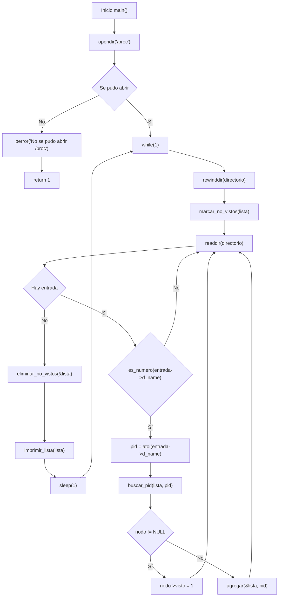
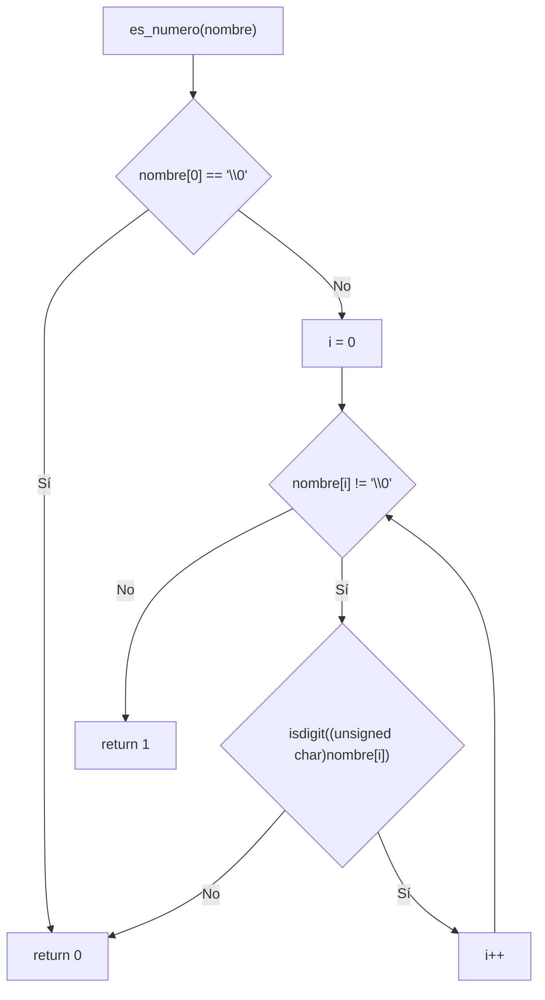
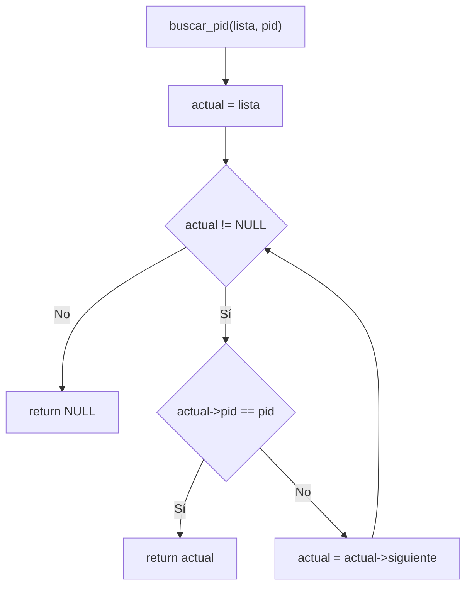
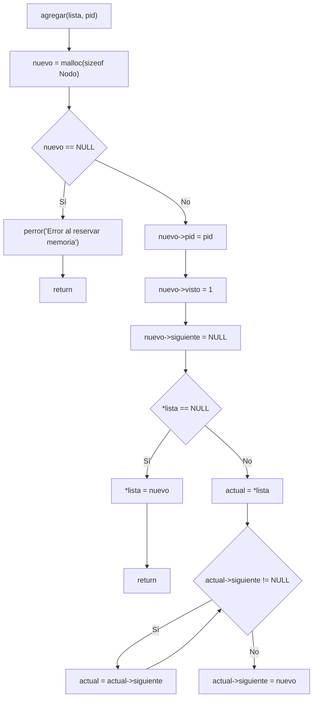
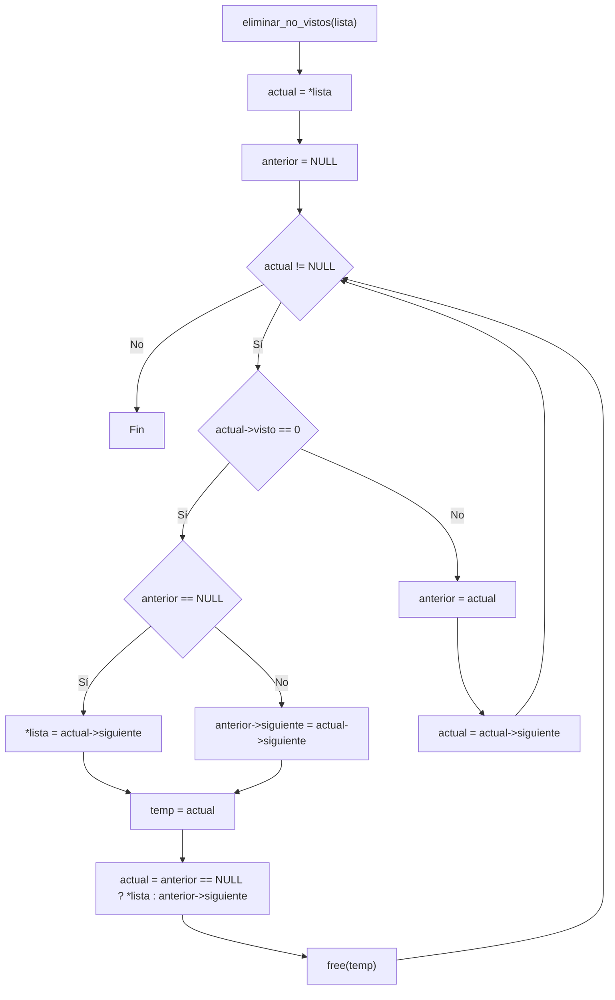
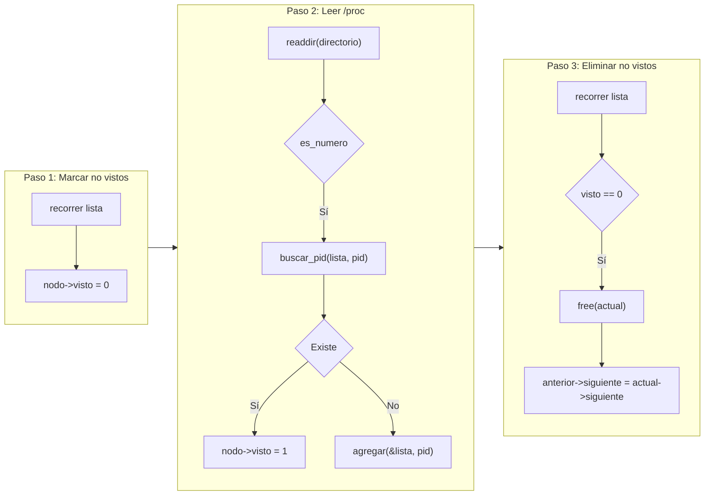

# Reporte de Programa 1 - Monitor de procesos activos en /proc

## 1. Portada

- Materia: Sistemas Operativos II
- Actividad: Programa 1 (monitoreo de procesos)
- Alumno: Dante Castelán Carpinteyro
- Fecha: 19 de agosto de 2026
- Lenguaje: C (gcc 13.3.0, Linux)

## 2. Objetivo

Desarrollar un monitor de procesos en C que lea continuamente el directorio `/proc`, detecte procesos nuevos y desaparecidos, y muestre los PIDs activos en tiempo real usando una lista enlazada. El programa debe reflejar los cambios del sistema operativo sin reiniciar, mostrando en cada ciclo qué procesos están corriendo.

## 3. Instrucciones de la actividad

> Realizar un programa que monitoree los procesos en ejecución en el sistema. El programa debe leer el directorio `/proc`, identificar los PIDs de los procesos activos, y mantener actualizada la lista de procesos mostrando cuáles aparecieron, cuáles siguen activos y cuáles desaparecieron.

## 4. Requisitos y entorno

- Sistema operativo: Linux (requiere el sistema de archivos `/proc`).
- Compilador: gcc.
- Librerías: solo las del estándar y POSIX (`stdio.h`, `stdlib.h`, `dirent.h`, `ctype.h`, `unistd.h`, `sys/types.h`). Sin dependencias externas.

Compilación:

```bash
cd programs
gcc -O2 -Wall -o program-x program-x.c
```

## 5. Implementación realizada

El programa se estructura en dos partes: una **lista enlazada** para almacenar los PIDs conocidos, y un **bucle continuo** que lee `/proc` en cada ciclo para detectar cambios.

### 5.1 Estructura de datos: lista enlazada de PIDs

Cada nodo de la lista guarda un PID y un flag `visto` que indica si el proceso apareció en el ciclo actual:

```c
typedef struct Nodo {
    int pid;
    int visto;              /* 1 = apareció en /proc este ciclo */
    struct Nodo *siguiente;
} Nodo;
```

El flag `visto` es la clave del algoritmo: al inicio de cada ciclo se ponen todos en 0, y los que reaparecen en `/proc` se marcan en 1. Los que quedan en 0 al final del ciclo ya no existen y se eliminan.

### 5.2 Funciones auxiliares de la lista

**`es_numero`** — verifica si el nombre de una entrada de `/proc` es un PID (solo dígitos):

```c
int es_numero(const char *nombre) {
    int i;
    if (nombre[0] == '\0')
        return 0;
    for (i = 0; nombre[i] != '\0'; i++) {
        if (!isdigit((unsigned char)nombre[i]))
            return 0;
    }
    return 1;
}
```

En `/proc` hay entradas como `self`, `net`, `bus` que no son PIDs. Solo las que son puramente numéricas corresponden a procesos reales.

**`buscar_pid`** — busca un PID en la lista y devuelve el nodo si existe:

```c
Nodo *buscar_pid(Nodo *lista, int pid) {
    Nodo *actual = lista;
    while (actual != NULL) {
        if (actual->pid == pid)
            return actual;
        actual = actual->siguiente;
    }
    return NULL;
}
```

**`agregar`** — agrega un PID nuevo al final de la lista:

```c
void agregar(Nodo **lista, int pid) {
    Nodo *nuevo = malloc(sizeof(Nodo));
    if (nuevo == NULL) {
        perror("Error al reservar memoria");
        return;
    }
    nuevo->pid = pid;
    nuevo->visto = 1;       /* se marca visto porque acaba de aparecer */
    nuevo->siguiente = NULL;

    if (*lista == NULL) {
        *lista = nuevo;
        return;
    }
    Nodo *actual = *lista;
    while (actual->siguiente != NULL)
        actual = actual->siguiente;
    actual->siguiente = nuevo;
}
```

### 5.3 Patrón de ciclo de vida: marcar, detectar, eliminar

El patrón funciona en tres pasos por cada ciclo del bucle:

**Paso 1 — Marcar todos como "no vistos":**

```c
void marcar_no_vistos(Nodo *lista) {
    Nodo *actual = lista;
    while (actual != NULL) {
        actual->visto = 0;
        actual = actual->siguiente;
    }
}
```

**Paso 2 — Recorrer `/proc` y marcar los que aparecen:**

```c
while ((entrada = readdir(directorio)) != NULL) {
    if (es_numero(entrada->d_name)) {
        pid = atoi(entrada->d_name);
        nodo = buscar_pid(lista, pid);
        if (nodo != NULL)
            nodo->visto = 1;       /* ya existia, sigue activo */
        else
            agregar(&lista, pid);   /* es nuevo */
    }
}
```

**Paso 3 — Eliminar los que no aparecieron:**

```c
void eliminar_no_vistos(Nodo **lista) {
    Nodo *actual = *lista;
    Nodo *anterior = NULL;
    while (actual != NULL) {
        if (actual->visto == 0) {
            if (anterior == NULL)
                *lista = actual->siguiente;
            else
                anterior->siguiente = actual->siguiente;
            free(actual);
            actual = (anterior == NULL) ? *lista : anterior->siguiente;
        } else {
            anterior = actual;
            actual = actual->siguiente;
        }
    }
}
```

Este patrón es equivalente a un "ciclo de vida" de procesos: se asume que todos murieron, se leen los que existen, y se eliminan los que no aparecieron. Es el mismo principio que usa el sistema operativo para actualizar tablas de procesos.

### 5.4 Bucle principal

```c
int main() {
    DIR *directorio;
    struct dirent *entrada;
    Nodo *lista = NULL;

    directorio = opendir("/proc");

    while (1) {
        rewinddir(directorio);          /* volver al inicio de /proc */
        marcar_no_vistos(lista);        /* paso 1 */
        while ((entrada = readdir(directorio)) != NULL) {
            if (es_numero(entrada->d_name))
                /* paso 2: marcar o agregar */;
        }
        eliminar_no_vistos(&lista);     /* paso 3 */
        imprimir_lista(lista);
        sleep(1);                       /* esperar 1 segundo */
    }

    closedir(directorio);
    liberar_lista(lista);
    return 0;
}
```

La función `rewinddir` es fundamental: sin ella, `readdir` no volvería al principio del directorio en el siguiente ciclo. Cada iteración del bucle `while(1)` es un ciclo completo de monitoreo.

### 5.5 Funciones

A continuación, de describen las funciones estándar de C utilizadas en el programa:

#### `isdigit()`

La función `isdigit()`en C verifica si un caracter específico es un dígito numérico entre '0' y '9'.

- **Requerimiento**: incluir la cabecera `<ctype.h>`
- **Parámetros o argumentos**: recibe un caracter representado como un entero, o `EOF`.
- **Valor de retorno**: devuelve un valor distinto de cero (`true`) si el caracter es un dígito, y cero (`false`) si no lo es.

#### `opendir()`
La función `opendir()` abre un directorio y devuelve un puntero a un objeto de tipo `DIR`, que se utiliza para leer las entradas del directorio.

- **Requerimiento**: incluir la cabecera `<dirent.h>`
- **Parámetros o argumentos**: recibe un string con la ruta del directorio a abrir
- **Valor de retorno**: devuelve un puntero a `DIR` si se abre correctamente, o `NULL` si ocurre un error (por ejemplo, si el directorio no existe o no se tienen permisos para abrirlo).

#### `readdir()`
La función `readdir()` lee la siguiente entrada de un directorio abierto y devuelve un puntero a una estructura `dirent` que contiene información sobre la entrada del directorio.

- **Requerimiento**: incluir la cabecera `<dirent.h>`
- **Parámetros o argumentos**: recibe un puntero a `DIR` que representa el directorio abierto.
- **Valor de retorno**: devuelve un puntero a `struct dirent` que contiene información sobre la entrada del directorio, o `NULL` si se alcanza el final del directorio o si ocurre un error.

#### `rewinddir()`
La función `rewinddir()` reinicia la posición de lectura de un directorio abierto a la primera entrada.

- **Requerimiento**: incluir la cabecera `<dirent.h>`
- **Parámetros o argumentos**: recibe un puntero a `DIR` que representa el directorio abierto.
- **Valor de retorno**: no devuelve ningún valor. Simplemente reinicia la posición de lectura del directorio para que la próxima llamada a `readdir()` comience desde la primera entrada nuevamente.

#### `closedir()`
La función `closedir()` cierra un directorio abierto y libera los recursos asociados con él.

- **Requerimiento**: incluir la cabecera `<dirent.h>`
- **Parámetros o argumentos**: recibe un puntero a `DIR` que representa el directorio abierto.
- **Valor de retorno**: devuelve 0 si se cierra correctamente, o -1 si ocurre un error (por ejemplo, si el directorio no estaba abierto).

#### `perror()`
La función `perror()` imprime un mensaje de error en la salida estándar de error (`stderr`) basado en el valor de la variable global `errno`, que indica el último error ocurrido en una llamada al sistema o función de biblioteca.

- **Requerimiento**: incluir la cabecera `<stdio.h>`
- **Parámetros o argumentos**: recibe un puntero a una cadena de caracteres (string) que se utiliza como prefijo del mensaje de error. Si se pasa `NULL`, solo se imprimirá el mensaje de error correspondiente al valor de `errno`.
- **Valor de retorno**: no devuelve ningún valor. Simplemente imprime el mensaje de error en la salida estándar de error.

#### `malloc()`
La función `malloc()` en C se utiliza para asignar memoria dinámica en tiempo de ejecución.

- **Requerimiento**: incluir la cabecera `<stdlib.h>`
- **Parámetros o argumentos**: recibe un tamaño en bytes que indica la cantidad de memoria que se desea asignar.
- **Valor de retorno**: devuelve un puntero al bloque de memoria asignado si la asignación es exitosa, o `NULL` si no se pudo asignar la memoria (por ejemplo, si no hay suficiente memoria disponible).

#### `free()`
La función `free()` en C se utiliza para liberar la memoria previamente asignada mediante funciones como `malloc()`, `calloc()` o `realloc()`.

- **Requerimiento**: incluir la cabecera `<stdlib.h>`
- **Parámetros o argumentos**: recibe un puntero a la memoria que se desea liberar.
- **Valor de retorno**: no devuelve ningún valor. Simplemente libera la memoria asignada.

#### `sleep()`
La función `sleep()` en C se utiliza para suspender la ejecución del programa durante un período de tiempo especificado en segundos.

- **Requerimiento**: incluir la cabecera `<unistd.h>`
- **Parámetros o argumentos**: recibe un número entero que representa la cantidad de segundos que se desea suspender la ejecución del programa.
- **Valor de retorno**: devuelve 0 si la suspensión se completó correctamente, o un valor distinto de cero si la suspensión fue interrumpida por una señal antes de que transcurriera el tiempo especificado.

#### `atoi()`
La función `atoi()` en C se utiliza para convertir una cadena de caracteres (string) que representa un número entero en su valor numérico correspondiente.

- **Requerimiento**: incluir la cabecera `<stdlib.h>`
- **Parámetros o argumentos**: recibe un puntero a una cadena de caracteres (string) que representa un número entero.
- **Valor de retorno**: devuelve el valor entero correspondiente a la cadena de caracteres. Si la cadena no representa un número válido, el comportamiento es indefinido y puede devolver 0 o un valor no esperado.
 
### 5.6. Funciones auxiliares (propias)

A continuación se resumen las funciones auxiliares implementadas para mantener la lista enlazada de PIDs, sus parámetros y la salida que producen.

#### `es_numero(const char *nombre)`
- Qué hace: Comprueba si la cadena `nombre` está formada únicamente por dígitos (útil para identificar entradas de `/proc` que corresponden a PIDs).
- Parámetros: `nombre` — cadena a validar.
- Salida: devuelve `1` si todos los caracteres son dígitos, `0` si no.

#### `buscar_pid(Nodo *lista, int pid)`
- Qué hace: Recorre la lista enlazada buscando un nodo con `pid` igual al solicitado.
- Parámetros: `lista` — puntero al primer nodo; `pid` — identificador a buscar.
- Salida: devuelve un puntero al `Nodo` encontrado o `NULL` si no existe.

#### `agregar(Nodo **lista, int pid)`
- Qué hace: Reserva y añade un nuevo nodo al final de la lista con el `pid` dado, marcándolo como `visto`.
- Parámetros: `lista` — puntero al puntero del primer nodo; `pid` — identificador a insertar.
- Salida: modifica la lista in-place; no devuelve valor (`void`).

#### `marcar_no_vistos(Nodo *lista)`
- Qué hace: Recorre la lista y pone `visto = 0` en cada nodo (preparación para el siguiente ciclo de escaneo de `/proc`).
- Parámetros: `lista` — puntero al primer nodo.
- Salida: modifica la lista in-place; no devuelve valor (`void`).

#### `eliminar_no_vistos(Nodo **lista)`
- Qué hace: Elimina y libera los nodos cuyo `visto == 0`, actualizando los enlaces de la lista.
- Parámetros: `lista` — puntero al puntero del primer nodo.
- Salida: modifica la lista in-place; no devuelve valor (`void`).

#### `imprimir_lista(Nodo *lista)`
- Qué hace: Imprime por pantalla los PIDs contenidos en la lista (uno por línea) y una línea separadora.
- Parámetros: `lista` — puntero al primer nodo.
- Salida: escribe en `stdout`; no devuelve valor (`void`).

#### `liberar_lista(Nodo *lista)`
- Qué hace: Libera toda la memoria asociada a la lista liberando cada nodo.
- Parámetros: `lista` — puntero al primer nodo.
- Salida: libera memoria; no devuelve valor (`void`).

## 6. Diagramas de flujo

### 6.1 Flujo principal `main()`



### 6.2 Función `es_numero()`



### 6.3 Función `buscar_pid()`



### 6.4 Función `agregar()`



### 6.5 Función `eliminar_no_vistos()`



### 6.6 Patrón de ciclo de vida (marco conceptual)



## 7. Ejecución

```bash
cd programs
gcc -O2 -Wall -o program-x program-x.c
./program-x
```

## 8. Cumplimiento del enunciado

- Lee el directorio `/proc` con `opendir`/`readdir`: cumplido.
- Identifica PIDs de procesos activos: cumplido (filtra entradas numéricas).
- Detecta procesos nuevos: cumplido (`agregar` cuando el PID no está en la lista).
- Detecta procesos desaparecidos: cumplido (`eliminar_no_vistos`).
- Mantiene lista actualizada en cada ciclo: cumplido (`rewinddir` + `while(1)`).
- Muestra la lista de PIDs en pantalla: cumplido (`imprimir_lista`).

## 9. Conclusión

El programa demuestra cómo el directorio `/proc` es una ventana en tiempo real hacia los procesos del sistema. La estructura de lista enlazada con el flag `visto` es un patrón eficiente para detectar cambios sin tener que comparar dos listas completas: basta con asumir que todos murieron y se eliminan los que no reaparecen.

Lo más interesante de esta implementación es que no necesita guardar una "instantánea" anterior del sistema. En cada ciclo, el simple hecho de recorrer `/proc` y cruzar datos con la lista existente es suficiente para saber exactamente qué proceso nació y cuál murió. Es el mismo principio que usan herramientas como `ps`, `top` o `htop` internamente.

## 10. Anexo A - Comandos usados

```bash
cd programs
gcc -O2 -Wall -o program-x program-x.c
./program-x
```

## 11. Bitácora de prompts

Prompts usados para llegar al resultado final:

| # |                                                                                            Prompt textual                                                                                            | ¿Sirve? | LLM / Agente |
| :-: | :---------------------------------------------------------------------------------------------------------------------------------------------------------------------------------------------------: | :------: | :----------: |
| 1 |                **"Cómo leer el directorio `/proc` en C para obtener solo los directorios numéricos?"** — Conduce a usar `opendir`/`readdir` y filtrar con `isdigit`.                |   Sí   |    Gemini    |
| 2 |                 **"Cómo implementar una lista enlazada en C para guardar PIDs de procesos?"** — Conduce a la definición de `Nodo` con `pid`, `visto` y `siguiente`.                 |   Sí   |    Gemini    |
| 3 |               **"Cómo detectar si un PID sigue activo en `/proc` después de un ciclo?"** — Conduce al patrón de marcar todos como "no vistos" antes de recorrer `/proc`.               |   Sí   |    Gemini    |
| 4 | **"Cómo comparar la lista de PIDs anterior con la actual para saber cuáles aparecieron o desaparecieron?"** — Conduce a la función `eliminar_no_vistos` que borra los que no se marcaron. |   Sí   |    Gemini    |
| 5 |                     **"Cómo estructurar el bucle `while(1)` con `rewinddir` para volver a leer `/proc`?"** — Conduce a usar `rewinddir` antes de cada recorrido.                     |   Sí   |    Gemini    |
| 6 |                                    **"Cómo usar `isdigit` para verificar si un nombre de entrada es numérico?"** — Conduce a la función `es_numero`.                                    |   Sí   |    Gemini    |
| 7 |                               **"Cómo liberar memoria de una lista enlazada al salir del programa?"** — Conduce a `liberar_lista` con `free` en cada nodo.                               |   Sí   |    Gemini    |
