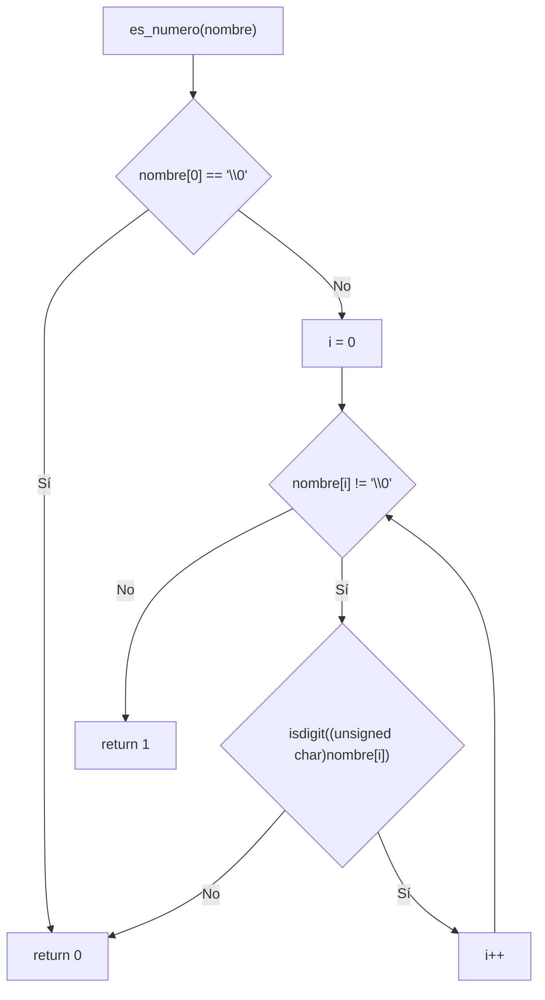
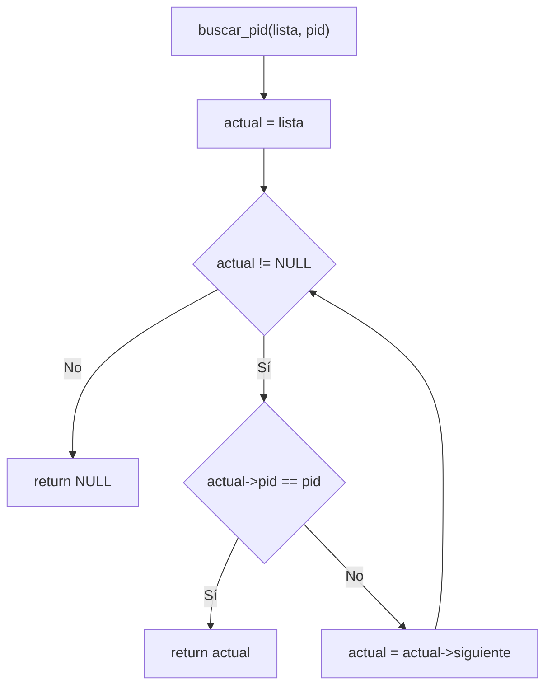
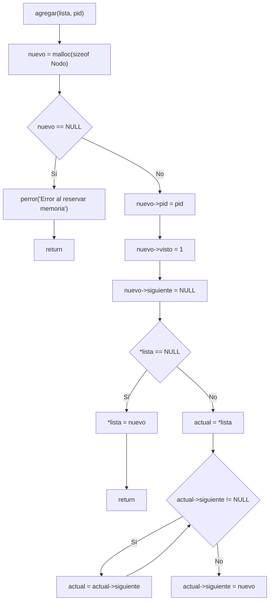
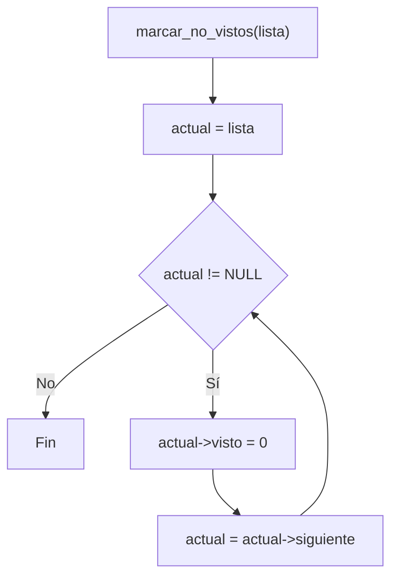
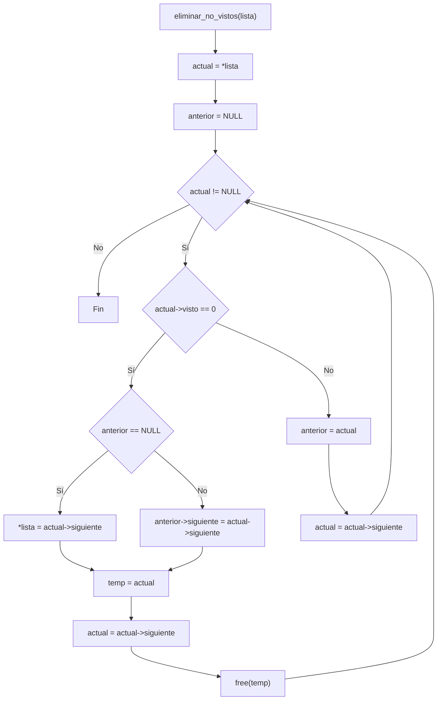
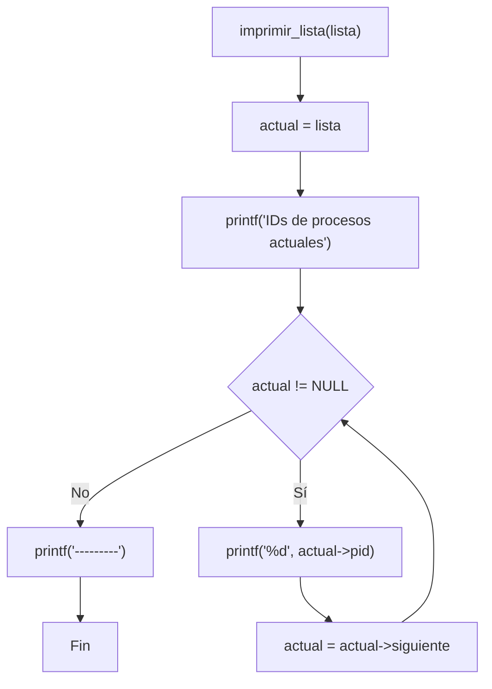
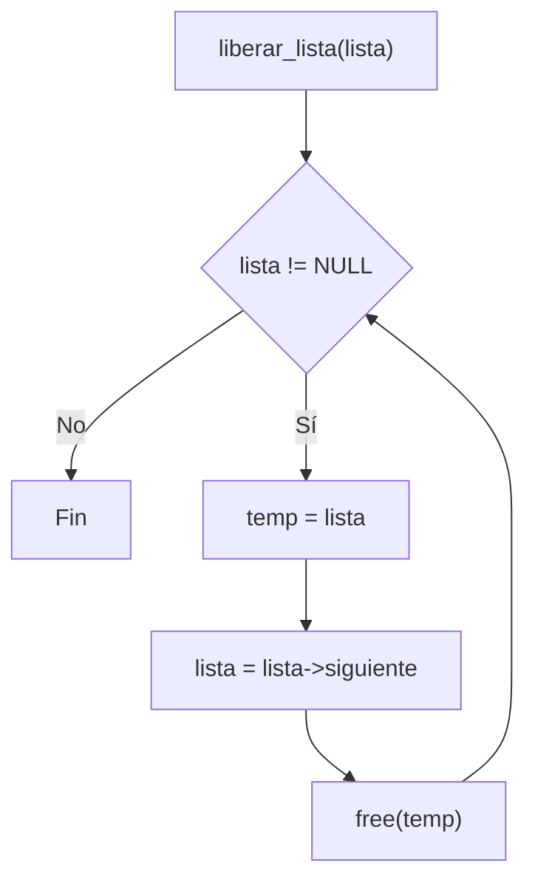
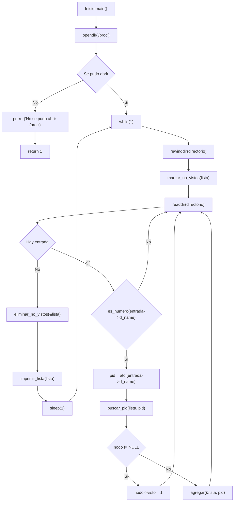
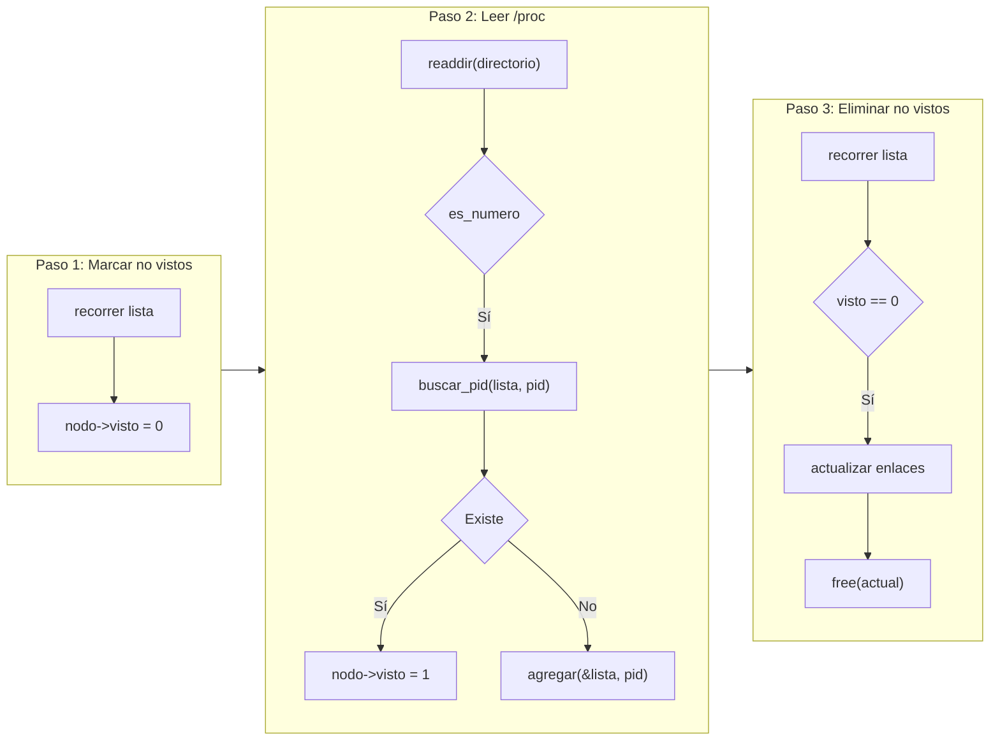

# Reporte de Programa 1 - Monitor de procesos activos en /proc

## 1. Portada

- Materia: Sistemas Operativos II
- Actividad: Programa 1 (monitoreo de procesos)
- Alumno: Dante Castelán Carpinteyro
- Fecha: 19 de agosto de 2026
- Lenguaje: C (gcc 13.3.0, Linux)

## 2. Objetivo

Desarrollar un monitor de procesos en C que lea continuamente el directorio `/proc`, detecte procesos nuevos y desaparecidos, y muestre los PIDs activos en tiempo real usando una lista enlazada. El programa debe reflejar los cambios del sistema operativo sin reiniciar, mostrando en cada ciclo qué procesos están corriendo.

## 3. Instrucciones de la actividad

> Realizar un programa que monitoree los procesos en ejecución en el sistema. El programa debe leer el directorio `/proc`, identificar los PIDs de los procesos activos, y mantener actualizada la lista de procesos mostrando cuáles aparecieron, cuáles siguen activos y cuáles desaparecieron.

## 4. Requisitos y entorno

- Sistema operativo: Linux (requiere el sistema de archivos `/proc`).
- Compilador: gcc.
- Librerías: solo las del estándar y POSIX (`stdio.h`, `stdlib.h`, `dirent.h`, `ctype.h`, `unistd.h`). Sin dependencias externas.

Compilación:

```bash
cd programs
gcc -O2 -Wall -Wextra -o program-1 program-1.c
```

## 5. Implementación realizada

El programa completo vive en un solo archivo (`programs/program-1.c`, 247 líneas). A continuación se explica **todo el código en el mismo orden en que aparece en el archivo**: primero las cabeceras, luego la estructura de datos, después cada función auxiliar en su orden de aparición, y al final un recorrido detallado de `main()`.

### 5.1 Cabeceras e includes (líneas 1–5)

```c
#include <stdio.h>
#include <stdlib.h>
#include <dirent.h>
#include <ctype.h>
#include <unistd.h>
```

- **`<stdio.h>`** — funciones de entrada/salida estándar (`printf`, `perror`). Se usa para imprimir la lista de PIDs y los mensajes de error.
- **`<stdlib.h>`** — funciones de biblioteca general (`malloc`, `free`, `atoi`). Se usa para reservar y liberar memoria de los nodos, y para convertir las cadenas de `/proc` a enteros.
- **`<dirent.h>`** — manejo de directorios (`DIR`, `struct dirent`, `opendir`, `readdir`, `rewinddir`, `closedir`). Es la cabecera central del programa: permite abrir y leer las entradas de `/proc`.
- **`<ctype.h>`** — clasificación de caracteres (`isdigit`). Se usa en `es_numero` para filtrar únicamente las entradas numéricas de `/proc`.
- **`<unistd.h>`** — funciones POSIX (`sleep`). Se usa para pausar 1 segundo entre ciclos de monitoreo.

No hay dependencias externas: el programa usa únicamente el estándar de C y POSIX.

### 5.2 Estructura de datos: `Nodo` (líneas 7–11)

Cada nodo de la lista guarda un PID y un flag `visto` que indica si el proceso apareció en el ciclo actual:

```c
typedef struct Nodo {
    int pid;
    int visto;              /* 1 = apareció en /proc este ciclo */
    struct Nodo *siguiente;
} Nodo;
```

- **`pid`** — el identificador del proceso (por ejemplo, `1234`).
- **`visto`** — bandera temporal del ciclo: se pone en `0` al inicio de cada ciclo y se pone en `1` si el proceso aparece en `/proc`. Es la clave del algoritmo.
- **`siguiente`** — puntero al siguiente nodo de la lista enlazada; `NULL` en el último.

El flag `visto` es la clave del algoritmo: al inicio de cada ciclo se ponen todos en `0`, y los que reaparecen en `/proc` se marcan en `1`. Los que quedan en `0` al final del ciclo ya no existen y se eliminan.

### 5.3 Función `es_numero` (líneas 14–27)

Verifica si el nombre de una entrada de `/proc` es un PID (solo dígitos):

```c
int es_numero(const char *nombre) {
    int i;

    if (nombre[0] == '\0')
        return 0;

    for (i = 0; nombre[i] != '\0'; i++) {
        if (!isdigit((unsigned char)nombre[i]))
            return 0;
    }

    return 1;
}
```

En `/proc` hay entradas como `self`, `net`, `bus` que no son PIDs. Solo las que son puramente numéricas corresponden a procesos reales.

- Si la cadena está vacía, devuelve `0` de inmediato.
- Recorre cada carácter; si encuentra alguno que no sea dígito, devuelve `0`.
- Solo devuelve `1` si **todos** los caracteres son dígitos.

El cast `(unsigned char)` es necesario porque `isdigit` requiere un valor no negado, y `char` puede ser negativo en sistemas con caracteres con signo.

### 5.4 Función `buscar_pid` (líneas 30–42)

Busca un PID en la lista y devuelve el nodo si existe:

```c
Nodo *buscar_pid(Nodo *lista, int pid) {
    Nodo *actual = lista;

    while (actual != NULL) {
        if (actual->pid == pid)
            return actual;

        actual = actual->siguiente;
    }

    return NULL;
}
```

Recorre la lista nodo por nodo comparando `pid`. Si lo encuentra, devuelve el puntero al nodo; si recorre toda la lista sin encontrarlo, devuelve `NULL`. La búsqueda es lineal `O(n)`, suficiente para la cantidad típica de procesos de un sistema.

### 5.5 Función `agregar` (líneas 45–73)

Agrega un PID nuevo al final de la lista:

```c
void agregar(Nodo **lista, int pid) {
    Nodo *nuevo;
    Nodo *actual;

    nuevo = malloc(sizeof(Nodo));

    if (nuevo == NULL) {
        perror("Error al reservar memoria");
        return;
    }

    nuevo->pid = pid;
    nuevo->visto = 1;       /* se marca visto porque acaba de aparecer */
    nuevo->siguiente = NULL;

    if (*lista == NULL) {
        *lista = nuevo;
        return;
    }

    actual = *lista;

    while (actual->siguiente != NULL) {
        actual = actual->siguiente;
    }

    actual->siguiente = nuevo;
}
```

- Reserva memoria con `malloc` y verifica que no sea `NULL` (con `perror` si falla).
- Inicializa los tres campos del nuevo nodo. Se marca `visto = 1` porque el proceso acaba de aparecer en `/proc` en este mismo ciclo.
- Si la lista está vacía (`*lista == NULL`), el nuevo nodo se convierte en el primero.
- Si no, recorre hasta el último nodo (`siguiente == NULL`) y lo enlaza con el nuevo nodo.

Recibe `Nodo **` (puntero al puntero) porque necesita poder modificar el puntero de inicio de la lista cuando esta está vacía.

### 5.6 Función `marcar_no_vistos` (líneas 76–84)

Pone todos los nodos de la lista en `visto = 0`:

```c
void marcar_no_vistos(Nodo *lista) {
    Nodo *actual = lista;

    while (actual != NULL) {
        actual->visto = 0;
        actual = actual->siguiente;
    }
}
```

Se llama al inicio de cada ciclo del bucle principal. Recorre toda la lista poniendo `visto = 0` en cada nodo. Es el paso de "reset" del algoritmo: el programa asume que ningún proceso existe y solo los que vuelvan a aparecer en `/proc` se marcarán como vistos.

Recibe la lista por valor (no necesita modificar los punteros de la lista, solo los campos de los nodos), a diferencia de `agregar` y `eliminar_no_vistos`.

### 5.7 Función `eliminar_no_vistos` (líneas 87–118)

Elimina de la lista los nodos que quedaron con `visto == 0` (procesos que ya no existen):

```c
void eliminar_no_vistos(Nodo **lista) {
    Nodo *actual = *lista;
    Nodo *anterior = NULL;
    Nodo *temp;

    while (actual != NULL) {
        if (actual->visto == 0) {
            /* El nodo es el primero */
            if (anterior == NULL) {
                *lista = actual->siguiente;
                temp = actual;
                actual = actual->siguiente;
                free(temp);
            }
            /* El nodo está en medio o al final */
            else {
                anterior->siguiente = actual->siguiente;
                temp = actual;
                actual = actual->siguiente;
                free(temp);
            }
        } else {
            anterior = actual;
            actual = actual->siguiente;
        }
    }
}
```

Esta función maneja **dos casos** al eliminar:

1. **El nodo a eliminar es el primero** (`anterior == NULL`): se mueve el puntero de inicio de la lista (`*lista`) al siguiente nodo, se guarda el nodo en `temp`, se avanza `actual` y se libera `temp`. Así el primer nodo queda fuera de la lista sin perder la referencia al resto.

2. **El nodo está en medio o al final** (`anterior != NULL`): se salta el nodo actual haciendo que `anterior->siguiente` apunte a `actual->siguiente`, luego se guarda en `temp`, se avanza `actual` y se libera `temp`.

Si el nodo fue visto (`visto == 1`), simplemente se avanza: `anterior = actual` y `actual = actual->siguiente`.

La variable `temp` es necesaria porque después de `free(actual)` el puntero `actual` quedaría colgando (dangling); se guarda antes de liberar y se avanza el puntero antes del `free`. Recibe `Nodo **` porque puede modificar el puntero de inicio de la lista cuando elimina el primer nodo.

### 5.8 Función `imprimir_lista` (líneas 121–133)

Imprime por pantalla los PIDs de la lista:

```c
void imprimir_lista(Nodo *lista) {
    Nodo *actual = lista;

    printf("IDs de procesos actuales:\n");

    while (actual != NULL) {
        printf("%d\n", actual->pid);
        actual = actual->siguiente;
    }

    printf("-------------------------\n");
}
```

Recorre la lista desde el primer nodo hasta `NULL` imprimiendo un PID por línea, precedido de un encabezado y seguido de una línea separadora. Se llama al final de cada ciclo del bucle principal, después de eliminar los procesos desaparecidos, para mostrar el estado actualizado del sistema.

### 5.9 Función `liberar_lista` (líneas 136–145)

Libera toda la memoria ocupada por la lista:

```c
void liberar_lista(Nodo *lista) {
    Nodo *temp;

    while (lista != NULL) {
        temp = lista;
        lista = lista->siguiente;
        free(temp);
    }
}
```

Mismo patrón de seguridad que en `eliminar_no_vistos`: guarda el nodo actual en `temp`, avanza `lista` al siguiente y libera `temp`. Está pensada para la salida limpia del programa; sin embargo, como `main()` nunca sale del `while(1)`, estas líneas no se ejecutan en la práctica (ver 5.10).

### 5.10 Función `main` — recorrido completo (líneas 148–247)

#### Variables locales (líneas 149–153)

```c
DIR *directorio;              /* identificador del directorio /proc abierto */
struct dirent *entrada;        /* entrada actual leída de /proc */
Nodo *lista = NULL;           /* lista enlazada, inicia vacía */
Nodo *nodo;                    /* puntero auxiliar para buscar en la lista */
int pid;                       /* PID convertido a entero */
```

- `lista` inicia en `NULL` porque al arrancar no se conoce ningún proceso.

#### Apertura de `/proc` (líneas 155–160)

```c
directorio = opendir("/proc");

if (directorio == NULL) {
    perror("No se pudo abrir /proc");
    return 1;
}
```

Abre el directorio `/proc` una sola vez al inicio. Si falla (no existe, sin permisos), imprime el error con `perror` y termina con código `1`.

#### Bucle infinito de monitoreo (líneas 164–234)

Cada iteración de `while (1)` es un ciclo completo de monitoreo:

**Paso A — Volver al principio de `/proc` (línea 170):**

```c
rewinddir(directorio);
```

Sin esta llamada, `readdir` continuaría desde donde quedó y en el segundo ciclo no leería nada. Es indispensable para que cada vuelta relea el directorio completo.

**Paso B — Marcar todos como "no vistos" (línea 177):**

```c
marcar_no_vistos(lista);
```

Pone todos los nodos en `visto = 0`. El programa asume inicialmente que todos los procesos desaparecieron; solo los que vuelvan a aparecer se marcarán como vivos.

**Paso C — Recorrer `/proc` y detectar cambios (líneas 183–213):**

```c
while ((entrada = readdir(directorio)) != NULL) {
    if (es_numero(entrada->d_name)) {
        pid = atoi(entrada->d_name);
        nodo = buscar_pid(lista, pid);

        if (nodo != NULL) {
            nodo->visto = 1;       /* ya existía, sigue activo */
        } else {
            agregar(&lista, pid);   /* es proceso nuevo */
        }
    }
}
```

- `readdir` lee cada entrada del directorio.
- `es_numero` filtra: solo interesan las entradas puramente numéricas (los PIDs). Entradas como `self`, `net`, `bus` se ignoran.
- `atoi` convierte el nombre (cadena) a entero.
- `buscar_pid` busca el PID en la lista:
  - Si **existe** → se marca `visto = 1` (sigue vivo).
  - Si **no existe** → es un proceso nuevo, se agrega con `agregar`.

**Paso D — Eliminar los que no aparecieron (línea 220):**

```c
eliminar_no_vistos(&lista);
```

Elimina los nodos que quedaron con `visto == 0`, es decir, los procesos que ya no aparecen en `/proc`.

**Paso E — Mostrar la lista actualizada (línea 226):**

```c
imprimir_lista(lista);
```

Imprime por pantalla los PIDs resultantes después de la limpieza.

**Paso F — Esperar 1 segundo (línea 233):**

```c
sleep(1);
```

Pausa antes del siguiente ciclo para no consumir CPU innecesariamente.

#### Código de salida (líneas 237–246)

```c
closedir(directorio);
liberar_lista(lista);

return 0;
```

Estas líneas nunca se alcanzan porque `while (1)` no tiene `break`. Conceptualmente serían necesarias para una salida controlada: cerrar el directorio y liberar toda la memoria de la lista antes de terminar.

### 5.11 Funciones del sistema utilizadas

A continuación se describen las funciones estándar de C utilizadas en el programa:

#### `isdigit()`

La función `isdigit()` en C verifica si un carácter específico es un dígito numérico entre '0' y '9'.

- **Requerimiento**: incluir la cabecera `<ctype.h>`
- **Parámetros o argumentos**: recibe un carácter representado como un entero, o `EOF`.
- **Valor de retorno**: devuelve un valor distinto de cero (`true`) si el carácter es un dígito, y cero (`false`) si no lo es.

#### `opendir()`

La función `opendir()` abre un directorio y devuelve un puntero a un objeto de tipo `DIR`, que se utiliza para leer las entradas del directorio.

- **Requerimiento**: incluir la cabecera `<dirent.h>`
- **Parámetros o argumentos**: recibe un string con la ruta del directorio a abrir.
- **Valor de retorno**: devuelve un puntero a `DIR` si se abre correctamente, o `NULL` si ocurre un error (por ejemplo, si el directorio no existe o no se tienen permisos para abrirlo).

#### `readdir()`

La función `readdir()` lee la siguiente entrada de un directorio abierto y devuelve un puntero a una estructura `dirent` que contiene información sobre la entrada del directorio.

- **Requerimiento**: incluir la cabecera `<dirent.h>`
- **Parámetros o argumentos**: recibe un puntero a `DIR` que representa el directorio abierto.
- **Valor de retorno**: devuelve un puntero a `struct dirent` que contiene información sobre la entrada del directorio, o `NULL` si se alcanza el final del directorio o si ocurre un error.

#### `rewinddir()`

La función `rewinddir()` reinicia la posición de lectura de un directorio abierto a la primera entrada.

- **Requerimiento**: incluir la cabecera `<dirent.h>`
- **Parámetros o argumentos**: recibe un puntero a `DIR` que representa el directorio abierto.
- **Valor de retorno**: no devuelve ningún valor. Simplemente reinicia la posición de lectura del directorio para que la próxima llamada a `readdir()` comience desde la primera entrada nuevamente.

#### `closedir()`

La función `closedir()` cierra un directorio abierto y libera los recursos asociados con él.

- **Requerimiento**: incluir la cabecera `<dirent.h>`
- **Parámetros o argumentos**: recibe un puntero a `DIR` que representa el directorio abierto.
- **Valor de retorno**: devuelve `0` si se cierra correctamente, o `-1` si ocurre un error (por ejemplo, si el directorio no estaba abierto).

#### `perror()`

La función `perror()` imprime un mensaje de error en la salida estándar de error (`stderr`) basado en el valor de la variable global `errno`, que indica el último error ocurrido en una llamada al sistema o función de biblioteca.

- **Requerimiento**: incluir la cabecera `<stdio.h>`
- **Parámetros o argumentos**: recibe un puntero a una cadena de caracteres (string) que se utiliza como prefijo del mensaje de error. Si se pasa `NULL`, solo se imprimirá el mensaje de error correspondiente al valor de `errno`.
- **Valor de retorno**: no devuelve ningún valor. Simplemente imprime el mensaje de error en la salida estándar de error.

#### `malloc()`

La función `malloc()` en C se utiliza para asignar memoria dinámica en tiempo de ejecución.

- **Requerimiento**: incluir la cabecera `<stdlib.h>`
- **Parámetros o argumentos**: recibe un tamaño en bytes que indica la cantidad de memoria que se desea asignar.
- **Valor de retorno**: devuelve un puntero al bloque de memoria asignado si la asignación es exitosa, o `NULL` si no se pudo asignar la memoria (por ejemplo, si no hay suficiente memoria disponible).

#### `free()`

La función `free()` en C se utiliza para liberar la memoria previamente asignada mediante funciones como `malloc()`, `calloc()` o `realloc()`.

- **Requerimiento**: incluir la cabecera `<stdlib.h>`
- **Parámetros o argumentos**: recibe un puntero a la memoria que se desea liberar.
- **Valor de retorno**: no devuelve ningún valor. Simplemente libera la memoria asignada.

#### `sleep()`

La función `sleep()` en C se utiliza para suspender la ejecución del programa durante un período de tiempo especificado en segundos.

- **Requerimiento**: incluir la cabecera `<unistd.h>`
- **Parámetros o argumentos**: recibe un número entero que representa la cantidad de segundos que se desea suspender la ejecución del programa.
- **Valor de retorno**: devuelve `0` si la suspensión se completó correctamente, o un valor distinto de cero si la suspensión fue interrumpida por una señal antes de que transcurriera el tiempo especificado.

#### `atoi()`

La función `atoi()` en C se utiliza para convertir una cadena de caracteres (string) que representa un número entero en su valor numérico correspondiente.

- **Requerimiento**: incluir la cabecera `<stdlib.h>`
- **Parámetros o argumentos**: recibe un puntero a una cadena de caracteres (string) que representa un número entero.
- **Valor de retorno**: devuelve el valor entero correspondiente a la cadena de caracteres. Si la cadena no representa un número válido, el comportamiento es indefinido y puede devolver `0` o un valor no esperado.

### 5.12 Funciones auxiliares (propias) — resumen

A continuación se resumen las funciones auxiliares implementadas para mantener la lista enlazada de PIDs, sus parámetros y la salida que producen.

#### `es_numero(const char *nombre)`
- Qué hace: Comprueba si la cadena `nombre` está formada únicamente por dígitos (útil para identificar entradas de `/proc` que corresponden a PIDs).
- Parámetros: `nombre` — cadena a validar.
- Salida: devuelve `1` si todos los caracteres son dígitos, `0` si no.

#### `buscar_pid(Nodo *lista, int pid)`
- Qué hace: Recorre la lista enlazada buscando un nodo con `pid` igual al solicitado.
- Parámetros: `lista` — puntero al primer nodo; `pid` — identificador a buscar.
- Salida: devuelve un puntero al `Nodo` encontrado o `NULL` si no existe.

#### `agregar(Nodo **lista, int pid)`
- Qué hace: Reserva y añade un nuevo nodo al final de la lista con el `pid` dado, marcándolo como `visto`.
- Parámetros: `lista` — puntero al puntero del primer nodo; `pid` — identificador a insertar.
- Salida: modifica la lista in-place; no devuelve valor (`void`).

#### `marcar_no_vistos(Nodo *lista)`
- Qué hace: Recorre la lista y pone `visto = 0` en cada nodo (preparación para el siguiente ciclo de escaneo de `/proc`).
- Parámetros: `lista` — puntero al primer nodo.
- Salida: modifica la lista in-place; no devuelve valor (`void`).

#### `eliminar_no_vistos(Nodo **lista)`
- Qué hace: Elimina y libera los nodos cuyo `visto == 0`, actualizando los enlaces de la lista.
- Parámetros: `lista` — puntero al puntero del primer nodo.
- Salida: modifica la lista in-place; no devuelve valor (`void`).

#### `imprimir_lista(Nodo *lista)`
- Qué hace: Imprime por pantalla los PIDs contenidos en la lista (uno por línea) y una línea separadora.
- Parámetros: `lista` — puntero al primer nodo.
- Salida: escribe en `stdout`; no devuelve valor (`void`).

#### `liberar_lista(Nodo *lista)`
- Qué hace: Libera toda la memoria asociada a la lista liberando cada nodo.
- Parámetros: `lista` — puntero al primer nodo.
- Salida: libera memoria; no devuelve valor (`void`).

## 6. Diagramas de flujo

### 6.1 Función `es_numero()`



### 6.2 Función `buscar_pid()`



### 6.3 Función `agregar()`



### 6.4 Función `marcar_no_vistos()`



### 6.5 Función `eliminar_no_vistos()`



### 6.6 Función `imprimir_lista()`



### 6.7 Función `liberar_lista()`



### 6.8 Flujo principal `main()`



### 6.9 Patrón de ciclo de vida (marco conceptual)



## 7. Ejecución

```bash
cd programs
gcc -O2 -Wall -Wextra -o program-1 program-1.c
./program-1
```

## 8. Cumplimiento del enunciado

- Lee el directorio `/proc` con `opendir`/`readdir`: cumplido.
- Identifica PIDs de procesos activos: cumplido (filtra entradas numéricas).
- Detecta procesos nuevos: cumplido (`agregar` cuando el PID no está en la lista).
- Detecta procesos desaparecidos: cumplido (`eliminar_no_vistos`).
- Mantiene lista actualizada en cada ciclo: cumplido (`rewinddir` + `while(1)`).
- Muestra la lista de PIDs en pantalla: cumplido (`imprimir_lista`).

## 9. Conclusión

El programa demuestra cómo el directorio `/proc` es una ventana en tiempo real hacia los procesos del sistema. La estructura de lista enlazada con el flag `visto` es un patrón eficiente para detectar cambios sin tener que comparar dos listas completas: basta con asumir que todos murieron y se eliminan los que no reaparecen.

Lo más interesante de esta implementación es que no necesita guardar una "instantánea" anterior del sistema. En cada ciclo, el simple hecho de recorrer `/proc` y cruzar datos con la lista existente es suficiente para saber exactamente qué proceso nació y cuál murió. Es el mismo principio que usan herramientas como `ps`, `top` o `htop` internamente.

## 10. Anexo A - Comandos usados

```bash
cd programs
gcc -O2 -Wall -Wextra -o program-1 program-1.c
./program-1
```

## 11. Bitácora de prompts

Prompts usados para llegar al resultado final:

| # |                                                                                            Prompt textual                                                                                            | ¿Sirve? | LLM / Agente |
| :-: | :---------------------------------------------------------------------------------------------------------------------------------------------------------------------------------------------------: | :------: | :----------: |
| 1 |                **"Cómo leer el directorio `/proc` en C para obtener solo los directorios numéricos?"** — Conduce a usar `opendir`/`readdir` y filtrar con `isdigit`.                |   Sí   |    Gemini    |
| 2 |                 **"Cómo implementar una lista enlazada en C para guardar PIDs de procesos?"** — Conduce a la definición de `Nodo` con `pid`, `visto` y `siguiente`.                 |   Sí   |    Gemini    |
| 3 |               **"Cómo detectar si un PID sigue activo en `/proc` después de un ciclo?"** — Conduce al patrón de marcar todos como "no vistos" antes de recorrer `/proc`.               |   Sí   |    Gemini    |
| 4 | **"Cómo comparar la lista de PIDs anterior con la actual para saber cuáles aparecieron o desaparecieron?"** — Conduce a la función `eliminar_no_vistos` que borra los que no se marcaron. |   Sí   |    Gemini    |
| 5 |                     **"Cómo estructurar el bucle `while(1)` con `rewinddir` para volver a leer `/proc`?"** — Conduce a usar `rewinddir` antes de cada recorrido.                     |   Sí   |    Gemini    |
| 6 |                                    **"Cómo usar `isdigit` para verificar si un nombre de entrada es numérico?"** — Conduce a la función `es_numero`.                                    |   Sí   |    Gemini    |
| 7 |                               **"Cómo liberar memoria de una lista enlazada al salir del programa?"** — Conduce a `liberar_lista` con `free` en cada nodo.                               |   Sí   |    Gemini    |
