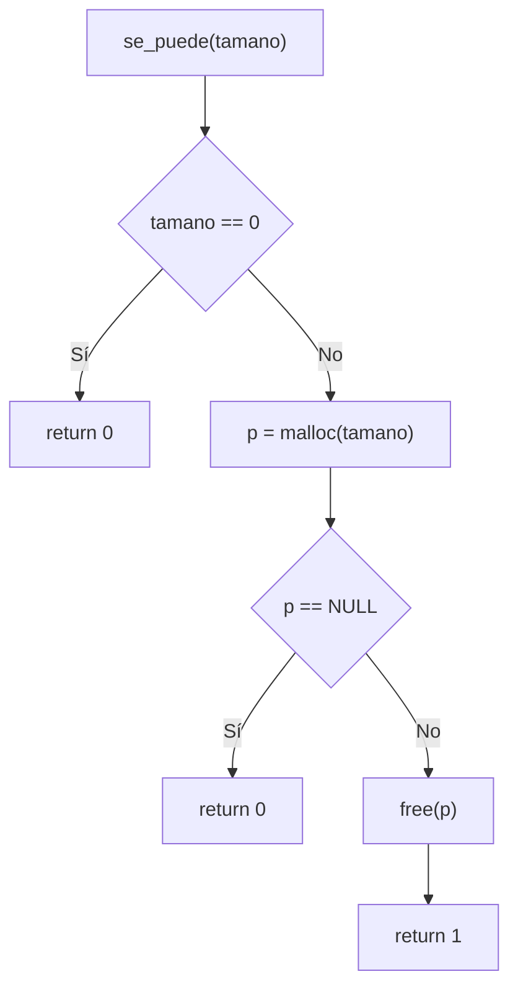
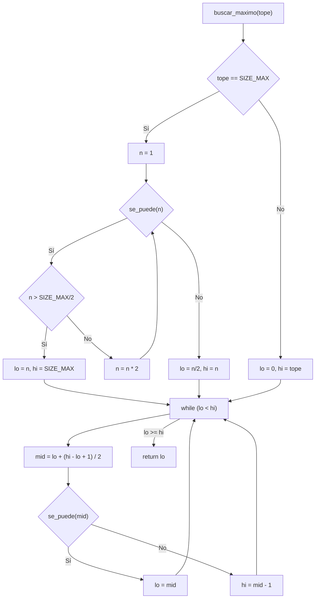
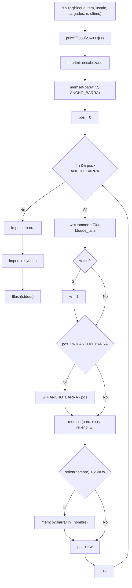
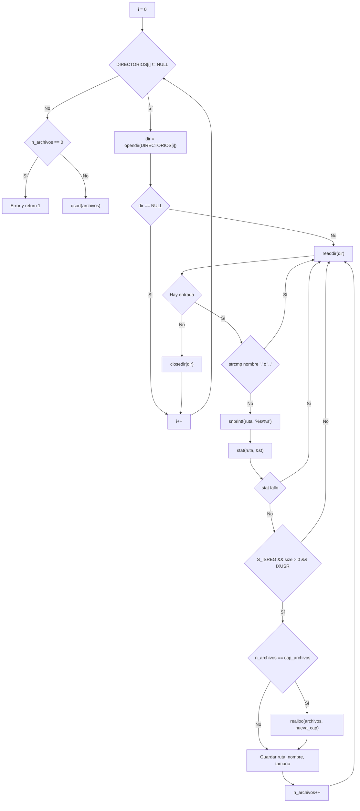
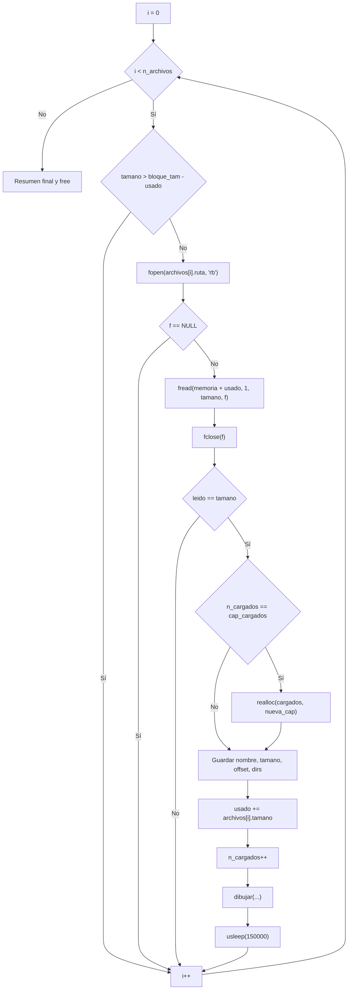
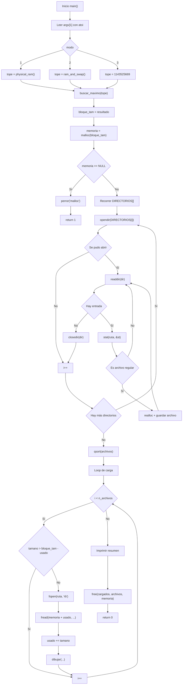
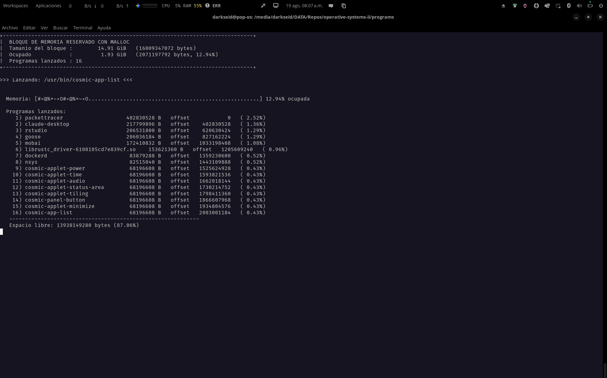
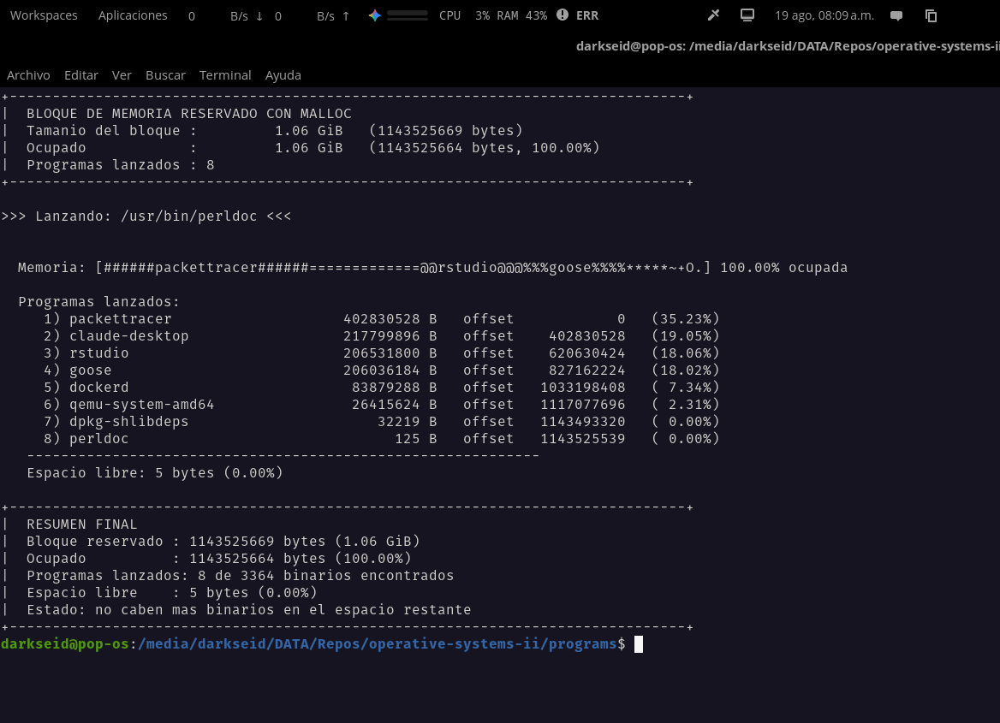
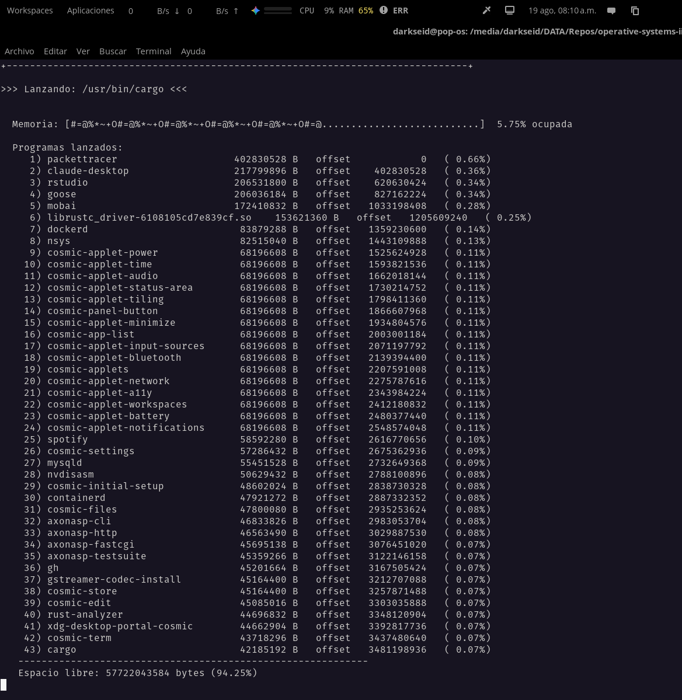

# Reporte de Programa 2 - Administración de la memoria: bloque máximo con malloc y carga de binarios

## 1. Portada

- Materia: Sistemas Operativos II
- Actividad: Programa 2 (gestión de la memoria)
- Alumno: Dante Castelán Carpinteyro
- Fecha: 19 de agosto de 2026
- Lenguaje: C (gcc 13.3.0, Linux)

## 2. Objetivo

Desarrollar un programa en C que:

1. Reserve con `malloc` el **bloque de memoria más grande** que el sistema permita utilizar, de acuerdo a un modo elegible por el usuario.
2. Recorra el disco duro con `opendir`, `readdir` y `stat` para localizar los binarios de los programas instalados.
3. Copie (cargue) esos binarios dentro del bloque reservado, ocupándolo poco a poco hasta que ya no quepa ninguno.
4. Muestre **dinámicamente en la salida, con caracteres ASCII**, qué programas van siendo "lanzados" (cargados en memoria) y cómo se va llenando el bloque.

## 3. Instrucciones de la actividad

> Haz un programa en C que obtenga el bloque de memoria RAM más grande que se permita o pueda utilizar con `malloc`, todo lo que se pueda. Luego hay que ir al disco duro y usando `opendir`, `readdir`, `stat` copiar los binarios de algunos programas en el bloque de memoria reservado, ver cuánto ocupa y subirlo. Hacer esto varias veces hasta que el bloque se llene. Que dinámicamente se vayan viendo en la salida con ASCII los programas que han sido lanzados.

## 4. Requisitos y entorno

- Sistema operativo: Linux (probado en Ubuntu 24.04).
- Compilador: gcc (C11/POSIX).
- Memoria física del equipo de prueba: `16009359360` bytes ≈ **14.91 GiB**.
- Espacio de swap del equipo de prueba: ≈ 45 GiB.
- Librerías: solo las del estándar y POSIX (`stdio.h`, `stdlib.h`, `string.h`, `stdint.h`, `dirent.h`, `sys/stat.h`, `sys/sysinfo.h`, `sys/types.h`, `unistd.h`). Sin dependencias externas.

Compilación:

```bash
cd programs
gcc -O2 -Wall -Wextra -o program-2 program-2.c
```

## 5. Implementación realizada

El programa completo vive en un solo archivo (`programs/program-2.c`, 449 líneas). A continuación se explica **todo el código en el mismo orden en que aparece en el archivo**: cabeceras, constantes, estructuras de datos, el arreglo de directorios, cada función auxiliar en su orden de aparición, y al final un recorrido detallado de `main()`.

### 5.1 Cabeceras e includes (líneas 1–9)

```c
#include <stdio.h>
#include <stdlib.h>
#include <string.h>
#include <stdint.h>
#include <dirent.h>
#include <sys/stat.h>
#include <sys/sysinfo.h>
#include <sys/types.h>
#include <unistd.h>
```

- **`<stdio.h>`** — E/S estándar (`printf`, `fprintf`, `fopen`, `fread`, `fclose`, `fflush`, `perror`). Se usa para la salida en pantalla y para leer los binarios del disco.
- **`<stdlib.h>`** — Biblioteca general (`malloc`, `free`, `realloc`, `qsort`, `atoi`). Reserva y libera el bloque grande, redimensiona arreglos dinámicos y convierte el argumento de línea de comandos.
- **`<string.h>`** — Manipulación de cadenas (`strcmp`, `strncpy`, `memset`, `memcpy`, `strlen`). Se usa para filtrar `.`/`..`, copiar rutas y construir la barra ASCII.
- **`<stdint.h>`** — Tipos de ancho fijo y constantes como `SIZE_MAX` (máximo valor de `size_t`), usada como tope "sin límite".
- **`<dirent.h>`** — Manejo de directorios (`DIR`, `struct dirent`, `opendir`, `readdir`, `closedir`). Recorre los directorios del sistema buscando binarios.
- **`<sys/stat.h>`** — Información de archivos (`struct stat`, `stat`, `S_ISREG`, `S_IXUSR`). Obtiene tipo, tamaño y permisos de cada entrada del disco.
- **`<sys/sysinfo.h>`** — Estructura `sysinfo` y función `sysinfo()`, para consultar RAM total y swap.
- **`<sys/types.h>`** — Tipos del sistema (`off_t`, usado en los tamaños de archivo).
- **`<unistd.h>`** — Funciones POSIX (`sysconf`, `usleep`). Calcula la RAM física y pausa la animación.

### 5.2 Constantes (líneas 11–13)

```c
#define ANCHO_BARRA 70
#define TAM_RUTA 1024
#define MAX_NOMBRE 256
```

- **`ANCHO_BARRA`** — ancho en caracteres de la barra de mapa de memoria que se dibuja en pantalla (70 columnas).
- **`TAM_RUTA`** — tamaño máximo del buffer para rutas completas (por ejemplo, `/usr/bin/python3.12`).
- **`MAX_NOMBRE`** — tamaño máximo del buffer para el nombre base del archivo.

### 5.3 Estructura de datos: `Archivo` (líneas 15–21)

Representa un binario encontrado en el disco, antes de cargarlo:

```c
/* Un binario encontrado en el disco */
typedef struct
{
    char ruta[TAM_RUTA];     /* Ruta completa al binario */
    char nombre[MAX_NOMBRE]; /* Nombre del archivo */
    off_t tamano;            /* Tamaño en bytes (st_size) */
} Archivo;
```

- **`ruta`** — ruta completa para poder abrirlo después con `fopen`.
- **`nombre`** — solo el nombre base, para mostrarlo en la leyenda de la barra.
- **`tamano`** — tamaño en bytes reportado por `stat` (`st_size`), de tipo `off_t` (entero grande que admite archivos de más de 2 GiB).

### 5.4 Estructura de datos: `Cargado` (líneas 23–31)

Representa un binario que ya fue copiado dentro del bloque reservado:

```c
/* Un binario ya cargado dentro del bloque de memoria */
typedef struct
{
    char nombre[MAX_NOMBRE];
    off_t tamano;
    size_t offset; /* Desfase dentro del bloque */
    void *direccion_inicial;
    void *direccion_final;
} Cargado;
```

- **`nombre`** — nombre que se muestra en la barra y en la leyenda.
- **`tamano`** — tamaño del binario en bytes.
- **`offset`** — posición de inicio dentro del bloque (`0` para el primero, y sucesivamente `usado` de cada carga).
- **`direccion_inicial`** — puntero real en el espacio de direcciones donde empieza el binario dentro del bloque (`memoria + usado`).
- **`direccion_final`** — puntero real donde termina el binario (`memoria + usado + tamano - 1`).

Estas dos direcciones permiten mostrar en la leyenda el rango exacto de memoria virtual que ocupa cada programa cargado.

### 5.5 Arreglo de directorios `DIRECTORIOS[]` (líneas 33–41)

```c
static const char *DIRECTORIOS[] = {
    "/usr/bin",
    "/usr/sbin",
    "/usr/local/bin",
    "/usr/local/sbin",
    "/usr/libexec",
    "/usr/lib",
    "/opt",
    NULL};
```

Lista terminada en `NULL` con los directorios donde Linux guarda binarios. Se recorre con un `for` estándar hasta encontrar el `NULL`. Solos en `/usr/bin` no habría binarios suficientes para llenar un bloque de ~15 GiB; con todos ellos se acumulan ≈ 28 GiB de archivos, que sí alcanzan para llenarlo. En el equipo de prueba se encontraron **3364 binarios**.

### 5.6 Función `uso` (líneas 43–51)

```c
static void uso(const char *prog)
{
    fprintf(stderr,
            "Uso: %s [modo]\n"
            "  modo 1 (por defecto): tope = RAM fisica del sistema\n"
            "  modo 2              : tope = RAM fisica + swap\n"
            "  modo 3              : sin tope (lo maximo que malloc devuelva)\n",
            prog);
}
```

Imprime en `stderr` la ayuda del programa: la forma de invocación y los tres modos disponibles. Se llama cuando el argumento no está en el rango 1–3. Usa `fprintf(stderr, ...)` en lugar de `printf` para que el mensaje de error/ayuda no se mezcle con la salida normal.

Nota: el texto de la ayuda describe el modo 3 como "sin tope", pero en `main()` el modo 3 tiene un valor hardcodeado (ver 5.13); el "sin tope" real corresponde al `default` del `switch`.

### 5.7 Función `physical_ram` (líneas 53–63)

```c
/* Total de memoria RAM fisica del sistema */
static size_t physical_ram(void)
{
    long paginas = sysconf(_SC_PHYS_PAGES);
    long tam_pagina = sysconf(_SC_PAGE_SIZE);

    if (paginas < 1 || tam_pagina < 1)
        return 0;

    return (size_t)paginas * (size_t)tam_pagina;
}
```

Calcula la RAM física total del sistema: número de páginas de memoria (`_SC_PHYS_PAGES`) multiplicado por el tamaño de cada página (`_SC_PAGE_SIZE`). Si alguna llamada falla (devuelve valores menores que 1), devuelve `0` como señal de error. Es la base del modo 1.

### 5.8 Función `ram_and_swap` (líneas 65–74)

```c
/* Total de RAM fisica + espacio de swap */
static size_t ram_and_swap(void)
{
    struct sysinfo info;

    if (sysinfo(&info) != 0)
        return 0;

    return (size_t)info.totalram + (size_t)info.totalswap;
}
```

Obtiene con `sysinfo()` la estructura que contiene los totales del sistema, y suma `totalram` (RAM física) + `totalswap` (espacio de swap). Si `sysinfo()` falla, devuelve `0`. Es la base del modo 2, que permite un bloque más grande a costa de depender del swap.

### 5.9 Función `se_puede` (líneas 76–96)

```c
static int se_puede(size_t tamano)
{
    void *p;

    if (tamano == 0)
        return 0;

    p = malloc(tamano);
    if (p == NULL)
        return 0;

    free(p);
    return 1;
}
```

"Prueba de fuego" para un tamaño dado: intenta reservar `tamano` bytes con `malloc` y, si funciona, libera de inmediato y devuelve `1`; si falla (o el tamaño es `0`), devuelve `0`. Con esto basta probar la llamada, porque con el overcommit por defecto de Linux (`vm.overcommit_memory = 0`) el propio `malloc` rechaza peticiones que exceden el límite de memoria comprometida (RAM + swap). La *utilidad real* del bloque se confirma después: cuando copiamos los binarios dentro de él estamos escribiendo en cada página, es decir, "tocando" la memoria; si el sistema no pudiera respaldarla, el programa fallaría ahí.

### 5.10 Función `buscar_maximo` (líneas 98–149)

```c
static size_t buscar_maximo(size_t tope)
{
    size_t lo, hi, mid;

    if (tope == SIZE_MAX)
    {
        size_t n = 1;

        while (1)
        {
            if (se_puede(n))
            {
                if (n > SIZE_MAX / 2)
                {
                    lo = n;
                    hi = SIZE_MAX;
                    break;
                }
                n *= 2;
            }
            else
            {
                lo = n / 2;
                hi = n;
                break;
            }
        }
    }
    else
    {
        lo = 0;
        hi = tope;
    }

    while (lo < hi)
    {
        mid = lo + (hi - lo + 1) / 2;

        if (se_puede(mid))
            lo = mid;
        else
            hi = mid - 1;
    }

    return lo;
}
```

Encuentra el tamaño máximo (≤ `tope`) que `malloc` puede reservar. La idea es que `malloc` es una función monótona: si un tamaño cabe, cualquiera menor también cabe; si uno no cabe, ninguno mayor cabrá. Por eso se usa una **búsqueda binaria** para "acorralar" el máximo muy rápido:

1. **Si no hay tope** (`tope == SIZE_MAX`): primero se duplica `1, 2, 4, ...` hasta que `se_puede` falle, para acotar el intervalo entre el último que sí cabe (`lo = n/2`) y el primero que no (`hi = n`). Se protege el desbordamiento con la condición `n > SIZE_MAX / 2`.
2. **Si hay tope** (modos 1–3): el intervalo inicial es `lo = 0`, `hi = tope`.
3. **Búsqueda binaria**: en cada paso se prueba `mid = lo + (hi - lo + 1) / 2` (redondeado hacia arriba para evitar estancamiento). Si `se_puede(mid)` es cierto, el máximo está en la mitad superior (`lo = mid`); si no, en la inferior (`hi = mid - 1`). Se repite hasta que `lo == hi`.

Devuelve `lo`, el mayor tamaño aceptado. En el equipo de prueba el modo 1 encontró **14.91 GiB (16009359360 bytes)**, justo toda la RAM física.

### 5.11 Función `comparar_desc` (líneas 151–162)

```c
/* Ordena los archivos por tamaño, de mayor a menor */
static int comparar_desc(const void *a, const void *b)
{
    off_t ta = ((const Archivo *)a)->tamano;
    off_t tb = ((const Archivo *)b)->tamano;

    if (ta > tb)
        return -1;
    if (ta < tb)
        return 1;
    return 0;
}
```

Comparador para `qsort` que ordena estructuras `Archivo` por tamaño en **orden descendente** (mayor a menor): devuelve `-1` si `a` es más grande (va antes), `1` si es más pequeño, y `0` si son iguales. Así los binarios grandes se cargan primero y los pequeños van "rellenando" el hueco que queda al final, dejando el bloque lo más lleno posible.

### 5.12 Función `dibujar` (líneas 164–240)

```c
static void dibujar(size_t bloque_tam, size_t usado,
                    const Cargado *cargados, size_t n,
                    const char *ultimo)
{
    char barra[ANCHO_BARRA + 1];
    const char *relleno = "#=@%*~+O";
    size_t pos = 0;
    size_t i;

    /* Limpiar pantalla y volver al inicio (efecto dinamico) */
    printf("\033[2J\033[H");

    printf("+-------------------------------------------------------------------------------+\n");
    printf("|  BLOQUE DE MEMORIA RESERVADO CON MALLOC\n");
    printf("|  Tamanio del bloque : %12.2f GiB   (%zu bytes)\n",
           (double)bloque_tam / (1024.0 * 1024.0 * 1024.0), bloque_tam);
    printf("|  Ocupado            : %12.2f GiB   (%zu bytes, %5.2f%%)\n",
           (double)usado / (1024.0 * 1024.0 * 1024.0), usado,
           100.0 * (double)usado / (double)bloque_tam);
    printf("|  Programas lanzados : %zu\n", n);
    printf("+-------------------------------------------------------------------------------+\n");
    printf("\n>>> Lanzando: %s <<<\n\n", ultimo);

    /* Barra de mapa de memoria */
    memset(barra, '.', ANCHO_BARRA);
    barra[ANCHO_BARRA] = '\0';

    for (i = 0; i < n && pos < ANCHO_BARRA; i++)
    {
        size_t w = (size_t)((double)cargados[i].tamano *
                            (double)ANCHO_BARRA / (double)bloque_tam);
        size_t l;

        if (w == 0)
            w = 1;
        if (pos + w > ANCHO_BARRA)
            w = ANCHO_BARRA - pos;

        memset(barra + pos, relleno[i % strlen(relleno)], w);

        /* Si el segmento es ancho, centrar el nombre del programa */
        l = strlen(cargados[i].nombre);
        if (l + 2 <= w)
        {
            size_t ini = pos + (w - l) / 2;
            memcpy(barra + ini, cargados[i].nombre, l);
        }

        pos += w;
    }

    printf("\n  Memoria: [%s] %5.2f%% ocupada\n", barra,
           100.0 * (double)usado / (double)bloque_tam);

    /* Leyenda de programas lanzados */
    printf("\n  Programas lanzados:\n");
    for (i = 0; i < n; i++)
    {
        printf("   %3zu) %-28s %12lld B   offset %12zu   inicio %p   fin %p   (%5.2f%%)\n",
               i + 1, cargados[i].nombre, (long long)cargados[i].tamano,
               cargados[i].offset,
               cargados[i].direccion_inicial, cargados[i].direccion_final,
               100.0 * (double)cargados[i].tamano / (double)bloque_tam);
    }

    printf("   ------------------------------------------------------------\n");
    printf("   Espacio libre: %zu bytes (%.2f%%)\n",
           bloque_tam - usado,
           100.0 * (double)(bloque_tam - usado) / (double)bloque_tam);

    fflush(stdout);
}
```

Dibuja en pantalla la vista ASCII del estado actual del bloque. Se llama después de cargar cada binario y hace cuatro cosas:

1. **Limpia la pantalla** con la secuencia de escape `\033[2J\033[H` (borra todo y coloca el cursor arriba a la izquierda), lo que produce el efecto de animación dinámica.
2. **Recuadro de encabezado**: tamaño total del bloque en GiB y bytes, bytes ocupados, porcentaje, número de programas lanzados, y la línea `>>> Lanzando: <ruta> <<<` con el último binario cargado.
3. **Barra de mapa de memoria** de `ANCHO_BARRA` (70) caracteres:
   - Primero se llena entera con puntos `.` (espacio libre) usando `memset`.
   - Luego, para cada programa cargado, se calcula su ancho con una regla de tres: `w = tamano * 70 / bloque_tam`. Se garantiza `w ≥ 1` (todo programa ocupa al menos un carácter) y que no se desborde de la barra.
   - El segmento se rellena con un carácter de la cadena `"#=@%*~+O"` (ciclando con `i % 8`), para distinguir visualmente programas consecutivos.
   - Si el segmento es lo bastante ancho (`strlen(nombre) + 2 <= w`), el nombre del programa se centra dentro del segmento con `memcpy`. En los segmentos angostos solo se ve el carácter de relleno.
4. **Leyenda**: lista cada programa con número, nombre, tamaño en bytes, `offset` dentro del bloque, dirección inicial, dirección final y porcentaje que ocupa; al final, el espacio libre en bytes y porcentaje. `fflush(stdout)` fuerza la escritura inmediata para que la animación no se atrase.

### 5.13 Función `main` — recorrido completo (líneas 242–450)

#### Variables locales (líneas 242–258)

```c
int main(int argc, char **argv)
{
    int modo = 1;
    size_t tope;
    size_t bloque_tam;
    unsigned char *memoria;
    size_t i;

    Archivo *archivos = NULL;
    size_t n_archivos = 0;
    size_t cap_archivos = 0;

    Cargado *cargados = NULL;
    size_t n_cargados = 0;
    size_t cap_cargados = 0;

    size_t usado = 0;
```

- **`modo`** — modo elegido por el usuario (por defecto `1`).
- **`tope`** — límite superior en bytes para la búsqueda del bloque máximo.
- **`bloque_tam`** — tamaño final del bloque que se va a reservar.
- **`memoria`** — puntero al bloque grande reservado con `malloc`.
- **`archivos` / `n_archivos` / `cap_archivos`** — arreglo dinámico de `Archivo` con los binarios encontrados: puntero, cuántos hay y cuánta capacidad tiene asignada (patrón de arreglo dinámico con `realloc`, se duplica la capacidad al llenarse; inicia en capacidad 1024).
- **`cargados` / `n_cargados` / `cap_cargados`** — mismo patrón pero para los `Cargado` ya copiados al bloque (capacidad inicial 64).
- **`usado`** — cuántos bytes del bloque ya están ocupados; funciona como el "offset de escritura" siguiente (`memoria + usado`).

#### Lectura del argumento de línea de comandos (líneas 260–268)

```c
if (argc > 1)
{
    modo = atoi(argv[1]);
    if (modo < 1 || modo > 3)
    {
        uso(argv[0]);
        return 1;
    }
}
```

Si se pasó un argumento, se convierte con `atoi` y se valida que esté en el rango 1–3; si no, se muestra la ayuda (`uso`) y se termina con código 1. Si no hay argumento, se queda con `modo = 1`.

#### Selección del tope según el modo (líneas 270–284)

```c
switch (modo)
{
case 1:
    tope = physical_ram();
    break;
case 2:
    tope = ram_and_swap();
    break;
case 3:
    tope = 1143525669; // Aquí hardcodeo un valor
    break;
default:
    tope = SIZE_MAX;
    break;
}
```

- **Modo 1 (por defecto):** tope = RAM física. Busca el bloque más grande *utilizable* dentro de la RAM física real. Es seguro: al tocar la memoria no se excede la RAM y no hay riesgo de thrashing ni OOM.
- **Modo 2:** tope = RAM + swap. El bloque puede ser mucho mayor (~57 GiB en el equipo de prueba), pero llenarlo entero implica pasar gigabytes por el swap y el sistema puede volverse muy lento.
- **Modo 3:** tope hardcodeado en bytes (`1143525669` ≈ 1.07 GiB). Útil para hacer pruebas rápidas y verificar el funcionamiento del programa sin reservar 15 GiB.
- **`default`:** `SIZE_MAX` (sin tope teórico); nunca se alcanza con la validación de `argc`, pero queda por robustez.

```bash
./program-2        # modo 1 (por defecto): tope = RAM física (~14.91 GiB aquí)
./program-2 2      # modo 2: RAM + swap (~57 GiB aquí)
./program-2 3      # modo 3: tope hardcodeado (~1.07 GiB)
```

#### Cálculo y reserva del bloque máximo (líneas 286–305)

```c
printf("Calculando el bloque de memoria mas grande utilizable con malloc...\n");
fflush(stdout);

bloque_tam = buscar_maximo(tope);
if (bloque_tam == 0)
{
    fprintf(stderr, "No se pudo reservar memoria.\n");
    return 1;
}

memoria = (unsigned char *)malloc(bloque_tam);
if (memoria == NULL)
{
    perror("malloc");
    return 1;
}

printf("Bloque reservado: %.2f GiB (%zu bytes) en %p\n\n",
       (double)bloque_tam / (1024.0 * 1024.0 * 1024.0), bloque_tam,
       (void *)memoria);
```

1. Se avisa que se está calculando el máximo (con `fflush` para que el mensaje se vea antes de la pausa del cálculo).
2. `buscar_maximo(tope)` devuelve el mayor tamaño aceptable; si devuelve `0`, hubo error y se sale con código 1.
3. Se hace la **reserva definitiva** con `malloc(bloque_tam)` y se verifica que no sea `NULL` (con `perror` si falla).
4. Se imprime el tamaño del bloque en GiB y la dirección base donde quedó (`%p`).

#### Recorrido del disco: buscar binarios (líneas 307–369)

```c
for (i = 0; DIRECTORIOS[i] != NULL; i++)
{
    DIR *dir = opendir(DIRECTORIOS[i]);
    struct dirent *entrada;

    if (dir == NULL)
        continue;

    while ((entrada = readdir(dir)) != NULL)
    {
        char ruta[TAM_RUTA];
        struct stat st;

        if (strcmp(entrada->d_name, ".") == 0 ||
            strcmp(entrada->d_name, "..") == 0)
            continue;

        snprintf(ruta, sizeof(ruta), "%s/%s",
                 DIRECTORIOS[i], entrada->d_name);

        if (stat(ruta, &st) != 0)
            continue;

        if (!S_ISREG(st.st_mode) || st.st_size <= 0 || !(st.st_mode & S_IXUSR))
            continue;

        if (n_archivos == cap_archivos)
        {
            size_t nueva_cap = cap_archivos ? cap_archivos * 2 : 1024;
            Archivo *tmp = (Archivo *)realloc(archivos,
                                              nueva_cap * sizeof(Archivo));
            if (tmp == NULL)
            {
                perror("realloc");
                continue;
            }
            archivos = tmp;
            cap_archivos = nueva_cap;
        }

        strncpy(archivos[n_archivos].ruta, ruta, TAM_RUTA - 1);
        archivos[n_archivos].ruta[TAM_RUTA - 1] = '\0';
        strncpy(archivos[n_archivos].nombre, entrada->d_name,
                MAX_NOMBRE - 1);
        archivos[n_archivos].nombre[MAX_NOMBRE - 1] = '\0';
        archivos[n_archivos].tamano = st.st_size;
        n_archivos++;
    }

    closedir(dir);
}

if (n_archivos == 0)
{
    fprintf(stderr, "No se encontraron binarios en el disco.\n");
    free(memoria);
    return 1;
}
```

Paso a paso:

1. **Bucle externo** sobre el arreglo `DIRECTORIOS[]` hasta el `NULL` final. Para cada directorio, `opendir`; si falla (no existe o sin permisos), se salta con `continue`.
2. **Bucle interno** `readdir`: lee cada entrada del directorio.
3. **Filtro de `.` y `..`**: se descartan las entradas de directorio actual y padre con `strcmp`.
4. **Ruta completa**: se arma con `snprintf("%s/%s", directorio, nombre)`, que además limita el tamaño al del buffer.
5. **`stat(ruta, &st)`**: obtiene los metadatos del archivo; si falla, se salta.
6. **Filtro de tipo y permisos**: tres condiciones en un solo `if`:
   - `S_ISREG(st.st_mode)` verifica que sea un archivo regular (no un directorio, enlace ni dispositivo).
   - `st.st_size <= 0` descarta archivos vacíos.
   - `!(st.st_mode & S_IXUSR)` descarta los que **no son ejecutables por el dueño**: el bit `S_IXUSR` (bit de ejecución del propietario dentro de `st.st_mode`) debe estar encendido. Así solo se copian binarios realmente ejecutables al bloque, no librerías, datos ni otros archivos que ocurra a tener en esos directorios.
7. **Arreglo dinámico**: si `n_archivos == cap_archivos` (el arreglo está lleno), se duplica la capacidad con `realloc` (primera vez: 1024). Si `realloc` falla, se reporta y se continúa con el siguiente archivo.
8. **Copia de datos**: `strncpy` copia ruta y nombre con terminación `NULL` explícita (por seguridad, en la última posición), y se guarda `st.st_size` como tamaño. Luego `n_archivos++`.
9. `closedir(dir)` al terminar cada directorio.
10. Si tras recorrer todo no se encontró ningún binario, se libera `memoria` y se sale con error.

#### Ordenamiento (líneas 371–376)

```c
/* Ordenar de mayor a menor para llenar mejor el bloque */
qsort(archivos, n_archivos, sizeof(Archivo), comparar_desc);

printf("Binarios encontrados en el disco: %zu\n", n_archivos);
printf("Cargando programas hasta llenar el bloque...\n\n");
fflush(stdout);
```

Se ordenan los `n_archivos` encontrados con `qsort` usando el comparador `comparar_desc` (mayor a menor), y se imprime cuántos binarios hay antes de empezar la carga.

#### Carga de binarios hasta llenar el bloque (líneas 378–425)

```c
for (i = 0; i < n_archivos; i++)
{
    FILE *f;
    size_t leido;

    if (archivos[i].tamano > (off_t)(bloque_tam - usado))
        continue;

    f = fopen(archivos[i].ruta, "rb");
    if (f == NULL)
        continue;

    leido = fread(memoria + usado, 1, (size_t)archivos[i].tamano, f);
    fclose(f);

    if (leido != (size_t)archivos[i].tamano)
        continue;

    if (n_cargados == cap_cargados)
    {
        size_t nueva_cap = cap_cargados ? cap_cargados * 2 : 64;
        Cargado *tmp = (Cargado *)realloc(cargados,
                                          nueva_cap * sizeof(Cargado));
        if (tmp == NULL)
        {
            perror("realloc");
            break;
        }
        cargados = tmp;
        cap_cargados = nueva_cap;
    }

    strncpy(cargados[n_cargados].nombre, archivos[i].nombre,
            MAX_NOMBRE - 1);
    cargados[n_cargados].nombre[MAX_NOMBRE - 1] = '\0';
    cargados[n_cargados].tamano = archivos[i].tamano;
    cargados[n_cargados].offset = usado;
    cargados[n_cargados].direccion_inicial = memoria + usado;
    cargados[n_cargados].direccion_final =
        memoria + usado + (size_t)archivos[i].tamano - 1;

    usado += (size_t)archivos[i].tamano;
    n_cargados++;

    dibujar(bloque_tam, usado, cargados, n_cargados, archivos[i].ruta);
    usleep(150000);
}
```

El ciclo itera sobre **todos** los binarios ordenados y, para cada uno:

1. **¿Cabe?** — si `tamano > bloque_tam - usado`, no queda espacio: se salta con `continue` (prueba con el siguiente, quizás más pequeño).
2. **Abrir** — `fopen(ruta, "rb")` en modo lectura binaria; si falla, se salta.
3. **Copiar al bloque** — `fread(memoria + usado, 1, tamano, f)` escribe los bytes del archivo directamente en el bloque, en la posición `usado` (que funciona como desfase/offset acumulado). Luego `fclose(f)`.
4. **Validar lectura** — si `leido != tamano` la lectura fue incompleta y no se registra el programa (se salta).
5. **Registrar en `cargados[]`** — mismo patrón de arreglo dinámico con `realloc` (capacidad inicial 64, se duplica). Se copian nombre y tamaño, se guarda el `offset` (= `usado` antes de avanzar), y las direcciones inicial y final reales dentro del bloque: `memoria + usado` y `memoria + usado + tamano - 1`.
6. **Avanzar el cursor** — `usado += tamano` y `n_cargados++`.
7. **Animar** — `dibujar(...)` redibuja toda la pantalla con el nuevo estado, y `usleep(150000)` pausa 150 ms (0.15 s) para que se aprecie la animación antes del siguiente binario.

El ciclo termina cuando ya no queda ningún binario que quepa en el espacio restante (o se acaban los archivos). La carga es "primero en entrar, contiguo": no hay huecos, cada binario empieza exactamente donde terminó el anterior.

#### Resumen final y liberación (líneas 427–449)

```c
/* Resumen final */
printf("\n+-------------------------------------------------------------------------------+\n");
printf("|  RESUMEN FINAL\n");
printf("|  Bloque reservado : %zu bytes (%.2f GiB)\n", bloque_tam,
       (double)bloque_tam / (1024.0 * 1024.0 * 1024.0));
printf("|  Ocupado          : %zu bytes (%.2f%%)\n", usado,
       100.0 * (double)usado / (double)bloque_tam);
printf("|  Programas lanzados: %zu de %zu binarios encontrados\n",
       n_cargados, n_archivos);
printf("|  Espacio libre    : %zu bytes (%.2f%%)\n",
       bloque_tam - usado,
       100.0 * (double)(bloque_tam - usado) / (double)bloque_tam);
if (usado == bloque_tam)
    printf("|  Estado: BLOQUE LLENO\n");
else
    printf("|  Estado: no caben mas binarios en el espacio restante\n");
printf("+-------------------------------------------------------------------------------+\n");

free(cargados);
free(archivos);
free(memoria);

return 0;
```

Al terminar la carga se imprime un recuadro con el resumen: tamaño del bloque, bytes y porcentaje ocupados, cuántos programas se lanzaron de los binarios encontrados, espacio libre, y el estado final (`BLOQUE LLENO` solo si `usado == bloque_tam` exactamente; en la práctica termina con "no caben más binarios" porque siempre queda un hueco menor que el siguiente archivo). Finalmente se libera toda la memoria en orden inverso: el arreglo `cargados`, el arreglo `archivos` y el bloque grande `memoria`, y se devuelve `0`.

### 5.14 Funciones del sistema utilizadas

A continuación se describen las funciones del sistema y de la biblioteca estándar que el programa usa para reservar memoria, recorrer archivos del disco y cargar contenido en el bloque.

#### `fflush()`

La función `fflush()` fuerza la escritura de cualquier dato pendiente en un flujo de salida.

- Requerimiento: incluir `<stdio.h>`.
- Parámetros: recibe un puntero a `FILE *` (por ejemplo, `stdout`).
- Valor de retorno: devuelve 0 si tuvo éxito o `EOF` si ocurre un error.

#### `malloc()`

La función `malloc()` en C reserva memoria dinámica en tiempo de ejecución.

- Requerimiento: incluir `<stdlib.h>`.
- Parámetros: recibe la cantidad de bytes a reservar.
- Valor de retorno: devuelve un puntero al bloque asignado o `NULL` si falla.

#### `free()`

La función `free()` libera memoria previamente reservada con `malloc()`.

- Requerimiento: incluir `<stdlib.h>`.
- Parámetros: recibe el puntero devuelto por `malloc()`.
- Valor de retorno: no devuelve nada.

#### `opendir()`

La función `opendir()` abre un directorio para su lectura.

- Requerimiento: incluir `<dirent.h>`.
- Parámetros: recibe la ruta del directorio a abrir.
- Valor de retorno: devuelve un puntero `DIR` o `NULL` si falla.

#### `readdir()`

La función `readdir()` lee la siguiente entrada del directorio abierto.

- Requerimiento: incluir `<dirent.h>`.
- Parámetros: recibe el puntero a `DIR` del directorio.
- Valor de retorno: devuelve `struct dirent *` con la siguiente entrada, o `NULL` al final.

#### `closedir()`

La función `closedir()` cierra un directorio que fue abierto con `opendir()`.

- Requerimiento: incluir `<dirent.h>`.
- Parámetros: recibe el puntero `DIR`.
- Valor de retorno: devuelve 0 si se cerró correctamente o `-1` en caso de error.

#### `stat()`

La función `stat()` obtiene información de un archivo o ruta, como tipo, tamaño y permisos.

- Requerimiento: incluir `<sys/stat.h>`.
- Parámetros: recibe la ruta del archivo y un puntero a `struct stat`.
- Valor de retorno: devuelve 0 si tuvo éxito o `-1` si ocurre un error.

#### `strcmp()`

La función `strcmp()` compara dos cadenas de caracteres.

- Requerimiento: incluir `<string.h>`.
- Parámetros: recibe dos cadenas `const char *`.
- Valor de retorno: devuelve 0 si son iguales, un valor negativo si la primera es menor, o positivo si la primera es mayor.

#### `strncpy()`

La función `strncpy()` copia hasta `n` caracteres de una cadena a otra, garantizando que no se desborde el buffer de destino.

- Requerimiento: incluir `<string.h>`.
- Parámetros: destino, origen y máximo de caracteres a copiar.
- Valor de retorno: devuelve el puntero al destino. El programa siempre termina la cadena con `'\0'` manualmente en la última posición, porque `strncpy` no garantiza el terminador si el origen es más largo que `n`.

#### `snprintf()`

La función `snprintf()` escribe una cadena formateada en un buffer con límite de tamaño, evitando desbordamientos.

- Requerimiento: incluir `<stdio.h>`.
- Parámetros: buffer, tamaño del buffer, formato y argumentos.
- Valor de retorno: devuelve el número de caracteres que se habrían escrito (sin contar `'\0'`).

#### `memset()`

La función `memset()` establece un byte dado en los primeros `n` bytes de un bloque de memoria.

- Requerimiento: incluir `<string.h>`.
- Parámetros: puntero destino, valor byte (0–255) y cantidad de bytes.
- Valor de retorno: devuelve el puntero destino. Se usa para rellenar la barra con `'.'` y los segmentos con caracteres ASCII.

#### `memcpy()`

La función `memcpy()` copia `n` bytes de un bloque de memoria a otro.

- Requerimiento: incluir `<string.h>`.
- Parámetros: destino, origen y cantidad de bytes.
- Valor de retorno: devuelve el puntero destino. Se usa para centrar el nombre del programa dentro de su segmento de la barra.

#### `strlen()`

La función `strlen()` calcula la longitud de una cadena (sin contar el `'\0'`).

- Requerimiento: incluir `<string.h>`.
- Parámetros: la cadena.
- Valor de retorno: devuelve la longitud en bytes.

#### `realloc()`

La función `realloc()` cambia el tamaño de un bloque de memoria previamente reservado con `malloc()` o `realloc()`.

- Requerimiento: incluir `<stdlib.h>`.
- Parámetros: recibe dos argumentos: un puntero a un bloque de memoria anterior, y el tamaño nuevo en bytes.
- Valor de retorno: devuelve un puntero al bloque redimensionado o `NULL` si falla. El programa siempre asigna el resultado a una variable temporal `tmp` y solo reemplaza el puntero original si `tmp` no es `NULL`, para no perder la referencia si falla.

#### `qsort()`

La función `qsort()` ordena un arreglo con un criterio definido por el programador.

- Requerimiento: incluir `<stdlib.h>`.
- Parámetros: recibe el arreglo, el número de elementos, el tamaño de cada elemento y una función comparadora.
- Valor de retorno: no devuelve nada.

#### `fopen()`

La función `fopen()` abre un archivo para lectura o escritura.

- Requerimiento: incluir `<stdio.h>`.
- Parámetros: recibe la ruta del archivo y el modo de apertura (`"rb"`, `"r"`, etc.).
- Valor de retorno: devuelve un apuntador a `FILE` o `NULL` si falla.

#### `fread()`

La función `fread()` lee bloques de bytes desde un archivo abierto.

- Requerimiento: incluir `<stdio.h>`.
- Parámetros: recibe el buffer destino, tamaño de cada elemento, cantidad de elementos y el flujo `FILE *`.
- Valor de retorno: devuelve la cantidad de elementos leídos.

#### `fclose()`

La función `fclose()` cierra un archivo abierto con `fopen()`.

- Requerimiento: incluir `<stdio.h>`.
- Parámetros: recibe el puntero `FILE *`.
- Valor de retorno: devuelve 0 si se cerró bien o `EOF` si hubo error.

#### `atoi()`

La función `atoi()` convierte una cadena a entero.

- Requerimiento: incluir `<stdlib.h>`.
- Parámetros: la cadena a convertir.
- Valor de retorno: devuelve el entero resultado (0 si la cadena no es numérica).

#### `sysconf()`

La función `sysconf()` consulta valores de configuración del sistema y de la plataforma.

- Requerimiento: incluir `<unistd.h>`.
- Parámetros: recibe una constante como `_SC_PHYS_PAGES` o `_SC_PAGE_SIZE`.
- Valor de retorno: devuelve el valor pedido o `-1` si falla.

#### `sysinfo()`

La función `sysinfo()` llena una estructura `sysinfo` con estadísticas del sistema (RAM, swap, cargas, etc.).

- Requerimiento: incluir `<sys/sysinfo.h>`.
- Parámetros: puntero a `struct sysinfo` a rellenar.
- Valor de retorno: devuelve 0 si tuvo éxito o `-1` si falla.

#### `usleep()`

La función `usleep()` suspende la ejecución durante microsegundos.

- Requerimiento: incluir `<unistd.h>`.
- Parámetros: tiempo en microsegundos (`150000` = 150 ms).
- Valor de retorno: devuelve 0 si completó, o `-1` si fue interrumpida.

### 5.15 Funciones auxiliares (propias) — resumen

A continuación se describen brevemente las funciones auxiliares implementadas en el programa, sus parámetros y la salida que producen.

#### `uso(const char *prog)`
- Qué hace: Muestra en pantalla (stderr) la forma de uso del programa y los modos disponibles.
- Parámetros: `prog` — cadena con el nombre del ejecutable (normalmente `argv[0]`).
- Salida: Imprime el mensaje de ayuda en `stderr`. No devuelve valor (función `void`).

#### `physical_ram(void)`
- Qué hace: Calcula y devuelve la cantidad de memoria RAM física total del sistema.
- Parámetros: ninguno.
- Salida: devuelve un `size_t` con el número de bytes de RAM física (0 en caso de error).

#### `ram_and_swap(void)`
- Qué hace: Obtiene la suma de la RAM física y el espacio de swap disponible mediante `sysinfo`.
- Parámetros: ninguno.
- Salida: devuelve un `size_t` con la cantidad total de bytes (RAM + swap), o 0 si falla.

#### `se_puede(size_t tamano)`
- Qué hace: Prueba si `malloc` puede reservar un bloque de `tamano` bytes (reserva y libera inmediatamente).
- Parámetros: `tamano` — número de bytes a comprobar.
- Salida: devuelve `1` si la reserva tuvo éxito (se puede), `0` si no (o si `tamano == 0`).

#### `buscar_maximo(size_t tope)`
- Qué hace: Encuentra el tamaño máximo utilizable por `malloc` menor o igual a `tope`. Si `tope == SIZE_MAX` primero expande por duplicación para acotar el intervalo y luego usa búsqueda binaria.
- Parámetros: `tope` — límite superior para la búsqueda (puede ser `SIZE_MAX` para indicar sin tope).
- Salida: devuelve un `size_t` con el mayor número de bytes que `malloc` acepta y que además es práctico de usar.

#### `comparar_desc(const void *a, const void *b)`
- Qué hace: Comparador para `qsort` que ordena estructuras `Archivo` por tamaño de mayor a menor.
- Parámetros: punteros genéricos a dos elementos del arreglo a comparar.
- Salida: devuelve `-1`, `0` o `1` según el contrato de `qsort` para indicar el orden relativo.

#### `dibujar(size_t bloque_tam, size_t usado, const Cargado *cargados, size_t n, const char *ultimo)`
- Qué hace: Dibuja en la salida estándar una vista ASCII del bloque reservado: encabezado con estadísticas, barra proporcional de 70 caracteres y leyenda de programas cargados.
- Parámetros:
    - `bloque_tam` — tamaño total del bloque en bytes.
    - `usado` — bytes ya ocupados dentro del bloque.
    - `cargados` — arreglo de `Cargado` con los programas cargados.
    - `n` — número de entradas válidas en `cargados`.
    - `ultimo` — ruta del último binario cargado (cadena para mostrar en el encabezado).
- Salida: imprime en `stdout` la representación ASCII del estado de la memoria y la leyenda; no devuelve valor (función `void`).

## 6. Diagramas de flujo

### 6.1 Función `se_puede()`



### 6.2 Búsqueda binaria `buscar_maximo()`



### 6.3 Función `dibujar()`



### 6.4 Búsqueda de archivos en disco (en `main`)



### 6.5 Carga de binarios al bloque (en `main`)



### 6.6 Flujo principal `main()`



## 7. Ejecución

```bash
cd programs
gcc -O2 -Wall -Wextra -o program-2 program-2.c
./program-2
```

## 8. Corridas y evidencias

### Evidencia 1 - Reserva del bloque máximo de memoria

Al arrancar, el programa calcula y reserva el bloque más grande posible. En el equipo de prueba el modo 1 reservó **14.91 GiB (16009359360 bytes)**.



### Evidencia 2 - Comienzo de la carga de binarios

Se muestran los binarios encontrados en el disco (3364) y la pantalla empieza a dibujarse dinámicamente: recuadro con datos, barra de memoria y el mensaje `>>> Lanzando: <binario> <<<`.



### Evidencia 3 - El bloque se va llenando

Conforme avanzan las iteraciones, la barra muestra más segmentos (cada uno con su carácter ASCII y su nombre) y la leyenda va creciendo con los programas lanzados y su desfase dentro del bloque.



## 9. Cumplimiento del enunciado

- Obtiene el bloque de memoria RAM más grande que `malloc` permite usar: cumplido (búsqueda binaria según modo 1/2/3).
- Recorre el disco duro con `opendir`, `readdir` y `stat`: cumplido (7 directorios del sistema; solo se aceptan archivos regulares, con tamaño > 0 y bit `S_IXUSR` de ejecución).
- Copia los binarios de los programas dentro del bloque reservado: cumplido (`fopen`/`fread` sobre el bloque).
- Ve cuánto ocupa y lo sube/carga: cumplido (muestra bytes ocupados y porcentaje).
- Lo repite hasta que el bloque se llena: cumplido (carga mientras quepa espacio; termina cuando ya no cabe ningún binario).
- Visualización dinámica ASCII de los programas lanzados: cumplido (barra de mapa de memoria, leyenda y `>>> Lanzando <<<`).

## 10. Bitácora de prompts

**Instrucción**: Registra todo lo que se pregunta a la IA para realizar cada una de las partes del programa.

| # | Promt textual                                                                                                                                                                                          | ¿Sirve? | LLM / Agente |
| - | ------------------------------------------------------------------------------------------------------------------------------------------------------------------------------------------------------ | -------- | ------------ |
| 1 | "¿Cómo se usan`opendir`, `readdir` y `stat` en C?"                                                                                                                                             | ✅       | Gemini       |
| 2 | "¿Qué variables del sistema puedo usar para determinar usando`C` estándar la RAM de mi laptop? Necesito conocer la física, la swap, la física y la swap"                                        | ✅       | Gemini       |
| 3 | "Dime todas las rutas desde las cuales puedo copiar binarios. Imagino que son las de sistema como /bin, /usr/bin, etc. Es tos archivos tendrán que ser revisados y copiados con C, ¿usaremos fread?" | ✅       | Gemini       |

**Nota**: Gemini es mi LLM favorito y con su capacidad de "recordar" (almacenar en memoria) información sobre mí, mi uso, mi perfil de estudio, ya me responde con contexto útil. Por ejemplo, siempre que pregunto sobre algo en mi computadora, orienta su respuesta a solucionar o diagnosticar en sistemas Linux, porque no uso Windows, y lo sabe.

- ¿Qué hace el programa, utiliza frases cortas?
- ¿Qué parte aún no se entiende al 100%?
- ¿Qué sucede en memoria/sistema?

## 11. Conclusión

El programa simula de forma muy cercana lo que hace un administrador de memoria en multiprogramación: un único bloque contiguo (la memoria principal) que se va repartiendo entre los programas que se cargan desde la memoria secundaria (el disco). La búsqueda binaria aprovecha que `malloc` es una función monótona y encuentra el máximo muy rápido, y el uso de `opendir`/`readdir`/`stat` permite leer el directorio de archivos del sistema tal como lo haría un cargador real.

La parte más interesante fue decidir cómo verificar que el bloque realmente se puede usar: en lugar de tocar cada página en cada prueba (muy lento cerca del máximo), se confía en el overcommit por defecto de Linux, que hace que `malloc` rechace peticiones imposibles, y la propia copia de los binarios confirma que la memoria es real. La visualización en ASCII hace evidente cómo los programas se van "lanzando" y cómo el espacio libre se reduce hasta que el bloque queda lleno.

## 12. Anexo - Comandos usados

```bash
# Compilar
cd programs
gcc -O2 -Wall -Wextra -o program-2 program-2.c

# Ejecutar (modo 1 por defecto: RAM física)
./program-2

# Otros modos
./program-2 2   # RAM + swap
./program-2 3   # tope hardcodeado (en bytes)

# Ver memoria del sistema
free -h
cat /proc/sys/vm/overcommit_memory
```
