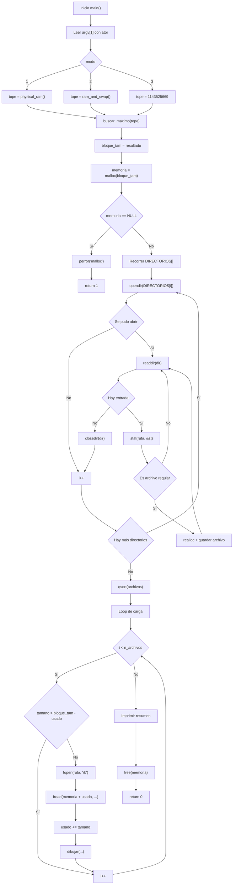
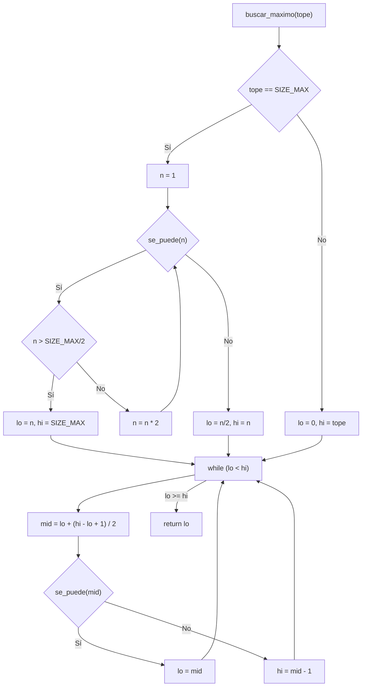
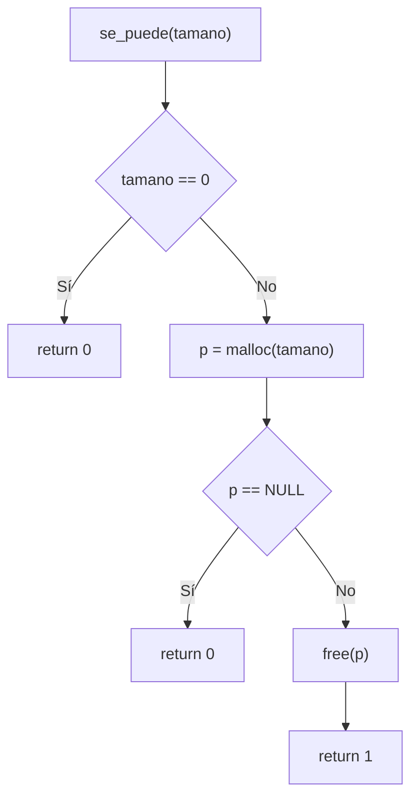
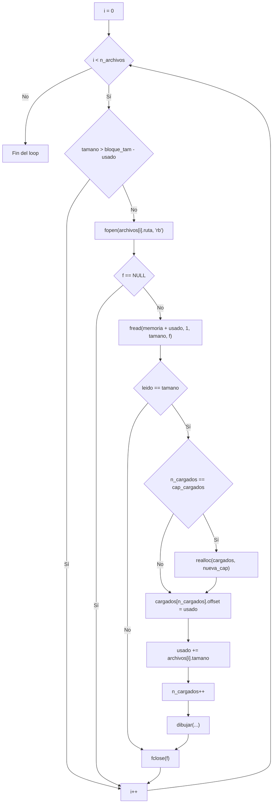
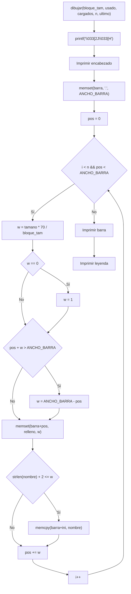
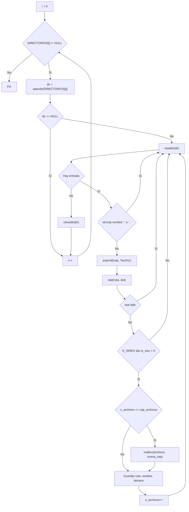

# Reporte de Programa 2 - Administración de la memoria: bloque máximo con malloc y carga de binarios

## 1. Portada

- Materia: Sistemas Operativos II
- Actividad: Programa 2 (gestión de la memoria)
- Alumno: Dante Castelán Carpinteyro
- Fecha: 19 de agosto de 2026
- Lenguaje: C (gcc 13.3.0, Linux)

## 2. Objetivo

Desarrollar un programa en C que:

1. Reserve con `malloc` el **bloque de memoria más grande** que el sistema permita utilizar, de acuerdo a un modo elegible por el usuario.
2. Recorra el disco duro con `opendir`, `readdir` y `stat` para localizar los binarios de los programas instalados.
3. Copie (cargue) esos binarios dentro del bloque reservado, ocupándolo poco a poco hasta que ya no quepa ninguno.
4. Muestre **dinámicamente en la salida, con caracteres ASCII**, qué programas van siendo "lanzados" (cargados en memoria) y cómo se va llenando el bloque.

## 3. Instrucciones de la actividad

> Haz un programa en C que obtenga el bloque de memoria RAM más grande que se permita o pueda utilizar con `malloc`, todo lo que se pueda. Luego hay que ir al disco duro y usando `opendir`, `readdir`, `stat` copiar los binarios de algunos programas en el bloque de memoria reservado, ver cuánto ocupa y subirlo. Hacer esto varias veces hasta que el bloque se llene. Que dinámicamente se vayan viendo en la salida con ASCII los programas que han sido lanzados.

## 4. Requisitos y entorno

- Sistema operativo: Linux (probado en Ubuntu 24.04).
- Compilador: gcc (C11/POSIX).
- Memoria física del equipo de prueba: `16009359360` bytes ≈ **14.91 GiB**.
- Espacio de swap del equipo de prueba: ≈ 45 GiB.
- Librerías: solo las del estándar y POSIX (`stdio.h`, `stdlib.h`, `string.h`, `stdint.h`, `dirent.h`, `sys/stat.h`, `sys/sysinfo.h`, `sys/types.h`, `unistd.h`). Sin dependencias externas.

Compilación:

```bash
cd programs
gcc -O2 -Wall -Wextra -o program-2 program-2.c
```

## 5. Implementación realizada

El programa tiene tres grandes etapas, y cada una se explica a continuación con su código relevante.

### 5.1 Calcular el bloque de memoria más grande que `malloc` puede otorgar

Primero se obtienen los límites del sistema:

- **RAM física**: `sysconf(_SC_PHYS_PAGES) * sysconf(_SC_PAGE_SIZE)`.
- **RAM + swap**: estructura `sysinfo` (campos `totalram` y `totalswap`).

Según el modo elegido en la línea de comandos (`1`, `2` o `3`) se fija un tope:

```c
switch (modo) {
    case 1:  tope = physical_ram();      break;   /* por defecto: RAM física */
    case 2:  tope = ram_and_swap();      break;   /* RAM + swap              */
    case 3:  tope = 1143525669; 	 break;   /* Hardcodeo un valor máximo */
    default: tope = SIZE_MAX;          break;   /* sin tope                */
}
```

Con ese tope se hace una **búsqueda binaria** sobre el tamaño. La idea es que `malloc` es una función monótona: si un tamaño cabe, cualquiera menor también cabe; si uno no cabe, ninguno mayor cabrá. Por eso podemos "acorralar" el máximo muy rápido:

```c
static int se_puede(size_t tamano) {
    void *p;

    if (tamano == 0)
        return 0;

    p = malloc(tamano);
    if (p == NULL)
        return 0;

    free(p);
    return 1;
}

static size_t buscar_maximo(size_t tope) {
    size_t lo, hi, mid;

    /* Sin tope: primero duplicar 1, 2, 4... hasta fallar */
    if (tope == SIZE_MAX) {
        size_t n = 1;
        while (1) {
            if (se_puede(n)) {
                if (n > SIZE_MAX / 2) { lo = n; hi = SIZE_MAX; break; }
                n *= 2;
            } else {
                lo = n / 2; hi = n; break;
            }
        }
    } else {
        lo = 0;
        hi = tope;
    }

    /* Búsqueda binaria: halla el mayor tamaño que se puede reservar */
    while (lo < hi) {
        mid = lo + (hi - lo + 1) / 2;
        if (se_puede(mid))
            lo = mid;
        else
            hi = mid - 1;
    }

    return lo;
}
```

**Explicación de la idea clave:** solo llamar a `malloc` para "probar" es suficiente en Linux, porque con el overcommit por defecto (`vm.overcommit_memory = 0`) el propio `malloc` rechaza peticiones que exceden el límite de memoria comprometida (RAM + swap). La *utilidad real* del bloque se confirma después: cuando copiamos los binarios dentro de él estamos escribiendo en cada página, es decir, "tocando" la memoria; si el sistema no pudiera respaldarla, el programa fallaría ahí.

El resultado se retiene con un `malloc` definitivo:

```c
bloque_tam = buscar_maximo(tope);
memoria = (unsigned char *)malloc(bloque_tam);
```

En el equipo de prueba el modo 1 reservó **14.91 GiB (16009359360 bytes)**, justo toda la RAM física.

### 5.2 Recorrer el disco: `opendir`, `readdir` y `stat`

Para encontrar los binarios se recorren varios directorios del sistema. Por cada entrada se arma la ruta completa, se llama a `stat()` para conocer su tipo y tamaño, y si es un archivo regular (`S_ISREG`) con tamaño mayor a cero se guarda en un arreglo dinámico:

```c
for (i = 0; DIRECTORIOS[i] != NULL; i++) {
    DIR *dir = opendir(DIRECTORIOS[i]);
    struct dirent *entrada;

    if (dir == NULL)
        continue;

    while ((entrada = readdir(dir)) != NULL) {
        char ruta[TAM_RUTA];
        struct stat st;

        if (strcmp(entrada->d_name, ".") == 0 ||
            strcmp(entrada->d_name, "..") == 0)
            continue;

        snprintf(ruta, sizeof(ruta), "%s/%s", DIRECTORIOS[i], entrada->d_name);

        if (stat(ruta, &st) != 0)
            continue;

        if (!S_ISREG(st.st_mode) || st.st_size <= 0)
            continue;

        /* guardar ruta, nombre y st.st_size en el arreglo 'archivos' */
    }
    closedir(dir);
}
```

Los directorios explorados son: `/usr/bin`, `/usr/sbin`, `/usr/local/bin`, `/usr/local/sbin`, `/usr/libexec`, `/usr/lib` y `/opt`. Solos en `/usr/bin` no habría binarios suficientes para llenar un bloque de ~15 GiB; con todos ellos se acumulan ≈ 28 GiB de archivos, que sí alcanzan para llenarlo. En el equipo de prueba se encontraron **3364 binarios**.

### 5.3 Ordenar de mayor a menor y cargar hasta llenar

Para que el bloque quede lo más lleno posible se ordenan los archivos por tamaño de **mayor a menor** con `qsort`. De esta forma los binarios grandes se cargan primero y los pequeños van "rellenando" el hueco que queda al final:

```c
static int comparar_desc(const void *a, const void *b) {
    off_t ta = ((const Archivo *)a)->tamano;
    off_t tb = ((const Archivo *)b)->tamano;
    if (ta > tb) return -1;
    if (ta < tb) return 1;
    return 0;
}
```

La carga en sí copia el contenido del binario dentro del bloque en el desfase actual (`offset`) y registra nombre, tamaño y posición:

```c
for (i = 0; i < n_archivos; i++) {
    FILE *f;
    size_t leido;

    if (archivos[i].tamano > (off_t)(bloque_tam - usado))
        continue;                     /* no cabe: se salta */

    f = fopen(archivos[i].ruta, "rb");
    if (f == NULL)
        continue;

    leido = fread(memoria + usado, 1, (size_t)archivos[i].tamano, f);
    fclose(f);

    if (leido != (size_t)archivos[i].tamano)
        continue;                     /* lectura incompleta */

    cargados[n_cargados].nombre = archivos[i].nombre;
    cargados[n_cargados].tamano  = archivos[i].tamano;
    cargados[n_cargados].offset  = usado;

    usado += (size_t)archivos[i].tamano;
    n_cargados++;

    dibujar(bloque_tam, usado, cargados, n_cargados, archivos[i].ruta);
    usleep(150000);                   /* pausa para apreciar la animación */
}
```

El ciclo termina cuando ya no queda ningún binario que quepa en el espacio restante. Se valida la lectura comparando el retorno de `fread` con el tamaño esperado para no registrar binarios incompletos.

### 5.4 Visualización ASCII dinámica

Después de cargar cada binario se limpia la pantalla (secuencia de escape `\033[2J\033[H`) y se redibuja el estado completo:

- Un recuadro con el tamaño total del bloque, los bytes ocupados, el porcentaje y cuántos programas se han lanzado.
- Una línea `>>> Lanzando: <ruta> <<<` con el último binario cargado.
- Una **barra de mapa de memoria** de 70 caracteres donde cada programa es un segmento proporcional a su tamaño (se rellena alternando los caracteres `# = @ % * ~ + O` y se escribe el nombre del programa centrado si el segmento es lo bastante ancho); el espacio libre se dibuja con puntos `.`.
- Una leyenda con todos los programas lanzados: número, nombre, tamaño, desfase dentro del bloque y porcentaje que ocupa.

```c
static void dibujar(size_t bloque_tam, size_t usado,
                    const Cargado *cargados, size_t n,
                    const char *ultimo) {
    char barra[ANCHO_BARRA + 1];
    const char *relleno = "#=@%*~+O";
    size_t pos = 0;
    size_t i;

    printf("\033[2J\033[H");                       /* limpiar pantalla */

    printf("|  Tamanio del bloque : %zu bytes (%5.2f%%)\n",
           bloque_tam, 100.0 * (double)usado / (double)bloque_tam);
    /* ... encabezado y ">>> Lanzando ... <<<" ... */

    memset(barra, '.', ANCHO_BARRA);               /* primero todo libre */
    barra[ANCHO_BARRA] = '\0';

    for (i = 0; i < n && pos < ANCHO_BARRA; i++) {
        size_t w = (size_t)((double)cargados[i].tamano *
                            (double)ANCHO_BARRA / (double)bloque_tam);
        if (w == 0)
            w = 1;
        if (pos + w > ANCHO_BARRA)
            w = ANCHO_BARRA - pos;

        memset(barra + pos, relleno[i % strlen(relleno)], w);

        if (strlen(cargados[i].nombre) + 2 <= w) {  /* centrar el nombre */
            size_t ini = pos + (w - strlen(cargados[i].nombre)) / 2;
            memcpy(barra + ini, cargados[i].nombre, strlen(cargados[i].nombre));
        }
        pos += w;
    }

    printf("\n  Memoria: [%s] %5.2f%% ocupada\n", barra,
           100.0 * (double)usado / (double)bloque_tam);
    /* ... leyenda de programas lanzados ... */
}
```

El ancho de cada segmento se calcula con una regla de tres: `tamano_programa * 70 / tamano_bloque`. Como los tamaños pueden ser muy distintos (hay binarios de megabytes y de cientos de megabytes), los nombres solo caben centrados en los segmentos suficientemente anchos; en los angostos solo se ve el carácter de relleno.

### 5.5 Modos de ejecución

El programa recibe un argumento numérico opcional:

```bash
./program-2        # modo 1 (por defecto): tope = RAM física (~14.91 GiB aquí)
./program-2 2      # modo 2: RAM + swap (~57 GiB aquí)
./program-2 3      # modo 3: tope hardcodeado
```

- **Modo 1 (por defecto):** busca el bloque más grande *utilizable* dentro de la RAM física real. Es seguro: al tocar la memoria no se excede la RAM y no hay riesgo de thrashing ni OOM.
- **Modo 2:** permite usar también el swap; el bloque puede ser mucho mayor, pero llenarlo entero implica pasar gigabytes por el swap y el sistema puede volverse muy lento.
- **Modo 3:** hardcodeamos un tope de bytes para la RAM a reservar. Útil para hacer pruebas y verificar el funcionamiento del programa.

### 5.6 Funciones del sistema utilizadas

A continuación se describen las funciones del sistema y de la biblioteca estándar que el programa usa para reservar memoria, recorrer archivos del disco y cargar contenido en el bloque.

#### `malloc()`

La función `malloc()` en C reserva memoria dinámica en tiempo de ejecución.

- Requerimiento: incluir `<stdlib.h>`.
- Parámetros: recibe la cantidad de bytes a reservar.
- Valor de retorno: devuelve un puntero al bloque asignado o `NULL` si falla.

#### `free()`

La función `free()` libera memoria previamente reservada con `malloc()`.

- Requerimiento: incluir `<stdlib.h>`.
- Parámetros: recibe el puntero devuelto por `malloc()`.
- Valor de retorno: no devuelve nada.

#### `opendir()`

La función `opendir()` abre un directorio para su lectura.

- Requerimiento: incluir `<dirent.h>`.
- Parámetros: recibe la ruta del directorio a abrir.
- Valor de retorno: devuelve un puntero `DIR` o `NULL` si falla.

#### `readdir()`

La función `readdir()` lee la siguiente entrada del directorio abierto.

- Requerimiento: incluir `<dirent.h>`.
- Parámetros: recibe el puntero a `DIR` del directorio.
- Valor de retorno: devuelve `struct dirent *` con la siguiente entrada, o `NULL` al final.

#### `stat()`

La función `stat()` obtiene información de un archivo o ruta, como tipo, tamaño y permisos.

- Requerimiento: incluir `<sys/stat.h>`.
- Parámetros: recibe la ruta del archivo y un puntero a `struct stat`.
- Valor de retorno: devuelve 0 si tuvo éxito o `-1` si ocurre un error.

#### `closedir()`

La función `closedir()` cierra un directorio que fue abierto con `opendir()`.

- Requerimiento: incluir `<dirent.h>`.
- Parámetros: recibe el puntero `DIR`.
- Valor de retorno: devuelve 0 si se cerró correctamente o `-1` en caso de error.

#### `qsort()`

La función `qsort()` ordena un arreglo con un criterio definido por el programador.

- Requerimiento: incluir `<stdlib.h>`.
- Parámetros: recibe el arreglo, el número de elementos, el tamaño de cada elemento y una función comparadora.
- Valor de retorno: no devuelve nada.

#### `fopen()`

La función `fopen()` abre un archivo para lectura o escritura.

- Requerimiento: incluir `<stdio.h>`.
- Parámetros: recibe la ruta del archivo y el modo de apertura (`"rb"`, `"r"`, etc.).
- Valor de retorno: devuelve un apuntador a `FILE` o `NULL` si falla.

#### `fread()`

La función `fread()` lee bloques de bytes desde un archivo abierto.

- Requerimiento: incluir `<stdio.h>`.
- Parámetros: recibe el buffer destino, tamaño de cada elemento, cantidad de elementos y el flujo `FILE *`.
- Valor de retorno: devuelve la cantidad de elementos leídos.

#### `fclose()`

La función `fclose()` cierra un archivo abierto con `fopen()`.

- Requerimiento: incluir `<stdio.h>`.
- Parámetros: recibe el puntero `FILE *`.
- Valor de retorno: devuelve 0 si se cerró bien o `EOF` si hubo error.

#### `sysconf()`

La función `sysconf()` consulta valores de configuración del sistema y de la plataforma.

- Requerimiento: incluir `<unistd.h>`.
- Parámetros: recibe una constante como `_SC_PHYS_PAGES` o `_SC_PAGE_SIZE`.
- Valor de retorno: devuelve el valor pedido o `-1` si falla.

### 5.7 Funciones auxiliares (propias)

A continuación se describen brevemente las funciones auxiliares implementadas en el programa, sus parámetros y la salida que producen.

#### `uso(const char *prog)`
- Qué hace: Muestra en pantalla (stderr) la forma de uso del programa y los modos disponibles.
- Parámetros: `prog` — cadena con el nombre del ejecutable (normalmente `argv[0]`).
- Salida: Imprime el mensaje de ayuda en `stderr`. No devuelve valor (función `void`).

#### `physical_ram(void)`
- Qué hace: Calcula y devuelve la cantidad de memoria RAM física total del sistema.
- Parámetros: ninguno.
- Salida: devuelve un `size_t` con el número de bytes de RAM física (0 en caso de error).

#### `ram_and_swap(void)`
- Qué hace: Obtiene la suma de la RAM física y el espacio de swap disponible mediante `sysinfo`.
- Parámetros: ninguno.
- Salida: devuelve un `size_t` con la cantidad total de bytes (RAM + swap), o 0 si falla.

#### `se_puede(size_t tamano)`
- Qué hace: Prueba si `malloc` puede reservar un bloque de `tamano` bytes (reserva y libera inmediatamente).
- Parámetros: `tamano` — número de bytes a comprobar.
- Salida: devuelve `1` si la reserva tuvo éxito (se puede), `0` si no (o si `tamano == 0`).

#### `buscar_maximo(size_t tope)`
- Qué hace: Encuentra el tamaño máximo utilizable por `malloc` menor o igual a `tope`. Si `tope == SIZE_MAX` primero expande por duplicación para acotar el intervalo y luego usa búsqueda binaria.
- Parámetros: `tope` — límite superior para la búsqueda (puede ser `SIZE_MAX` para indicar sin tope).
- Salida: devuelve un `size_t` con el mayor número de bytes que `malloc` acepta y que además es práctico de usar.

#### `comparar_desc(const void *a, const void *b)`
- Qué hace: Comparador para `qsort` que ordena estructuras `Archivo` por tamaño de mayor a menor.
- Parámetros: punteros genéricos a dos elementos del arreglo a comparar.
- Salida: devuelve `-1`, `0` o `1` según el contrato de `qsort` para indicar el orden relativo.

#### `dibujar(size_t bloque_tam, size_t usado, const Cargado *cargados, size_t n, const char *ultimo)`
- Qué hace: Dibuja en la salida estándar una vista ASCII del bloque reservado: encabezado con estadísticas, barra proporcional de 70 caracteres y leyenda de programas cargados.
- Parámetros:
    - `bloque_tam` — tamaño total del bloque en bytes.
    - `usado` — bytes ya ocupados dentro del bloque.
    - `cargados` — arreglo de `Cargado` con los programas cargados.
    - `n` — número de entradas válidas en `cargados`.
    - `ultimo` — ruta del último binario cargado (cadena para mostrar en el encabezado).
- Salida: imprime en `stdout` la representación ASCII del estado de la memoria y la leyenda; no devuelve valor (función `void`).

## 6. Diagramas de flujo

### 6.1 Flujo principal `main()`



### 6.2 Búsqueda binaria `buscar_maximo()`



### 6.3 Función `se_puede()`



### 6.4 Carga de binarios al bloque



### 6.5 Función `dibujar()`



### 6.6 Búsqueda de archivos en disco



## 7. Ejecución

```bash
cd programs
gcc -O2 -Wall -Wextra -o program-2 program-2.c
./program-2
```

## 8. Corridas y evidencias

### Evidencia 1 - Reserva del bloque máximo de memoria

Al arrancar, el programa calcula y reserva el bloque más grande posible. En el equipo de prueba el modo 1 reservó **14.91 GiB (16009359360 bytes)**.


### Evidencia 2 - Comienzo de la carga de binarios

Se muestran los binarios encontrados en el disco (3364) y la pantalla empieza a dibujarse dinámicamente: recuadro con datos, barra de memoria y el mensaje `>>> Lanzando: <binario> <<<`.


### Evidencia 3 - El bloque se va llenando

Conforme avanzan las iteraciones, la barra muestra más segmentos (cada uno con su carácter ASCII y su nombre) y la leyenda va creciendo con los programas lanzados y su desfase dentro del bloque.


## 9. Cumplimiento del enunciado

- Obtiene el bloque de memoria RAM más grande que `malloc` permite usar: cumplido (búsqueda binaria según modo 1/2/3).
- Recorre el disco duro con `opendir`, `readdir` y `stat`: cumplido (7 directorios del sistema).
- Copia los binarios de los programas dentro del bloque reservado: cumplido (`fopen`/`fread` sobre el bloque).
- Ve cuánto ocupa y lo sube/carga: cumplido (muestra bytes ocupados y porcentaje).
- Lo repite hasta que el bloque se llena: cumplido (carga mientras quepa espacio; termina cuando ya no cabe ningún binario).
- Visualización dinámica ASCII de los programas lanzados: cumplido (barra de mapa de memoria, leyenda y `>>> Lanzando <<<`).

## 10. Bitácora de prompts

**Instrucción**: Registra todo lo que se pregunta a la IA para realizar cada una de las partes del programa.

| # | Promt textual                                                                                                                                                                                          | ¿Sirve? | LLM / Agente |
| - | ------------------------------------------------------------------------------------------------------------------------------------------------------------------------------------------------------ | -------- | ------------ |
| 1 | "¿Cómo se usan`opendir`, `readdir` y `stat` en C?"                                                                                                                                             | ✅       | Gemini       |
| 2 | "¿Qué variables del sistema puedo usar para determinar usando`C` estándar la RAM de mi laptop? Necesito conocer la física, la swap, la física y la swap"                                        | ✅       | Gemini       |
| 3 | "Dime todas las rutas desde las cuales puedo copiar binarios. Imagino que son las de sistema como /bin, /usr/bin, etc. Es tos archivos tendrán que ser revisados y copiados con C, ¿usaremos fread?" | ✅       | Gemini       |

**Nota**: Gemini es mi LLM favorito y con su capacidad de "recordar" (almacenar en memoria) información sobre mí, mi uso, mi perfil de estudio, ya me responde con contexto útil. Por ejemplo, siempre que pregunto sobre algo en mi computadora, orienta su respuesta a solucionar o diagnosticar en sistemas Linux, porque no uso Windows, y lo sabe.

- ¿Qué hace el programa, utiliza frases cortas?
- ¿Qué parte aún no se entiende al 100%?
- ¿Qué sucede en memoria/sistema?

## 11. Conclusión

El programa simula de forma muy cercana lo que hace un administrador de memoria en multiprogramación: un único bloque contiguo (la memoria principal) que se va repartiendo entre los programas que se cargan desde la memoria secundaria (el disco). La búsqueda binaria aprovecha que `malloc` es una función monótona y encuentra el máximo muy rápido, y el uso de `opendir`/`readdir`/`stat` permite leer el directorio de archivos del sistema tal como lo haría un cargador real.

La parte más interesante fue decidir cómo verificar que el bloque realmente se puede usar: en lugar de tocar cada página en cada prueba (muy lento cerca del máximo), se confía en el overcommit por defecto de Linux, que hace que `malloc` rechace peticiones imposibles, y la propia copia de los binarios confirma que la memoria es real. La visualización en ASCII hace evidente cómo los programas se van "lanzando" y cómo el espacio libre se reduce hasta que el bloque queda lleno.

## 12. Anexo - Comandos usados

```bash
# Compilar
cd programs
gcc -O2 -Wall -Wextra -o program-2 program-2.c

# Ejecutar (modo 1 por defecto: RAM física)
./program-2

# Otros modos
./program-2 2   # RAM + swap
./program-2 3   # tope hardcodeado (en bytes)

# Ver memoria del sistema
free -h
cat /proc/sys/vm/overcommit_memory
```
