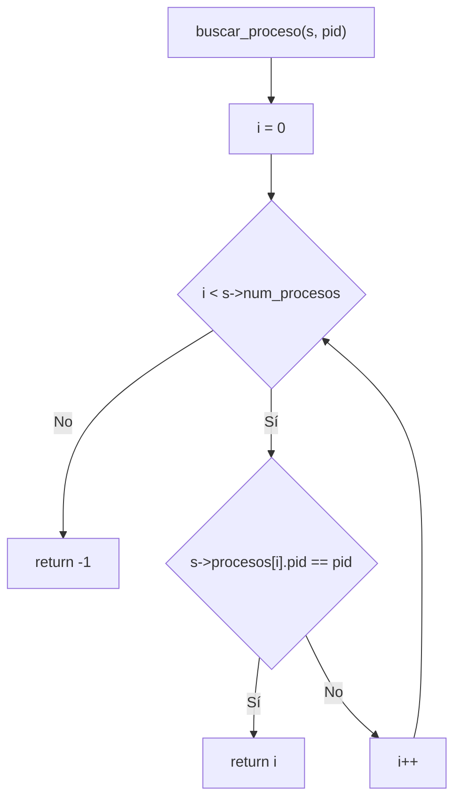
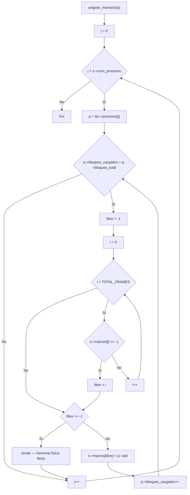
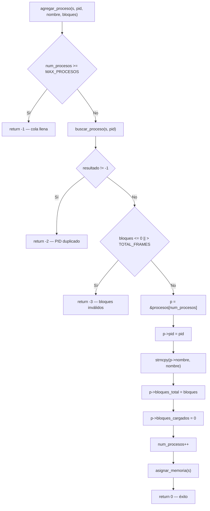
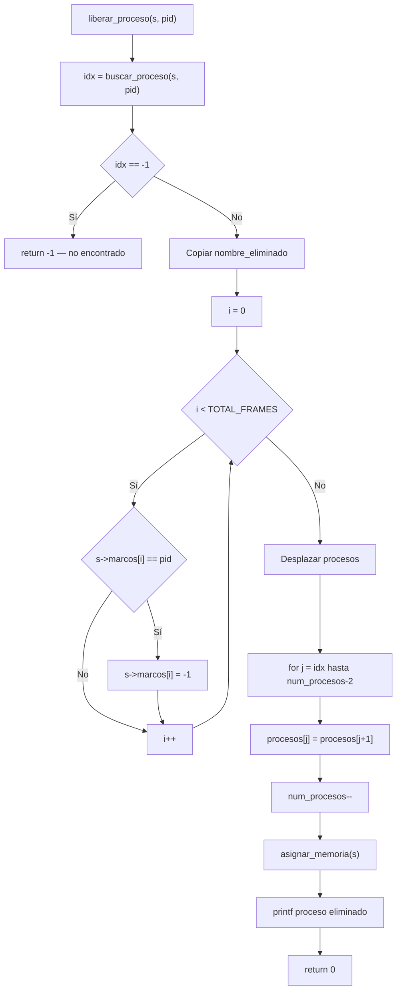
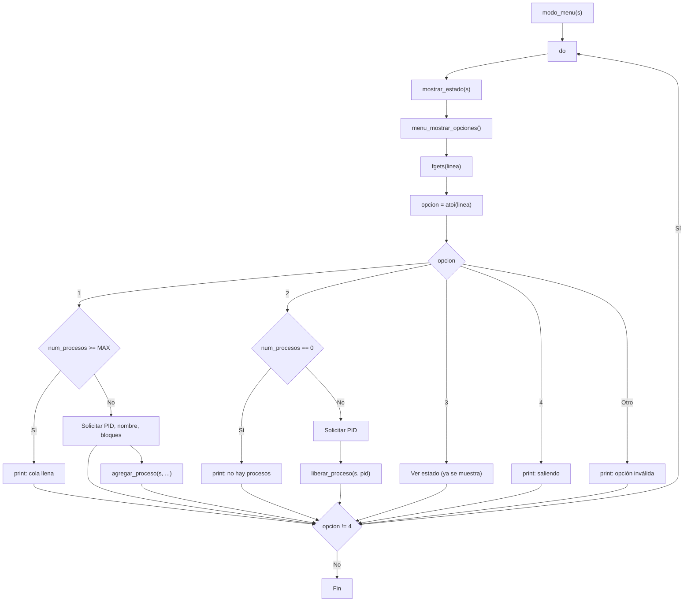
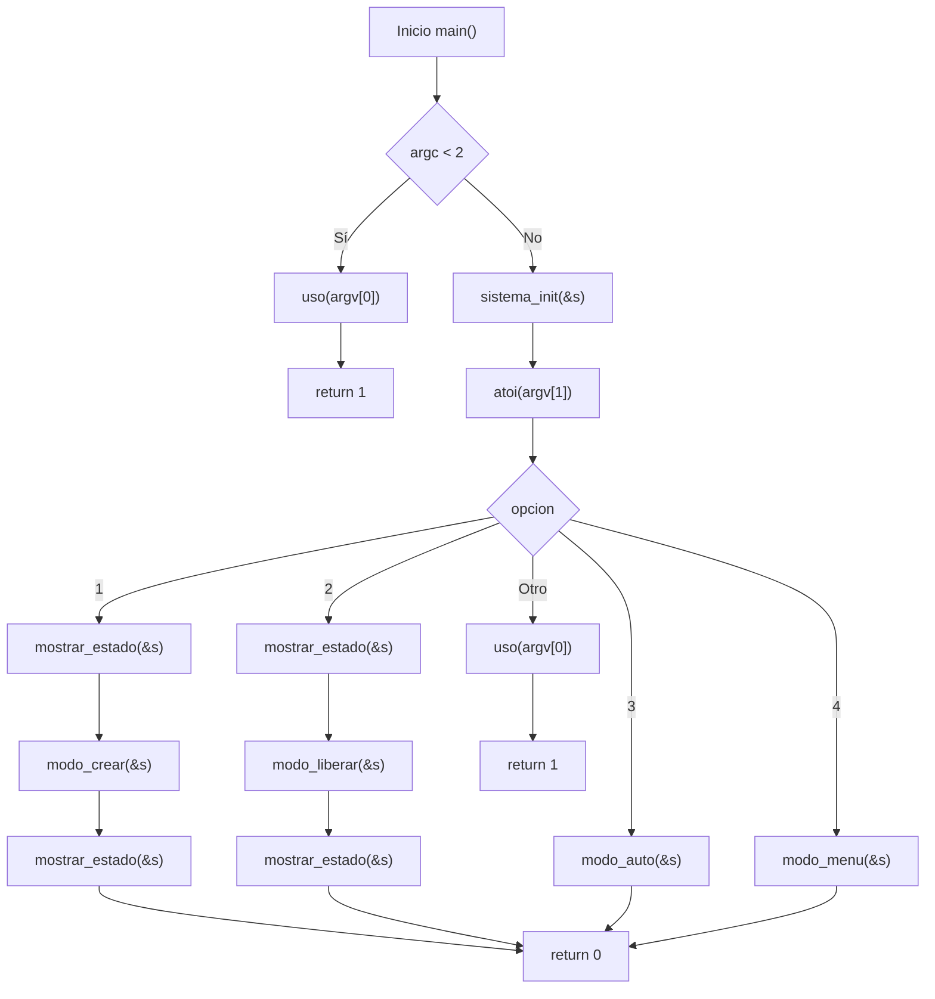

# Reporte de Programa 3 - Simulador de administración de memoria y paginación

## 1. Portada

- Materia: Sistemas Operativos II
- Actividad: Programa 3 (administración de memoria)
- Alumno: Dante Castelán Carpinteyro
- Fecha: 19 de agosto de 2026
- Lenguaje: C (gcc 13.3.0, Linux)

## 2. Objetivo

Desarrollar un simulador de administración de memoria con paginación en C que permita:

1. Visualizar la memoria física dividida en marcos de página.
2. Crear procesos que se dividen en bloques y se cargan en marcos libres.
3. Liberar procesos y reasignar los marcos liberados a otros procesos en espera.
4. Ejecutar una demostración automática que muestre todo el ciclo de vida.

## 3. Instrucciones de la actividad

> Desarrollar un simulador de administración de memoria y paginación que permita crear procesos, asignarles bloques de memoria, visualizar el estado de la memoria física y liberar procesos para reasignar memoria.

## 4. Requisitos y entorno

- Sistema operativo: Linux.
- Compilador: gcc.
- Librerías: solo las del estándar (`stdio.h`, `stdlib.h`, `string.h`, `unistd.h`). Sin dependencias externas.

Compilación:

```bash
cd programs
gcc -O2 -Wall -Wextra -o program-3 program-3.c
```

## 5. Implementación realizada

El programa completo vive en un solo archivo (`programs/program-3.c`, 475 líneas). A continuación se explica **todo el código en el mismo orden en que aparece en el archivo**: cabeceras, constantes, estructuras de datos, cada función en su orden de aparición, y al final un recorrido detallado de `main()`.

### 5.1 Cabeceras e includes (líneas 1–4)

```c
#include <stdio.h>
#include <stdlib.h>
#include <string.h>
#include <unistd.h>
```

- **`<stdio.h>`** — E/S estándar (`printf`, `fprintf`, `fgets`). Se usa para toda la salida en pantalla y para leer la entrada del usuario con `fgets`.
- **`<stdlib.h>`** — Biblioteca general (`atoi`). Convierte las cadenas leídas con `fgets` a enteros (PID, bloques, opción del menú).
- **`<string.h>`** — Manipulación de cadenas (`strncpy`, `strcspn`). Copia nombres de proceso con límite y elimina el salto de línea de la entrada.
- **`<unistd.h>`** — Funciones POSIX (`usleep`). Pausa la animación de la demostración automática.

### 5.2 Constantes (líneas 6–8)

```c
#define TOTAL_FRAMES 16
#define MAX_PROCESOS 10
#define MAX_NOMBRE 30
```

- **`TOTAL_FRAMES`** — número de marcos de página de la memoria física simulada (16).
- **`MAX_PROCESOS`** — capacidad máxima de la cola de procesos (10).
- **`MAX_NOMBRE`** — longitud máxima del nombre de un proceso (30 caracteres).

### 5.3 Colores ANSI (líneas 10–15)

```c
/* Colores ANSI */
#define RESET   "\033[0m"
#define ROJO    "\033[31m"
#define VERDE   "\033[32m"
#define AMARILLO "\033[33m"
#define GRIS    "\033[90m"
```

Son secuencias de escape ANSI que, al imprimirse, cambian el color del texto en la terminal:

- **`RESET`** (`\033[0m`) — restaura el color por defecto; siempre se pone al final para no "heredar" el color a lo que sigue.
- **`ROJO`** — procesos en espera (sin memoria asignada).
- **`VERDE`** — marcos ocupados y procesos completos en memoria.
- **`AMARILLO`** — procesos parcialmente cargados.
- **`GRIS`** — marcos libres (puntos) y separadores de tabla.

### 5.4 Estructura de datos: `Proceso` (líneas 17–23)

```c
/* Estructura que representa un proceso */
typedef struct {
    int pid;
    char nombre[MAX_NOMBRE];
    int bloques_total;
    int bloques_cargados;
} Proceso;
```

- **`pid`** — identificador único del proceso (por ejemplo, 100, 200).
- **`nombre`** — nombre legible (`"navegador"`, `"editor"`).
- **`bloques_total`** — cuántos bloques (páginas) solicitó el proceso.
- **`bloques_cargados`** — cuántos de esos bloques ya están en marcos físicos. Si es igual a `bloques_total`, el proceso está completo; si es 0, está en espera.

### 5.5 Estructura de datos: `Sistema` (líneas 25–30)

```c
/* Estado completo del sistema de paginacion */
typedef struct {
    int marcos[TOTAL_FRAMES];    /* -1 = libre, otherwise = PID */
    Proceso procesos[MAX_PROCESOS];
    int num_procesos;
} Sistema;
```

- **`marcos`** — la memoria física simulada: un arreglo de 16 enteros. `-1` significa marco libre; cualquier otro valor es el PID del proceso que lo ocupa.
- **`procesos`** — la cola de procesos: arreglo fijo de hasta 10 `Proceso`.
- **`num_procesos`** — cuántos procesos hay activos actualmente en la cola.

Toda la simulación es el estado de esta una estructura: todos los modos operan sobre ella.

### 5.6 Función `sistema_init` (líneas 35–40)

```c
void sistema_init(Sistema *s) {
    int i;
    for (i = 0; i < TOTAL_FRAMES; i++)
        s->marcos[i] = -1;
    s->num_procesos = 0;
}
```

Al iniciar, todos los marcos se marcan como libres (`-1`) y no hay procesos en la cola. Esto es equivalente a lo que hace un SO cuando arranca: toda la memoria física está disponible. Recibe un puntero a `Sistema` y lo inicializa in-place.

### 5.7 Función `asignar_memoria` (líneas 47–65)

```c
void asignar_memoria(Sistema *s) {
    int j, i;
    for (j = 0; j < s->num_procesos; j++) {
        Proceso *p = &s->procesos[j];
        while (p->bloques_cargados < p->bloques_total) {
            int libre = -1;
            for (i = 0; i < TOTAL_FRAMES; i++) {
                if (s->marcos[i] == -1) {
                    libre = i;
                    break;
                }
            }
            if (libre == -1)
                break; /* memoria fisica llena */
            s->marcos[libre] = p->pid;
            p->bloques_cargados++;
        }
    }
}
```

Esta es la función clave. Implementa el algoritmo **first-fit**:

1. **Bucle externo** (`j`): recorre cada proceso activo de la cola.
2. **`while` interno**: mientras el proceso tenga bloques pendientes (`bloques_cargados < bloques_total`):
   - Busca el **primer** marco libre recorriendo `marcos[]` desde el índice 0 (`for` con `break` al encontrar el primer `-1`).
   - Si no hay ningún marco libre (`libre == -1`), se rompe el `while`: la memoria física está llena y no se puede cargar más.
   - Si hay, asigna el marco al proceso (`marcos[libre] = p->pid`) y incrementa `bloques_cargados`.

Se llama después de cada operación (crear o liberar proceso) para mantener el estado consistente. La diferencia con `best-fit` o `worst-fit` es que first-fit es más rápido (se detiene en el primer hueco que encuentra) y en la práctica tiene un rendimiento comparable para cargas de trabajo típicas.

### 5.8 Función `buscar_proceso` (líneas 70–77)

```c
int buscar_proceso(const Sistema *s, int pid) {
    int i;
    for (i = 0; i < s->num_procesos; i++) {
        if (s->procesos[i].pid == pid)
            return i;
    }
    return -1;
}
```

Búsqueda lineal por PID. Retorna el índice del proceso en el arreglo, o `-1` si no existe. Se usa para verificar PIDs duplicados al crear y para encontrar procesos al liberar. Recibe el `Sistema` como `const` porque solo lee, no modifica.

### 5.9 Función `mostrar_estado` (líneas 82–126)

```c
void mostrar_estado(const Sistema *s) {
    int i;
    printf("\n");
    printf("============================================================\n");
    printf("  SIMULADOR DE ADMINISTRACION DE MEMORIA Y PAGINACION\n");
    printf("============================================================\n\n");

    /* Memoria fisica */
    printf("Memoria Fisica (Marcos de Pagina: %d):\n[ ", TOTAL_FRAMES);
    for (i = 0; i < TOTAL_FRAMES; i++) {
        if (s->marcos[i] == -1)
            printf(GRIS "." RESET " ");
        else
            printf(VERDE "P%d" RESET " ", s->marcos[i]);
    }
    printf("]\n\n");

    /* Tabla de procesos */
    printf("Cola de Procesos Activos:\n");
    printf("---------------------------------------------------------------------------\n");
    printf("%-5s | %-15s | %-8s | %-8s | %s\n",
           "PID", "Nombre", "Bloques", "Cargados", "Estado");
    printf("---------------------------------------------------------------------------\n");

    if (s->num_procesos == 0) {
        printf("                     (No hay procesos activos)                     \n");
    } else {
        for (i = 0; i < s->num_procesos; i++) {
            const Proceso *p = &s->procesos[i];
            const char *estado;

            if (p->bloques_cargados >= p->bloques_total)
                estado = VERDE "EN MEMORIA (COMPLETO)" RESET;
            else if (p->bloques_cargados > 0)
                estado = AMARILLO "PARCIALMENTE CARGADO" RESET;
            else
                estado = ROJO "EN ESPERA (SWAP)" RESET;

            printf("%-5d | %-15s | %-8d | %-8d | %s\n",
                   p->pid, p->nombre, p->bloques_total,
                   p->bloques_cargados, estado);
        }
    }
    printf("---------------------------------------------------------------------------\n\n");
}
```

Imprime el estado completo del sistema en tres partes:

1. **Encabezado** con el título del simulador entre líneas de `=`.
2. **Memoria física**: los 16 marcos entre corchetes. Cada marco libre se imprime como un punto gris `.`; cada marco ocupado como `P<pid>` en verde (por ejemplo, `P100`). El formato `%-5s` de la tabla alinea las columnas a la izquierda con ancho fijo.
3. **Cola de procesos**: una tabla con columnas PID, Nombre, Bloques, Cargados y Estado. El estado se colorea según la regla:
   - **Verde** `EN MEMORIA (COMPLETO)` — `bloques_cargados >= bloques_total`.
   - **Amarillo** `PARCIALMENTE CARGADO` — tiene al menos 1 bloque cargado pero no todos.
   - **Rojo** `EN ESPERA (SWAP)` — 0 bloques cargados (no le tocó memoria).

Si no hay procesos, imprime un mensaje indicándolo.

### 5.10 Función `agregar_proceso` (líneas 131–153)

```c
int agregar_proceso(Sistema *s, int pid, const char *nombre, int bloques) {
    Proceso *p;

    if (s->num_procesos >= MAX_PROCESOS)
        return -1; /* cola llena */

    if (buscar_proceso(s, pid) != -1)
        return -2; /* PID duplicado */

    if (bloques <= 0 || bloques > TOTAL_FRAMES)
        return -3; /* bloques invalidos */

    p = &s->procesos[s->num_procesos];
    p->pid = pid;
    strncpy(p->nombre, nombre, MAX_NOMBRE - 1);
    p->nombre[MAX_NOMBRE - 1] = '\0';
    p->bloques_total = bloques;
    p->bloques_cargados = 0;
    s->num_procesos++;

    asignar_memoria(s);
    return 0; /* exito */
}
```

Antes de agregar valida tres condiciones, cada una con su código de error:

- `-1` — la cola está llena (`num_procesos >= MAX_PROCESOS`).
- `-2` — el PID ya existe (`buscar_proceso != -1`).
- `-3` — bloques inválidos (fuera del rango 1 a `TOTAL_FRAMES`).

Si todo está bien, toma el siguiente slot libre del arreglo, copia los campos (el nombre con `strncpy` y terminación `NULL` explícita por seguridad), inicializa `bloques_cargados = 0`, incrementa `num_procesos`, y llama a `asignar_memoria` para intentar cargar sus bloques inmediatamente. Devuelve `0` en éxito.

### 5.11 Función `liberar_proceso` (líneas 158–187)

```c
int liberar_proceso(Sistema *s, int pid) {
    int idx, i, j;
    char nombre_eliminado[MAX_NOMBRE];

    idx = buscar_proceso(s, pid);
    if (idx == -1)
        return -1; /* no encontrado */

    /* Copiar nombre antes de eliminar */
    strncpy(nombre_eliminado, s->procesos[idx].nombre, MAX_NOMBRE - 1);
    nombre_eliminado[MAX_NOMBRE - 1] = '\0';

    /* Liberar marcos en memoria fisica */
    for (i = 0; i < TOTAL_FRAMES; i++) {
        if (s->marcos[i] == pid)
            s->marcos[i] = -1;
    }

    /* Eliminar de la cola (desplazar) */
    for (j = idx; j < s->num_procesos - 1; j++)
        s->procesos[j] = s->procesos[j + 1];
    s->num_procesos--;

    /* Reasignar bloques pendientes a otros procesos */
    asignar_memoria(s);

    printf("\n[-] Proceso '%s' (PID %d) finalizado y memoria liberada.\n",
           nombre_eliminado, pid);
    return 0;
}
```

Este es el flujo inverso a la creación, en cuatro pasos:

1. **Buscar** el proceso por PID; si no existe, devuelve `-1`.
2. **Copiar el nombre** a `nombre_eliminado` *antes* de borrarlo, porque después de eliminar el nodo de la cola el nombre ya no estaría disponible para el mensaje de confirmación.
3. **Liberar marcos**: recorre los 16 marcos y marca como `-1` todos los que tengan el PID del proceso.
4. **Eliminar de la cola**: desplaza todos los elementos posteriores hacia atrás (`procesos[j] = procesos[j+1]`) desde el índice `idx`, y decrementa `num_procesos`.
5. **Reasignar**: llama a `asignar_memoria` para que los marcos liberados se asignen a otros procesos que estaban en espera (estados `EN ESPERA (SWAP)` o `PARCIALMENTE CARGADO`).

Este patrón es idéntico a como un SO real maneja la terminación de procesos: liberar marcos, actualizar tablas, y despertar procesos bloqueados que ahora pueden entrar en memoria.

### 5.12 Función `modo_crear` (líneas 192–247)

```c
void modo_crear(Sistema *s) {
    int pid, bloques;
    char nombre[MAX_NOMBRE];
    char linea[128];
    char respuesta;

    do {
        if (s->num_procesos >= MAX_PROCESOS) {
            printf("\n[!] Cola de procesos llena (maximo %d).\n", MAX_PROCESOS);
            return;
        }

        printf("\n--- CREAR NUEVO PROCESO ---\n");

        printf("PID: ");
        if (fgets(linea, sizeof(linea), stdin) == NULL) return;
        pid = atoi(linea);
        if (pid <= 0) {
            printf("[!] PID invalido.\n");
            continue;
        }

        if (buscar_proceso(s, pid) != -1) {
            printf("[!] Ya existe un proceso con PID %d.\n", pid);
            continue;
        }

        printf("Nombre: ");
        if (fgets(nombre, sizeof(nombre), stdin) == NULL) return;
        nombre[strcspn(nombre, "\n")] = '\0';

        printf("Bloques (1-%d): ", TOTAL_FRAMES);
        if (fgets(linea, sizeof(linea), stdin) == NULL) return;
        bloques = atoi(linea);

        switch (agregar_proceso(s, pid, nombre, bloques)) {
            case -1: printf("[!] Cola llena.\n"); break;
            case -2: printf("[!] PID duplicado.\n"); break;
            case -3: printf("[!] Bloques invalidos.\n"); break;
            default:
                printf("[+] Proceso '%s' agregado.\n", nombre);
                mostrar_estado(s);
                break;
        }

        if (s->num_procesos >= MAX_PROCESOS) {
            printf("\n[!] Cola de procesos llena (maximo %d).\n", MAX_PROCESOS);
            return;
        }

        printf("\nAgregar otro proceso? (s/n): ");
        if (fgets(linea, sizeof(linea), stdin) == NULL) return;
        respuesta = linea[0];

    } while (respuesta == 's' || respuesta == 'S');
}
```

Interfaz interactiva del modo 1: un bucle `do...while` que:

1. Verifica que la cola no esté llena antes de pedir datos (y también después de agregar).
2. Lee el **PID** con `fgets` + `atoi` y valida que sea mayor que 0 y que no exista ya (con `buscar_proceso`); si falla, `continue` vuelve al inicio del bucle sin pedir el resto.
3. Lee el **nombre** con `fgets` y elimina el salto de línea con `nombre[strcspn(nombre, "\n")] = '\0'` (`strcspn` devuelve la posición del primer `\n`).
4. Lee los **bloques** con `fgets` + `atoi`.
5. Llama a `agregar_proceso` y traduce el código de retorno a un mensaje (`-1` cola llena, `-2` PID duplicado, `-3` bloques inválidos, `0` éxito con `mostrar_estado`).
6. Pregunta `Agregar otro proceso? (s/n)` y repite mientras la respuesta sea `s` o `S`.

Se usa `fgets` en lugar de `scanf` porque `fgets` lee la línea completa (evita problemas con el buffer de entrada) y `atoi` convierte después.

### 5.13 Función `modo_liberar` (líneas 252–268)

```c
void modo_liberar(Sistema *s) {
    int pid;
    char linea[128];

    if (s->num_procesos == 0) {
        printf("\n[!] No hay procesos activos.\n");
        return;
    }

    printf("\n--- FINALIZAR PROCESO ---\n");
    printf("PID a finalizar: ");
    if (fgets(linea, sizeof(linea), stdin) == NULL) return;
    pid = atoi(linea);

    if (liberar_proceso(s, pid) == -1)
        printf("[!] No se encontro proceso con PID %d.\n", pid);
}
```

Interfaz del modo 2: verifica que haya procesos activos, pide el PID con `fgets` + `atoi`, y llama a `liberar_proceso`. Si devuelve `-1` (no encontrado), imprime el error.

### 5.14 Función `menu_mostrar_opciones` (líneas 273–279)

```c
static void menu_mostrar_opciones(void) {
    printf("\n1. Agregar proceso\n");
    printf("2. Liberar proceso\n");
    printf("3. Ver estado\n");
    printf("4. Salir\n");
    printf("Seleccione: ");
}
```

Función auxiliar pequeña con linkage `static` (solo visible dentro de este archivo) que imprime las cuatro opciones del menú interactivo. Se separó de `modo_menu` para mantener esa función más limpia y poder reutilizar el menú si se necesitara.

### 5.15 Función `modo_menu` (líneas 281–359)

```c
void modo_menu(Sistema *s) {
    int opcion;
    char linea[128];
    int pid, bloques;
    char nombre[MAX_NOMBRE];

    do {
        mostrar_estado(s);
        menu_mostrar_opciones();

        if (fgets(linea, sizeof(linea), stdin) == NULL) break;
        opcion = atoi(linea);

        switch (opcion) {
            case 1:
                /* Agregar proceso */
                if (s->num_procesos >= MAX_PROCESOS) {
                    printf("[!] Cola de procesos llena (maximo %d).\n", MAX_PROCESOS);
                    break;
                }

                printf("PID: ");
                if (fgets(linea, sizeof(linea), stdin) == NULL) return;
                pid = atoi(linea);
                if (pid <= 0) {
                    printf("[!] PID invalido.\n");
                    break;
                }

                if (buscar_proceso(s, pid) != -1) {
                    printf("[!] Ya existe un proceso con PID %d.\n", pid);
                    break;
                }

                printf("Nombre: ");
                if (fgets(nombre, sizeof(nombre), stdin) == NULL) return;
                nombre[strcspn(nombre, "\n")] = '\0';

                printf("Bloques (1-%d): ", TOTAL_FRAMES);
                if (fgets(linea, sizeof(linea), stdin) == NULL) return;
                bloques = atoi(linea);

                switch (agregar_proceso(s, pid, nombre, bloques)) {
                    case -1: printf("[!] Cola llena.\n"); break;
                    case -2: printf("[!] PID duplicado.\n"); break;
                    case -3: printf("[!] Bloques invalidos.\n"); break;
                    default: printf("[+] Proceso '%s' agregado.\n", nombre); break;
                }
                break;

            case 2:
                /* Liberar proceso */
                if (s->num_procesos == 0) {
                    printf("[!] No hay procesos activos.\n");
                    break;
                }

                printf("PID a finalizar: ");
                if (fgets(linea, sizeof(linea), stdin) == NULL) return;
                pid = atoi(linea);

                if (liberar_proceso(s, pid) == -1)
                    printf("[!] No se encontro proceso con PID %d.\n", pid);
                break;

            case 3:
                /* Ver estado (ya se muestra al inicio del ciclo) */
                break;

            case 4:
                printf("Saliendo del menu...\n");
                break;

            default:
                printf("[!] Opcion invalida.\n");
                break;
        }
    } while (opcion != 4);
}
```

Modo 4: un menú interactivo continuo que combina agregar y liberar sin salir del programa:

- Cada ciclo del `do...while` empieza con `mostrar_estado` (por eso la opción 3 "Ver estado" no hace nada: el estado ya se mostró al inicio del ciclo) y `menu_mostrar_opciones`.
- **Opción 1 (Agregar)**: pide PID, nombre y bloques con la misma validación que `modo_crear` (cola llena, PID inválido, PID duplicado) y llama a `agregar_proceso`.
- **Opción 2 (Liberar)**: verifica que haya procesos, pide el PID y llama a `liberar_proceso`.
- **Opción 3**: no hace nada porque el estado ya se imprimió al inicio del ciclo.
- **Opción 4**: sale del bucle (`while (opcion != 4)`).
- **`default`**: mensaje de opción inválida.
- Si `fgets` devuelve `NULL` (EOF, Ctrl+D), se rompe el bucle con `break`.

### 5.16 Función `modo_auto` (líneas 364–421)

```c
void modo_auto(Sistema *s) {
    printf("\n>>> MODO AUTOMATICO - Demostracion de paginacion <<<\n");
    usleep(800000);

    /* Paso 1: crear procesos */
    printf("\n[1] Creando procesos...\n");
    agregar_proceso(s, 100, "navegador", 5);
    mostrar_estado(s);
    usleep(1200000);

    agregar_proceso(s, 200, "editor", 3);
    mostrar_estado(s);
    usleep(1200000);

    agregar_proceso(s, 300, "terminal", 4);
    mostrar_estado(s);
    usleep(1200000);

    /* Paso 2: crear mas procesos para llenar memoria */
    printf("\n[2] Agregando mas procesos...\n");
    agregar_proceso(s, 400, "servidor", 3);
    mostrar_estado(s);
    usleep(1200000);

    agregar_proceso(s, 500, "compilador", 2);
    mostrar_estado(s);
    usleep(1200000);

    /* Paso 3: liberar un proceso y ver reasignacion */
    printf("\n[3] Liberando proceso 'editor' (PID 200)...\n");
    liberar_proceso(s, 200);
    mostrar_estado(s);
    usleep(1200000);

    /* Paso 4: liberar otro y crear uno nuevo */
    printf("\n[4] Liberando 'terminal' (PID 300) y creando 'juego' (PID 600)...\n");
    liberar_proceso(s, 300);
    agregar_proceso(s, 600, "juego", 6);
    mostrar_estado(s);
    usleep(1200000);

    /* Paso 5: intentar crear mas de los que caben */
    printf("\n[5] Intentando crear proceso que excede la memoria disponible...\n");
    agregar_proceso(s, 700, "gigante", 15);
    mostrar_estado(s);
    usleep(1200000);

    /* Paso 6: limpiar todo */
    printf("\n[6] Liberando todos los procesos...\n");
    liberar_proceso(s, 100);
    liberar_proceso(s, 400);
    liberar_proceso(s, 500);
    liberar_proceso(s, 600);
    liberar_proceso(s, 700);
    mostrar_estado(s);

    printf(">>> DEMO COMPLETADA <<<\n");
}
```

Modo 3: una secuencia predefinida de 6 pasos que demuestra todo el ciclo de vida de la paginación:

1. **Crear procesos** (PID 100 navegador 5 bloques, 200 editor 3, 300 terminal 4) — 12 de 16 marcos ocupados.
2. **Agregar más** (400 servidor 3, 500 compilador 2) — 17 bloques solicitados sobre 16 marcos: la memoria se llena y alguien queda en espera.
3. **Liberar el editor (200)** — sus 3 marcos se liberan y `asignar_memoria` los reasigna a los que estaban en espera.
4. **Liberar terminal (300) y crear juego (600, 6 bloques)** — demuestra liberar y crear en un solo paso.
5. **Intentar el gigante (700, 15 bloques)** — proceso que casi no cabe; muestra cómo first-fit reparte lo que queda.
6. **Liberar todos** — devuelve el sistema a su estado inicial.

Entre cada paso hay una pausa con `usleep(1200000)` (1.2 segundos) para que el usuario observe los cambios en pantalla. La demo termina con `mostrar_estado` final y el mensaje `DEMO COMPLETADA`.

### 5.17 Función `uso` (líneas 426–437)

```c
void uso(const char *prog) {
    fprintf(stderr,
        "Uso: %s <opcion>\n\n"
        "Opciones:\n"
        "  1   Crear nuevo proceso (solicita PID, nombre, bloques)\n"
        "  2   Finalizar proceso (solicita PID)\n"
        "  3   Ejecutar demostracion automatica\n"
        "  4   Menu interactivo (agregar, liberar, ver estado)\n"
        "\n"
        "Ejemplo: %s 3\n",
        prog, prog);
}
```

Imprime la ayuda en `stderr` con las cuatro opciones y un ejemplo. Se llama cuando no se pasó argumento o cuando el argumento no es 1–4.

### 5.18 Función `main` — recorrido completo (líneas 442–475)

```c
int main(int argc, char **argv) {
    Sistema s;

    if (argc < 2) {
        uso(argv[0]);
        return 1;
    }

    sistema_init(&s);

    switch (atoi(argv[1])) {
        case 1:
            mostrar_estado(&s);
            modo_crear(&s);
            mostrar_estado(&s);
            break;
        case 2:
            mostrar_estado(&s);
            modo_liberar(&s);
            mostrar_estado(&s);
            break;
        case 3:
            modo_auto(&s);
            break;
        case 4:
            modo_menu(&s);
            break;
        default:
            uso(argv[0]);
            return 1;
    }

    return 0;
}
```

Recorrido:

1. **Variables**: una sola instancia `Sistema s` en el stack; todo el estado de la simulación vive ahí.
2. **Validación de argumentos**: si no hay `argv[1]`, se muestra la ayuda y se retorna 1.
3. **`sistema_init(&s)`** — inicializa los 16 marcos como libres y la cola vacía.
4. **`switch` sobre `atoi(argv[1])`** — la opción viene de la línea de comandos (no de un menú con `scanf`), lo que permite tanto uso interactivo (`./program-3 1`) como automatizado:
   - **`1`** — mostrar estado, `modo_crear` (interactivo), mostrar estado actualizado.
   - **`2`** — mostrar estado, `modo_liberar` (interactivo), mostrar estado actualizado.
   - **`3`** — `modo_auto` (la demostración completa).
   - **`4`** — `modo_menu` (menú interactivo continuo).
   - **`default`** — ayuda y retorno 1.
5. **`return 0`** — salida limpia.

### 5.19 Funciones del sistema utilizadas

A continuación se describen las funciones más relevantes del lenguaje C y del sistema que se usan para manejar memoria simulada, validar entradas y controlar la interfaz del programa.

#### `atoi()`
La función `atoi()` convierte una cadena de texto en un entero.

- Requerimiento: incluir `<stdlib.h>`.
- Parámetros: recibe un puntero a la cadena que contiene el número.
- Valor de retorno: devuelve el entero convertido, o 0 si no se puede interpretar correctamente.

#### `strncpy()`
La función `strncpy()` copia una cadena de caracteres a otra con longitud máxima especificada.

- Requerimiento: incluir `<string.h>`.
- Parámetros: recibe el destino, la fuente y el número máximo de caracteres a copiar.
- Valor de retorno: devuelve el puntero al destino. El programa siempre termina la cadena con `'\0'` manualmente, porque `strncpy` no garantiza el terminador si el origen es más largo que el máximo.

#### `strcspn()`
La función `strcspn()` devuelve la longitud del primer segmento de una cadena que no contiene ninguno de los caracteres de una segunda cadena (conjunto de rechazo).

- Requerimiento: incluir `<string.h>`.
- Parámetros: la cadena y el conjunto de caracteres a evitar.
- Valor de retorno: devuelve la posición del primer carácter que está en el conjunto. Se usa como `nombre[strcspn(nombre, "\n")] = '\0'` para cortar la cadena en el salto de línea que deja `fgets`.

#### `fgets()`
La función `fgets()` lee una línea desde un flujo de entrada.

- Requerimiento: incluir `<stdio.h>`.
- Parámetros: recibe un buffer, su tamaño y el flujo `FILE *`.
- Valor de retorno: devuelve el buffer leído o `NULL` si falla.

#### `printf()` / `fprintf()`
Las funciones `printf()` y `fprintf()` imprimen texto formateado en la salida estándar o en un flujo dado.

- Requerimiento: incluir `<stdio.h>`.
- Parámetros: recibe una cadena de formato y los argumentos correspondientes (`fprintf` además recibe el `FILE *`).
- Valor de retorno: devuelven el número de caracteres impresos o un valor negativo si hay error.

#### `snprintf()`
La función `snprintf()` escribe una cadena formateada a un buffer de tamaño acotado.

- Requerimiento: incluir `<stdio.h>`.
- Parámetros: recibe el buffer destino, el tamaño máximo, el formato y los argumentos.
- Valor de retorno: devuelve el número de caracteres que se habrían escrito sin contar el terminador nulo.

#### `usleep()`
La función `usleep()` suspende la ejecución del programa durante un número de microsegundos.

- Requerimiento: incluir `<unistd.h>`.
- Parámetros: recibe el tiempo en microsegundos (`1200000` = 1.2 segundos).
- Valor de retorno: devuelve 0 si tuvo éxito o `-1` si ocurre un error.

### 5.20 Funciones auxiliares (propias) — resumen

A continuación se documentan brevemente las funciones auxiliares implementadas en el programa, sus parámetros y la salida esperada.

#### `uso(const char *prog)`
- Qué hace: Muestra la ayuda y las opciones de uso del programa en `stderr`.
- Parámetros: `prog` — nombre del ejecutable (normalmente `argv[0]`).
- Salida: imprime el mensaje de ayuda; no devuelve valor (`void`).

#### `sistema_init(Sistema *s)`
- Qué hace: Inicializa la estructura `Sistema` marcando todos los marcos como libres y poniendo `num_procesos = 0`.
- Parámetros: `s` — puntero a la estructura `Sistema` a inicializar.
- Salida: modifica `s` in-place; no devuelve valor (`void`).

#### `asignar_memoria(Sistema *s)`
- Qué hace: Recorre la lista de procesos y asigna marcos libres siguiendo el algoritmo `first-fit` hasta cubrir los bloques requeridos por cada proceso o hasta agotar marcos.
- Parámetros: `s` — puntero al `Sistema` que contiene marcos y procesos.
- Salida: actualiza `s->marcos` y `procesos[].bloques_cargados`; no devuelve valor (`void`).

#### `buscar_proceso(const Sistema *s, int pid)`
- Qué hace: Busca un proceso por `pid` en la tabla de procesos y devuelve su índice si existe.
- Parámetros: `s` — puntero const al `Sistema`; `pid` — identificador del proceso.
- Salida: devuelve el índice entero del proceso en `s->procesos` o `-1` si no existe.

#### `mostrar_estado(const Sistema *s)`
- Qué hace: Imprime en pantalla el estado actual del sistema simulado: marcos, tabla de procesos, y estados coloreados.
- Parámetros: `s` — puntero const al `Sistema`.
- Salida: imprime información formateada en `stdout`; no devuelve valor (`void`).

#### `agregar_proceso(Sistema *s, int pid, const char *nombre, int bloques)`
- Qué hace: Valida y añade un nuevo proceso a la cola, inicializa sus campos y llama a `asignar_memoria`.
- Parámetros: `s` — puntero al `Sistema`; `pid` — identificador; `nombre` — cadena con el nombre; `bloques` — número de bloques solicitados.
- Salida: devuelve `0` en éxito, `-1` cola llena, `-2` PID duplicado, `-3` bloques inválidos.

#### `liberar_proceso(Sistema *s, int pid)`
- Qué hace: Libera los marcos ocupados por `pid`, elimina el proceso de la cola y vuelve a llamar a `asignar_memoria`.
- Parámetros: `s` — puntero al `Sistema`; `pid` — identificador a liberar.
- Salida: devuelve `0` en éxito o `-1` si no se encontró el proceso; además imprime un mensaje de confirmación.

#### `menu_mostrar_opciones(void)`
- Qué hace: Imprime las cuatro opciones del menú interactivo (agregar, liberar, ver estado, salir).
- Parámetros: ninguno (`static`, solo visible en el archivo).
- Salida: imprime el menú en `stdout`; no devuelve valor (`void`).

#### `modo_crear(Sistema *s)`
- Qué hace: Interfaz interactiva del modo 1; pide PID, nombre y bloques en un bucle hasta que el usuario indique que no quiere agregar más.
- Parámetros: `s` — puntero al `Sistema`.
- Salida: interactúa con el usuario por `stdin`/`stdout`; no devuelve valor (`void`).

#### `modo_liberar(Sistema *s)`
- Qué hace: Interfaz interactiva del modo 2; pide un PID y libera ese proceso.
- Parámetros: `s` — puntero al `Sistema`.
- Salida: interactúa con el usuario; no devuelve valor (`void`).

#### `modo_menu(Sistema *s)`
- Qué hace: Menú interactivo continuo del modo 4; combina agregar, liberar y ver estado en un bucle hasta que el usuario elige salir.
- Parámetros: `s` — puntero al `Sistema`.
- Salida: interactúa con el usuario; no devuelve valor (`void`).

#### `modo_auto(Sistema *s)`
- Qué hace: Demostración automática del modo 3; ejecuta una secuencia predefinida de 6 pasos (crear, llenar, liberar, reasignar, intentar exceder, limpiar) con pausas entre cada uno.
- Parámetros: `s` — puntero al `Sistema`.
- Salida: imprime la secuencia de la demo en `stdout`; no devuelve valor (`void`).

## 6. Diagramas de flujo

### 6.1 Función `buscar_proceso()`



### 6.2 Asignación de memoria `asignar_memoria()` (first-fit)



### 6.3 Función `agregar_proceso()`



### 6.4 Función `liberar_proceso()`



### 6.5 Menú interactivo `modo_menu()`



### 6.6 Modo automático `modo_auto()`

```mermaid
flowchart TD
    A["modo_auto(s)"] --> B["print: MODO AUTOMATICO"]
    B --> C["Paso 1: Crear procesos"]
    C --> D["agregar_proceso(100, navegador, 5)"]
    D --> E["mostrar_estado"]
    E --> F["usleep(1200000)"]
    F --> G["agregar_proceso(200, editor, 3)"]
    G --> H["mostrar_estado"]
    H --> I["usleep(1200000)"]
    I --> J["agregar_proceso(300, terminal, 4)"]
    J --> K["mostrar_estado"]
    K --> L["Paso 2: Agregar mas procesos"]
    L --> M["agregar_proceso(400, servidor, 3)"]
    M --> N["agregar_proceso(500, compilador, 2)"]
    N --> O["Paso 3: Liberar editor"]
    O --> P["liberar_proceso(200)"]
    P --> Q["mostrar_estado"]
    Q --> R["Paso 4: Liberar terminal + crear juego"]
    R --> S["liberar_proceso(300)"]
    S --> T["agregar_proceso(600, juego, 6)"]
    T --> U["Paso 5: Intentar gigante"]
    U --> V["agregar_proceso(700, gigante, 15)"]
    V --> W["Paso 6: Liberar todos"]
    W --> X["liberar 100, 400, 500, 600, 700"]
    X --> Y["mostrar_estado"]
    Y --> Z["print: DEMO COMPLETADA"]
```



### 6.7 Flujo principal `main()`



## 7. Ejecución

```bash
cd programs
gcc -O2 -Wall -Wextra -o program-3 program-3.c

# Modo automático
./program-3 3

# Crear proceso (interactivo)
./program-3 1

# Liberar proceso (interactivo)
./program-3 2

# Menú interactivo (agregar + liberar)
./program-3 4
```

## 8. Cumplimiento del enunciado

- Simula memoria fisica con marcos de página: cumplido (arreglo de 16 enteros).
- Permite crear procesos que se dividen en bloques: cumplido (`agregar_proceso`).
- Asigna bloques a marcos libres (first-fit): cumplido (`asignar_memoria`).
- Muestra el estado de la memoria y los procesos: cumplido (`mostrar_estado` con colores ANSI).
- Permite liberar procesos y reasignar memoria: cumplido (`liberar_proceso`).
- Visualización dinámica del estado: cumplido (se muestra antes y después de cada operación).
- Modo automático para demostración: cumplido (`modo_auto`).
- Menú interactivo para agregar/liberar: cumplido (`modo_menu`).

## 9. Conclusión

Se demuestran los conceptos fundamentales de paginación en sistemas operativos: la memoria física se divide en marcos de tamaño fijo, los procesos se dividen en bloques (páginas) que se cargan en marcos disponibles, y cuando un proceso termina sus marcos se liberan para ser reasignados.

Lo más interesante de esta implementación es el patrón de "asignar después de cada operación". En un SO real, la asignación de páginas es más compleja (involucra tablas de página, TLB, swaps, etc.), pero el principio básico es el mismo: buscar marcos libres y asignarlos a procesos que los necesiten. El algoritmo first-fit es suficiente para esta simulación y es el mismo que usan algunos sistemas reales por su simplicidad y velocidad.

La visualización con colores ANSI hace evidente el estado del sistema en cada momento: se puede ver instantaneamente cuantos marcos están ocupados, por cuáles procesos, y cuáles procesos están esperando memoria.

## 10. Anexo A - Comandos usados

```bash
cd programs
gcc -O2 -Wall -Wextra -o program-3 program-3.c
./program-3 3    # demo automatica
./program-3 1    # crear proceso
./program-3 2    # liberar proceso
./program-3 4    # menu interactivo
```

## 11. Bitácora de prompts

Prompts usados para llegar al resultado final:

| # | Prompt textual | ¿Sirve? | LLM / Agente |
|:-:|:-:|:-:|:-:|
| 1 | **"Cómo representar la memoria física en C para simular paginación?"** — Conduce al arreglo `int marcos[TOTAL_FRAMES]` donde `-1` es libre y cualquier otro valor es el PID. | Sí | Gemini |
| 2 | **"Cómo implementar la asignación first-fit en C?"** — Conduce a la función `asignar_memoria` que recorre la memoria buscando el primer marco libre. | Sí | Gemini |
| 3 | **"Cómo manejar la liberación de un proceso y reasignar sus marcos a otros?"** — Conduce a `liberar_proceso` que marca marcos como libres, elimina el proceso de la cola, y llama a `asignar_memoria` para reasignar. | Sí | Gemini |
| 4 | **"Cómo mostrar el estado de la memoria con colores en terminal?"** — Conduce al uso de secuencias ANSI (`\033[32m` para verde, `\033[31m` para rojo, etc.). | Sí | Gemini |
| 5 | **"Cómo hacer que el programa reciba la opcion por argumento en vez de un menú?"** — Conduce al uso de `argv[1]` con `atoi` y un `switch` en `main`. | Sí | Gemini |
| 6 | **"Cómo crear una demostración automática que muestre todo el ciclo de vida?"** — Conduce a `modo_auto` que crea procesos, muestra estado, libera, y repite con pausas. | Sí | Gemini |
| 7 | **"Cómo evitar problemas con scanf y el buffer de entrada?"** — Conduce al uso de `fgets` + `strtol` en lugar de `scanf` directo. | Sí | Gemini |
| 8 | **"Cómo validar PIDs duplicados y bloques inválidos antes de agregar un proceso?"** — Conduce a las validaciones en `agregar_proceso` que retornan codigos de error especificos. | Sí | Gemini |
