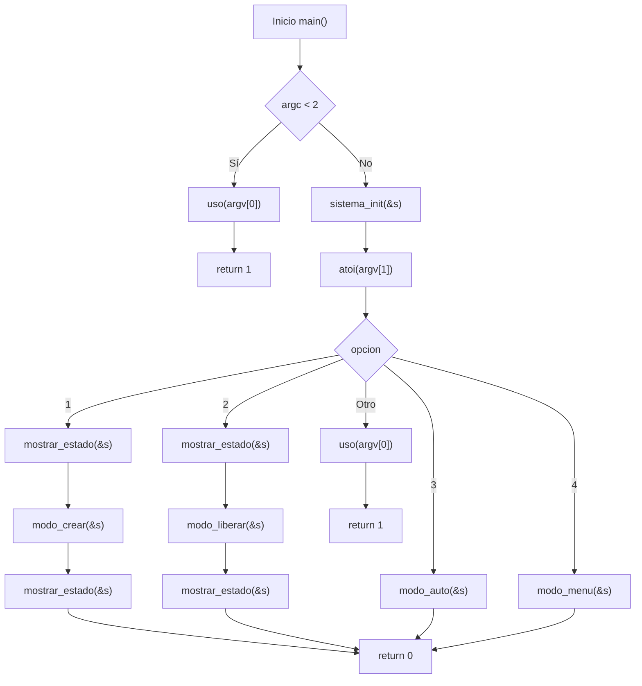
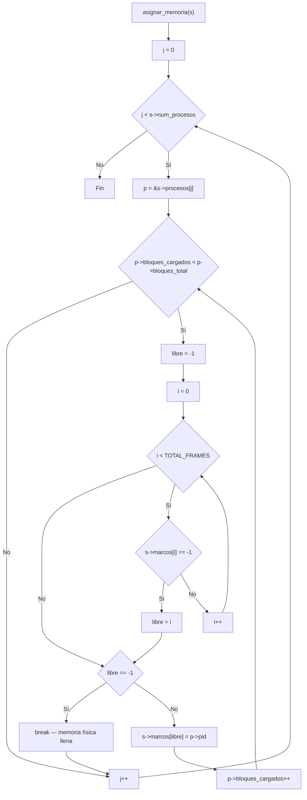
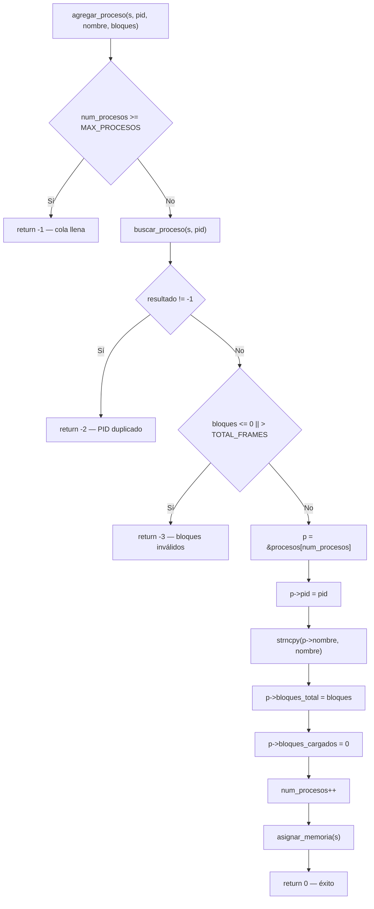
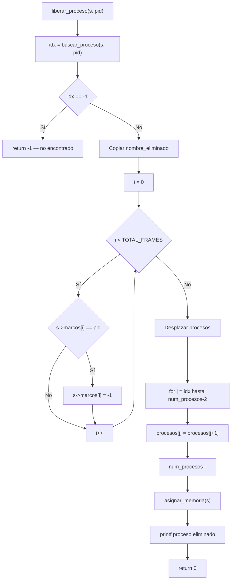
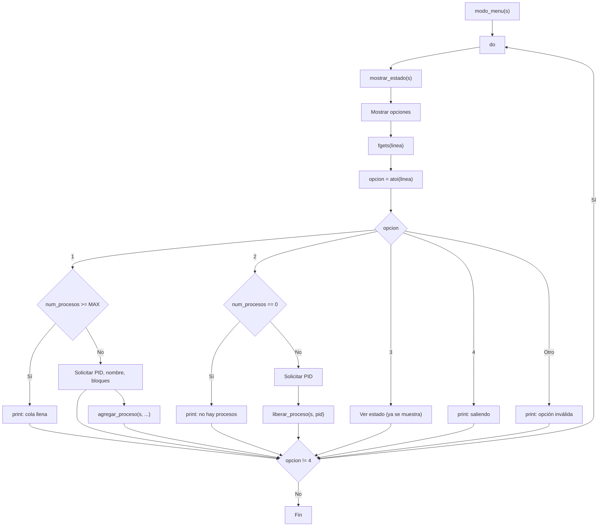
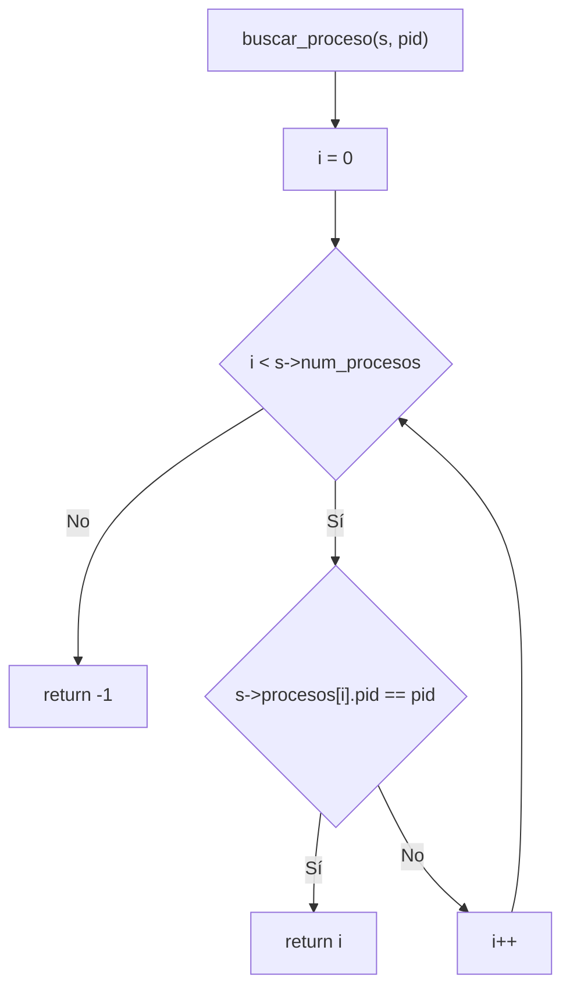

# Reporte de Programa 3 - Simulador de administración de memoria y paginación

## 1. Portada

- Materia: Sistemas Operativos II
- Actividad: Programa 3 (administración de memoria)
- Alumno: Dante Castelán Carpinteyro
- Fecha: 19 de agosto de 2026
- Lenguaje: C (gcc 13.3.0, Linux)

## 2. Objetivo

Desarrollar un simulador de administración de memoria con paginación en C que permita:

1. Visualizar la memoria física dividida en marcos de página.
2. Crear procesos que se dividen en bloques y se cargan en marcos libres.
3. Liberar procesos y reasignar los marcos liberados a otros procesos en espera.
4. Ejecutar una demostración automática que muestre todo el ciclo de vida.

## 3. Instrucciones de la actividad

> Desarrollar un simulador de administración de memoria y paginación que permita crear procesos, asignarles bloques de memoria, visualizar el estado de la memoria física y liberar procesos para reasignar memoria.

## 4. Requisitos y entorno

- Sistema operativo: Linux.
- Compilador: gcc.
- Librerías: solo las del estándar (`stdio.h`, `stdlib.h`, `string.h`, `unistd.h`). Sin dependencias externas.

Compilación:

```bash
cd programs
gcc -O2 -Wall -Wextra -o program-3 program-3.c
```

## 5. Implementación realizada

### 5.1 Estructura de datos: el sistema simulado

El núcleo del simulador es una estructura `Sistema` que contiene todo el estado del sistema de paginación:

```c
#define TOTAL_FRAMES 16
#define MAX_PROCESOS 10
#define MAX_NOMBRE 30

typedef struct {
    int pid;
    char nombre[MAX_NOMBRE];
    int bloques_total;
    int bloques_cargados;
} Proceso;

typedef struct {
    int marcos[TOTAL_FRAMES];    /* -1 = libre, otherwise = PID */
    Proceso procesos[MAX_PROCESOS];
    int num_procesos;
} Sistema;
```

**Explicación:** La memoria física se representa como un arreglo de 16 enteros. Cada posición es un "marco de página". Si el valor es `-1`, el marco está libre; si es un numero positivo, indica el PID del proceso que lo ocupa. La cola de procesos es un arreglo de hasta 10 procesos, cada uno con su PID, nombre, total de bloques requeridos y cuántos se han cargado realmente.

### 5.2 Inicialización del sistema

```c
void sistema_init(Sistema *s) {
    int i;
    for (i = 0; i < TOTAL_FRAMES; i++)
        s->marcos[i] = -1;
    s->num_procesos = 0;
}
```

**Explicación:** Al iniciar, todos los marcos se marcan como libres (`-1`) y no hay procesos en la cola. Esto es equivalente a lo que hace un SO cuando arranca: toda la memoria física está disponible.

### 5.3 Asignación de memoria (first-fit)

```c
void asignar_memoria(Sistema *s) {
    int j, i;
    for (j = 0; j < s->num_procesos; j++) {
        Proceso *p = &s->procesos[j];
        while (p->bloques_cargados < p->bloques_total) {
            int libre = -1;
            for (i = 0; i < TOTAL_FRAMES; i++) {
                if (s->marcos[i] == -1) {
                    libre = i;
                    break;
                }
            }
            if (libre == -1)
                break; /* memoria fisica llena */
            s->marcos[libre] = p->pid;
            p->bloques_cargados++;
        }
    }
}
```

**Explicación:** Esta es la función clave. Implementa el algoritmo **first-fit**: recorre la memoria física buscando el primer marco libre y lo asigna al primer proceso que tenga bloques pendientes. Si la memoria se llena, se detiene. Se llama después de cada operación (crear o liberar proceso) para mantener el estado consistente.

La diferencia con `best-fit` o `worst-fit` es que first-fit es mas rápido (se detiene en el primer hueco que encuentra) y en la práctica tiene un rendimiento comparable para cargas de trabajo típicas.

### 5.4 Búsqueda de procesos

```c
int buscar_proceso(const Sistema *s, int pid) {
    int i;
    for (i = 0; i < s->num_procesos; i++) {
        if (s->procesos[i].pid == pid)
            return i;
    }
    return -1;
}
```

**Explicación:** Búsqueda lineal por PID. Retorna el índice del proceso en el arreglo, o `-1` si no existe. Se usa para verificar PIDs duplicados al crear y para encontrar procesos al liberar.

### 5.5 Agregar proceso al sistema

```c
int agregar_proceso(Sistema *s, int pid, const char *nombre, int bloques) {
    Proceso *p;

    if (s->num_procesos >= MAX_PROCESOS)
        return -1; /* cola llena */

    if (buscar_proceso(s, pid) != -1)
        return -2; /* PID duplicado */

    if (bloques <= 0 || bloques > TOTAL_FRAMES)
        return -3; /* bloques invalidos */

    p = &s->procesos[s->num_procesos];
    p->pid = pid;
    strncpy(p->nombre, nombre, MAX_NOMBRE - 1);
    p->nombre[MAX_NOMBRE - 1] = '\0';
    p->bloques_total = bloques;
    p->bloques_cargados = 0;
    s->num_procesos++;

    asignar_memoria(s);
    return 0;
}
```

**Explicación:** Antes de agregar valida tres condiciones: que la cola no esté llena, que el PID no exista ya, y que los bloques sean válidos (1 a 16). Si todo está bien, registra el proceso con 0 bloques cargados y llama a `asignar_memoria` para intentar cargar sus bloques inmediatamente. El retorno indica el resultado: 0 = éxito, -1 = cola llena, -2 = PID duplicado, -3 = bloques inválidos.

### 5.6 Liberar proceso y reasignar memoria

```c
int liberar_proceso(Sistema *s, int pid) {
    int idx, i, j;
    char nombre_eliminado[MAX_NOMBRE];

    idx = buscar_proceso(s, pid);
    if (idx == -1)
        return -1;

    strncpy(nombre_eliminado, s->procesos[idx].nombre, MAX_NOMBRE - 1);
    nombre_eliminado[MAX_NOMBRE - 1] = '\0';

    /* Liberar marcos en memoria fisica */
    for (i = 0; i < TOTAL_FRAMES; i++) {
        if (s->marcos[i] == pid)
            s->marcos[i] = -1;
    }

    /* Eliminar de la cola (desplazar) */
    for (j = idx; j < s->num_procesos - 1; j++)
        s->procesos[j] = s->procesos[j + 1];
    s->num_procesos--;

    /* Reasignar bloques pendientes a otros procesos */
    asignar_memoria(s);

    return 0;
}
```

**Explicación:** Este es el flujo inverso a la creación. Primero busca el proceso por PID. Luego recorre la memoria física y libera todos los marcos que le pertenecían (los marca como `-1`). Después elimina el proceso de la cola desplazando los elementos restantes hacia atrás. Finalmente llama a `asignar_memoria` para que los marcos liberados se asignen a otros procesos que estaban en espera (estados `EN ESPERA (SWAP)` o `PARCIALMENTE CARGADO`).

Este patrón es idéntico a como un SO real maneja la terminación de procesos: liberar marcos, actualizar tablas, y despertar procesos bloqueados que ahora pueden entrar en memoria.

### 5.7 Visualización con colores ANSI

```c
printf("Memoria Fisica (Marcos de Pagina: %d):\n[ ", TOTAL_FRAMES);
for (i = 0; i < TOTAL_FRAMES; i++) {
    if (s->marcos[i] == -1)
        printf(GRIS "." RESET " ");
    else
        printf(VERDE "P%d" RESET " ", s->marcos[i]);
}
printf("]\n\n");
```

**Explicación:** Se usan secuencias de escape ANSI para colorear la salida:
- Verde para marcos ocupados (`P100`, `P200`, etc.).
- Gris para marcos libres (`.`).
- Rojo para procesos en espera.
- Amarillo para procesos parcialmente cargados.

Esto hace que la visualización sea inmediatamente intuitiva: se puede ver de un vistazo cuánta memoria está ocupada y por cual proceso.

### 5.8 Modo de ejecución por argumento

```c
int main(int argc, char **argv) {
    Sistema s;

    if (argc < 2) {
        uso(argv[0]);
        return 1;
    }

    sistema_init(&s);

    switch (atoi(argv[1])) {
        case 1:
            mostrar_estado(&s);
            modo_crear(&s);
            mostrar_estado(&s);
            break;
        case 2:
            mostrar_estado(&s);
            modo_liberar(&s);
            mostrar_estado(&s);
            break;
        case 3:
            modo_auto(&s);
            break;
        case 4:
            modo_menu(&s);
            break;
        default:
            uso(argv[0]);
            return 1;
    }

    return 0;
}
```

**Explicación:** En lugar de un menú interactivo con `scanf`, el programa recibe la opción como argumento de línea de comandos. Esto permite tanto el uso interactivo (`./program-3 1` y luego ingresar datos) como el uso automatizado.

### 5.9 Modo menú interactivo (agregar + liberar)

El modo 4 implementa un menú interactivo continuo que permite agregar y liberar procesos sin salir del programa:

```c
void modo_menu(Sistema *s) {
    int opcion;
    char linea[128];
    int pid, bloques;
    char nombre[MAX_NOMBRE];

    do {
        mostrar_estado(s);
        printf("\n1. Agregar proceso\n");
        printf("2. Liberar proceso\n");
        printf("3. Ver estado\n");
        printf("4. Salir\n");
        printf("Seleccione: ");

        if (fgets(linea, sizeof(linea), stdin) == NULL) break;
        opcion = atoi(linea);

        switch (opcion) {
            case 1:
                /* Agregar proceso */
                if (s->num_procesos >= MAX_PROCESOS) {
                    printf("[!] Cola de procesos llena.\n");
                    break;
                }
                /* ... solicitar PID, nombre, bloques ... */
                break;
            case 2:
                /* Liberar proceso */
                if (s->num_procesos == 0) {
                    printf("[!] No hay procesos activos.\n");
                    break;
                }
                /* ... solicitar PID ... */
                break;
            case 3:
                /* Ver estado (ya se muestra al inicio) */
                break;
            case 4:
                printf("Saliendo del menu...\n");
                break;
        }
    } while (opcion != 4);
}
```

**Explicación:** Este modo combina las funcionalidades de agregar y liberar en un solo bucle interactivo. Después de cada operación se muestra el estado actualizado de la memoria, y el usuario puede seguir operando hasta que elija salir con la opción 4.

### 5.9 Modo automático (demostración)

El modo automático ejecuta una secuencia predefinida que muestra:

1. Creación de procesos con asignación inmediata de memoria.
2. Agregación de más procesos hasta llenar la memoria.
3. Liberación de un proceso y reasignación automática.
4. Creación de un proceso grande que excede la memoria disponible.
5. Liberación de todos los procesos para demostrar la limpieza completa.

Cada paso incluye una pausa (`usleep`) para que el usuario pueda observar los cambios en la pantalla.

### 5.10 Funciones del sistema utilizadas

A continuación se describen las funciones más relevantes del lenguaje C y del sistema que se usan para manejar memoria simulada, validar entradas y controlar la interfaz del programa.

#### `atoi()`
La función `atoi()` convierte una cadena de texto en un entero.

- Requerimiento: incluir `<stdlib.h>`.
- Parámetros: recibe un puntero a la cadena que contiene el número.
- Valor de retorno: devuelve el entero convertido, o 0 si no se puede interpretar correctamente.

#### `strncpy()`
La función `strncpy()` copia una cadena de caracteres a otra con longitud máxima especificada.

- Requerimiento: incluir `<string.h>`.
- Parámetros: recibe el destino, la fuente y el número máximo de caracteres a copiar.
- Valor de retorno: devuelve el puntero al destino.

#### `fgets()`
La función `fgets()` lee una línea desde un flujo de entrada.

- Requerimiento: incluir `<stdio.h>`.
- Parámetros: recibe un buffer, su tamaño y el flujo `FILE *`.
- Valor de retorno: devuelve el buffer leído o `NULL` si falla.

#### `usleep()`
La función `usleep()` suspende la ejecución del programa durante un número de microsegundos.

- Requerimiento: incluir `<unistd.h>`.
- Parámetros: recibe el tiempo en microsegundos.
- Valor de retorno: devuelve 0 si tuvo éxito o `-1` si ocurre un error.

#### `printf()`
La función `printf()` imprime texto formateado en la salida estándar.

- Requerimiento: incluir `<stdio.h>`.
- Parámetros: recibe una cadena de formato y los argumentos correspondientes.
- Valor de retorno: devuelve el número de caracteres impresos o un valor negativo si hay error.

#### `snprintf()`
La función `snprintf()` escribe una cadena formateada a un buffer de tamaño acotado.

- Requerimiento: incluir `<stdio.h>`.
- Parámetros: recibe el buffer destino, el tamaño máximo, el formato y los argumentos.
- Valor de retorno: devuelve el número de caracteres que se habrían escrito sin contar el terminador nulo.

### 5.11 Funciones auxiliares (propias)

A continuación se documentan brevemente las funciones auxiliares implementadas en el programa, sus parámetros y la salida esperada.

#### `uso(const char *prog)`
- Qué hace: Muestra la ayuda y las opciones de uso del programa en `stderr`.
- Parámetros: `prog` — nombre del ejecutable (normalmente `argv[0]`).
- Salida: imprime el mensaje de ayuda; no devuelve valor (`void`).

#### `sistema_init(Sistema *s)`
- Qué hace: Inicializa la estructura `Sistema` marcando todos los marcos como libres y poniendo `num_procesos = 0`.
- Parámetros: `s` — puntero a la estructura `Sistema` a inicializar.
- Salida: modifica `s` in-place; no devuelve valor (`void`).

#### `asignar_memoria(Sistema *s)`
- Qué hace: Recorre la lista de procesos y asigna marcos libres siguiendo el algoritmo `first-fit` hasta cubrir los bloques requeridos por cada proceso o hasta agotar marcos.
- Parámetros: `s` — puntero al `Sistema` que contiene marcos y procesos.
- Salida: actualiza `s->marcos` y `procesos[].bloques_cargados`; no devuelve valor (`void`).

#### `buscar_proceso(const Sistema *s, int pid)`
- Qué hace: Busca un proceso por `pid` en la tabla de procesos y devuelve su índice si existe.
- Parámetros: `s` — puntero const al `Sistema`; `pid` — identificador del proceso.
- Salida: devuelve el índice entero del proceso en `s->procesos` o `-1` si no existe.

#### `mostrar_estado(const Sistema *s)`
- Qué hace: Imprime en pantalla el estado actual del sistema simulado: marcos, tabla de procesos, y estados coloreados.
- Parámetros: `s` — puntero const al `Sistema`.
- Salida: imprime información formateada en `stdout`; no devuelve valor (`void`).

#### `agregar_proceso(Sistema *s, int pid, const char *nombre, int bloques)`
- Qué hace: Valida y añade un nuevo proceso a la cola, inicializa sus campos y llama a `asignar_memoria`.
- Parámetros: `s` — puntero al `Sistema`; `pid` — identificador; `nombre` — cadena con el nombre; `bloques` — número de bloques solicitados.
- Salida: devuelve `0` en éxito, `-1` cola llena, `-2` PID duplicado, `-3` bloques inválidos.

#### `liberar_proceso(Sistema *s, int pid)`
- Qué hace: Libera los marcos ocupados por `pid`, elimina el proceso de la cola y vuelve a llamar a `asignar_memoria`.
- Parámetros: `s` — puntero al `Sistema`; `pid` — identificador a liberar.
- Salida: devuelve `0` en éxito o `-1` si no se encontró el proceso; además imprime un mensaje de confirmación.

#### `modo_crear(Sistema *s)`, `modo_liberar(Sistema *s)`, `modo_menu(Sistema *s)`, `modo_auto(Sistema *s)`
- Qué hacen: Interfaces (interactivas o automáticas) para crear procesos, liberar procesos, mostrar el menú o ejecutar la demostración automática.
- Parámetros: `s` — puntero al `Sistema` sobre el que operan.
- Salida: interactúan con el usuario o imprimen la secuencia de la demo; no devuelven valor (`void`) salvo códigos de error impresos en pantalla.

## 6. Diagramas de flujo

### 6.1 Flujo principal `main()`



### 6.2 Asignación de memoria `asignar_memoria()` (first-fit)



### 6.3 Función `agregar_proceso()`



### 6.4 Función `liberar_proceso()`



### 6.5 Menú interactivo `modo_menu()`



### 6.6 Modo automático `modo_auto()`


### 6.7 Función `buscar_proceso()`



## 7. Ejecución

```bash
cd programs
gcc -O2 -Wall -Wextra -o program-3 program-3.c

# Modo automático
./program-3 3

# Crear proceso (interactivo)
./program-3 1

# Liberar proceso (interactivo)
./program-3 2

# Menú interactivo (agregar + liberar)
./program-3 4
```

## 8. Cumplimiento del enunciado

- Simula memoria fisica con marcos de página: cumplido (arreglo de 16 enteros).
- Permite crear procesos que se dividen en bloques: cumplido (`agregar_proceso`).
- Asigna bloques a marcos libres (first-fit): cumplido (`asignar_memoria`).
- Muestra el estado de la memoria y los procesos: cumplido (`mostrar_estado` con colores ANSI).
- Permite liberar procesos y reasignar memoria: cumplido (`liberar_proceso`).
- Visualización dinámica del estado: cumplido (se muestra antes y después de cada operación).
- Modo automático para demostración: cumplido (`modo_auto`).
- Menú interactivo para agregar/liberar: cumplido (`modo_menu`).

## 9. Conclusión

Se demuestran los conceptos fundamentales de paginación en sistemas operativos: la memoria física se divide en marcos de tamaño fijo, los procesos se dividen en bloques (páginas) que se cargan en marcos disponibles, y cuando un proceso termina sus marcos se liberan para ser reasignados.

Lo más interesante de esta implementación es el patrón de "asignar después de cada operación". En un SO real, la asignación de páginas es más compleja (involucra tablas de página, TLB, swaps, etc.), pero el principio básico es el mismo: buscar marcos libres y asignarlos a procesos que los necesiten. El algoritmo first-fit es suficiente para esta simulación y es el mismo que usan algunos sistemas reales por su simplicidad y velocidad.

La visualización con colores ANSI hace evidente el estado del sistema en cada momento: se puede ver instantaneamente cuantos marcos están ocupados, por cuáles procesos, y cuáles procesos están esperando memoria.

## 10. Anexo A - Comandos usados

```bash
cd programs
gcc -O2 -Wall -Wextra -o program-3 program-3.c
./program-3 3    # demo automatica
./program-3 1    # crear proceso
./program-3 2    # liberar proceso
./program-3 4    # menu interactivo
```

## 11. Bitácora de prompts

Prompts usados para llegar al resultado final:

| # | Prompt textual | ¿Sirve? | LLM / Agente |
|:-:|:-:|:-:|:-:|
| 1 | **"Cómo representar la memoria física en C para simular paginación?"** — Conduce al arreglo `int marcos[TOTAL_FRAMES]` donde `-1` es libre y cualquier otro valor es el PID. | Sí | Gemini |
| 2 | **"Cómo implementar la asignación first-fit en C?"** — Conduce a la función `asignar_memoria` que recorre la memoria buscando el primer marco libre. | Sí | Gemini |
| 3 | **"Cómo manejar la liberación de un proceso y reasignar sus marcos a otros?"** — Conduce a `liberar_proceso` que marca marcos como libres, elimina el proceso de la cola, y llama a `asignar_memoria` para reasignar. | Sí | Gemini |
| 4 | **"Cómo mostrar el estado de la memoria con colores en terminal?"** — Conduce al uso de secuencias ANSI (`\033[32m` para verde, `\033[31m` para rojo, etc.). | Sí | Gemini |
| 5 | **"Cómo hacer que el programa reciba la opcion por argumento en vez de un menú?"** — Conduce al uso de `argv[1]` con `atoi` y un `switch` en `main`. | Sí | Gemini |
| 6 | **"Cómo crear una demostración automática que muestre todo el ciclo de vida?"** — Conduce a `modo_auto` que crea procesos, muestra estado, libera, y repite con pausas. | Sí | Gemini |
| 7 | **"Cómo evitar problemas con scanf y el buffer de entrada?"** — Conduce al uso de `fgets` + `strtol` en lugar de `scanf` directo. | Sí | Gemini |
| 8 | **"Cómo validar PIDs duplicados y bloques inválidos antes de agregar un proceso?"** — Conduce a las validaciones en `agregar_proceso` que retornan codigos de error especificos. | Sí | Gemini |
