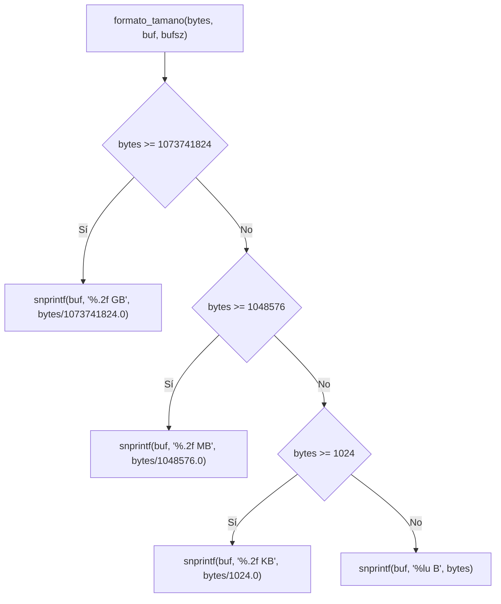
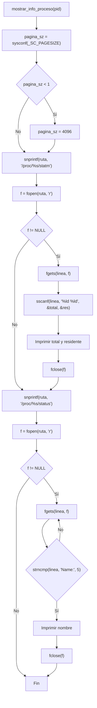
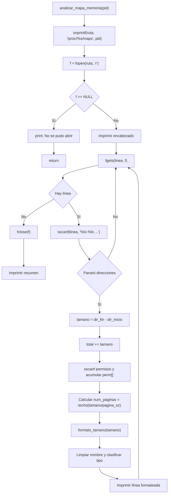
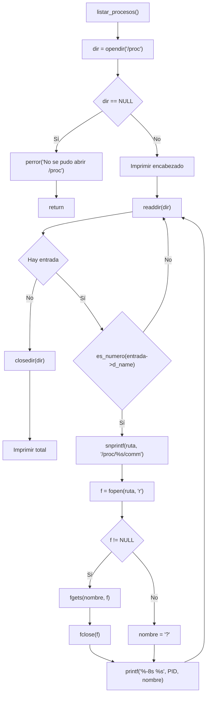

# Reporte de Programa 4 - Análisis de paginación y mapas de memoria de procesos en /proc

## 1. Portada

- Materia: Sistemas Operativos II
- Actividad: Programa 4 (análisis de memoria de procesos)
- Alumno: Dante Castelán Carpinteyro
- Fecha: 2 de septiembre de 2026
- Lenguaje: C (gcc 13.3.0, Linux)

## 2. Objetivo

Desarrollar un programa en C que lea el directorio `/proc` para analizar la paginación y los mapas de memoria de procesos activos. El programa debe:

1. Obtener el tamaño de página del sistema.
2. Leer `/proc/[pid]/maps` para mostrar las regiones de memoria (direcciones, permisos, tamaño, tipo).
3. Leer `/proc/[pid]/statm` para obtener estadísticas de páginas (total, residentes).
4. Clasificar cada región por tipo (ejecutable, librería, heap, stack, vdso, anónimo).
5. Mostrar un resumen con permisos acumulados y total de páginas.
6. Listar todos los procesos activos del sistema.

## 3. Instrucciones de la actividad

> Analizar de qué tamaño son las páginas, entrar al /proc y decir qué rangos de direcciones de memoria manejan asociado a un proceso, verificar cuál es el tamaño o cómo lo divide ese proceso, o que esté en el PID asociado al proceso, y mostrar el proceso.

## 4. Requisitos y entorno

- Sistema operativo: Linux (requiere el sistema de archivos `/proc`).
- Compilador: gcc.
- Librerías: solo las del estándar y POSIX (`stdio.h`, `stdlib.h`, `string.h`, `dirent.h`, `ctype.h`, `unistd.h`). Sin dependencias externas.
- Tamaño de página: 4096 bytes (4.0 KB) en x86_64 (obtenido con `sysconf(_SC_PAGESIZE)`).

Compilación:

```bash
cd programs
gcc -O2 -Wall -Wextra -o program-4 program-4.c
```

## 5. Implementación realizada

El programa completo vive en un solo archivo (`programs/program-4.c`, 307 líneas). A continuación se explica **todo el código en el mismo orden en que aparece en el archivo**: cabeceras, colores, cada función en su orden de aparición, y al final un recorrido detallado de `main()`.

A diferencia de los programas anteriores, este **no define estructuras de datos propias**: el sistema operativo ya tiene todas las estructuras necesarias en `/proc`. Nosotros solo leemos y formateamos lo que el kernel ya calculó, con `fopen`/`fgets`/`sscanf`.

### 5.1 Cabeceras e includes (líneas 1–6)

```c
#include <stdio.h>
#include <stdlib.h>
#include <string.h>
#include <dirent.h>
#include <ctype.h>
#include <unistd.h>
```

- **`<stdio.h>`** — E/S estándar (`printf`, `fopen`, `fgets`, `sscanf`, `snprintf`, `perror`, `fprintf`). Lectura de los archivos de `/proc` y toda la salida.
- **`<stdlib.h>`** — Biblioteca general (`atoi`). Convierte el argumento de línea de comandos (opción y PID).
- **`<string.h>`** — Manipulación de cadenas (`strncmp`, `strstr`, `strcspn`). Busca el prefijo `Name:` en `status`, clasifica regiones por subcadena (`[heap]`, `.so`) y corta saltos de línea.
- **`<dirent.h>`** — Manejo de directorios (`DIR`, `struct dirent`, `opendir`, `readdir`, `closedir`). Recorre `/proc` para listar procesos.
- **`<ctype.h>`** — Clasificación de caracteres (`isdigit`). Filtra las entradas numéricas de `/proc` (PIDs) y valida el PID ingresado por el usuario.
- **`<unistd.h>`** — Funciones POSIX (`sysconf`). Obtiene el tamaño de página del sistema.

### 5.2 Colores ANSI (líneas 8–16)

```c
/* Colores ANSI */
#define RESET    "\033[0m"
#define ROJO     "\033[31m"
#define VERDE    "\033[32m"
#define AMARILLO "\033[33m"
#define AZUL     "\033[34m"
#define MAGENTA  "\033[35m"
#define CIAN     "\033[36m"
#define GRIS     "\033[90m"
```

Secuencias de escape ANSI que cambian el color del texto en la terminal (8 colores + reset):

- **`RESET`** — restaura el color por defecto; se pone al final de cada impresión coloreada para no "heredar" el color.
- **`ROJO`** — `[stack]` y mensajes de error.
- **`VERDE`** — `[heap]`.
- **`AMARILLO`** — ejecutables y la columna de tamaño.
- **`AZUL`** — definido por completitud (no se usa actualmente).
- **`MAGENTA`** — `[vdso]` y `[vvar]`.
- **`CIAN`** — librerías compartidas, encabezados y la columna de páginas.
- **`GRIS`** — direcciones, regiones anónimas y separadores de tabla.

### 5.3 Función `es_numero` (líneas 19–27)

```c
/* Verifica si una cadena es solo numeros */
int es_numero(const char *s) {
    int i;
    if (s[0] == '\0') return 0;
    for (i = 0; s[i] != '\0'; i++) {
        if (!isdigit((unsigned char)s[i]))
            return 0;
    }
    return 1;
}
```

Verifica si una cadena contiene solo dígitos. Se usa para:

1. Filtrar entradas de `/proc` que no son PIDs (como `self`, `net`, `bus`) en `listar_procesos`.
2. Validar el PID ingresado por el usuario en `main` antes de analizarlo.

Si la cadena está vacía devuelve `0`; recorre cada carácter y devuelve `0` en cuanto encuentra algo que no sea dígito; solo devuelve `1` si todos lo son. El cast `(unsigned char)` es necesario porque `isdigit` espera un valor no negativo y `char` puede ser negativo.

### 5.4 Función `formato_tamano` (líneas 30–39)

```c
/* Convierte bytes a formato legible (KB, MB, GB) */
void formato_tamano(unsigned long bytes, char *buf, size_t bufsz) {
    if (bytes >= 1073741824UL)
        snprintf(buf, bufsz, "%.2f GB", (double)bytes / 1073741824.0);
    else if (bytes >= 1048576UL)
        snprintf(buf, bufsz, "%.2f MB", (double)bytes / 1048576.0);
    else if (bytes >= 1024UL)
        snprintf(buf, bufsz, "%.2f KB", (double)bytes / 1024.0);
    else
        snprintf(buf, bufsz, "%lu B", bytes);
}
```

Convierte bytes a formato legible para humanos. Usa condicionales de **mayor a menor** para que el primer match sea la unidad correcta (1 GB = 1073741824 bytes, 1 MB = 1048576, 1 KB = 1024). Escribe el resultado en `buf` respetando su tamaño `bufsz` (con `snprintf`, que nunca desborda). Si no llega a 1 KB, imprime los bytes tal cual.

### 5.5 Función `mostrar_info_proceso` (líneas 42–82)

```c
/* Muestra la informacion basica de un proceso */
void mostrar_info_proceso(const char *pid) {
    char ruta[256];
    FILE *f;
    char linea[512];
    long paginas_total, paginas_residentes;
    long pagina_sz;

    pagina_sz = sysconf(_SC_PAGESIZE);
    if (pagina_sz < 1) pagina_sz = 4096;

    /* Leer statm */
    snprintf(ruta, sizeof(ruta), "/proc/%s/statm", pid);
    f = fopen(ruta, "r");
    if (f) {
        if (fgets(linea, sizeof(linea), f)) {
            sscanf(linea, "%ld %ld", &paginas_total, &paginas_residentes);
            printf(CIAN "\n--- Informacion del Proceso PID %s ---\n" RESET, pid);
            printf("Tamano de pagina del sistema: %ld bytes (%.1f KB)\n",
                   pagina_sz, (double)pagina_sz / 1024.0);
            printf("Tamanio total: %ld paginas (%lu bytes)\n",
                   paginas_total, (unsigned long)(paginas_total * pagina_sz));
            printf("Residente:     %ld paginas (%lu bytes)\n",
                   paginas_residentes, (unsigned long)(paginas_residentes * pagina_sz));
        }
        fclose(f);
    }

    /* Leer status (nombre del proceso) */
    snprintf(ruta, sizeof(ruta), "/proc/%s/status", pid);
    f = fopen(ruta, "r");
    if (f) {
        while (fgets(linea, sizeof(linea), f)) {
            if (strncmp(linea, "Name:", 5) == 0) {
                linea[strcspn(linea, "\n")] = '\0';
                printf("Proceso:       %s\n", linea + 6);
                break;
            }
        }
        fclose(f);
    }
}
```

Muestra la información básica del proceso en dos lecturas:

**Primer bloque — `/proc/[pid]/statm`:**
1. Obtiene el tamaño de página con `sysconf(_SC_PAGESIZE)`; si falla (devuelve < 1), usa 4096 como fallback (bueno práctica defensiva, no debería pasar en Linux funcional).
2. Arma la ruta con `snprintf` y abre el archivo con `fopen`.
3. Lee la primera línea con `fgets` y extrae los dos primeros campos con `sscanf("%ld %ld")`:
   - **Tamaño total** (páginas): cuántas páginas tiene el proceso en su espacio de dirección virtual.
   - **Residente** (páginas): cuántas páginas están realmente en memoria física (no en swap).
4. Imprime ambos valores convertidos a bytes multiplicados por `pagina_sz`.

Los demás campos de `statm` (shared, text, lib, data, dt) se ignoran por simplicidad.

**Diferencia clave:** un proceso puede tener 1000 páginas asignadas (virtuales) pero solo 200 residentes (en RAM). Las demás pueden estar en swap o no haber sido tocadas aún (lazy allocation).

**Segundo bloque — `/proc/[pid]/status`:**
1. Reabre la ruta con `/proc/%s/status`.
2. Recorre las líneas con `fgets` buscando el prefijo `Name:` con `strncmp(linea, "Name:", 5)`.
3. Al encontrarlo, corta el salto de línea con `strcspn` y imprime el nombre con `linea + 6` (saltando los 6 caracteres `"Name: "`).
4. `break` sale del bucle en cuanto encuentra el nombre.

### 5.6 Función `analizar_mapa_memoria` (líneas 85–216)

Esta es la función principal del programa. Se divide en varias etapas:

#### 5.6.1 Variables locales y apertura (líneas 85–112)

```c
void analizar_mapa_memoria(const char *pid) {
    char ruta[256];
    FILE *f;
    char linea[1024];
    unsigned long dir_inicio, dir_fin, tamano, total = 0;
    int perm[4] = {0, 0, 0, 0}; /* r, w, x, p */
    int num_mapeos = 0;
    char nombre_arch[256];
    char tamano_str[32];
    unsigned long pagina_sz;

    pagina_sz = sysconf(_SC_PAGESIZE);
    if (pagina_sz < 1) pagina_sz = 4096;

    snprintf(ruta, sizeof(ruta), "/proc/%s/maps", pid);
    f = fopen(ruta, "r");
    if (f == NULL) {
        printf(ROJO "[!] No se pudo abrir %s\n" RESET, ruta);
        printf("    Asegurese de que el PID %s existe y tiene permisos.\n", pid);
        return;
    }

    printf(CIAN "\n--- Mapa de Memoria del Proceso PID %s ---\n" RESET, pid);
    printf("Pagina del sistema: %lu bytes (%.1f KB)\n\n", pagina_sz, (double)pagina_sz / 1024.0);

    printf(AMARILLO "%-18s %-18s %-8s %-6s %-10s %s\n" RESET,
           "Direccion Inicio", "Direccion Fin", "Tamano", "Perms", "Paginas", "Nombre/Tipo");
    printf(GRIS "---------------------------------------------------------------------------------------------------\n" RESET);
```

- **`total`** — acumulador de bytes de todas las regiones.
- **`perm[4]`** — contador de regiones con cada permiso: `[0]` = lectura, `[1]` = escritura, `[2]` = ejecución, `[3]` = privado.
- **`num_mapeos`** — contador de mapeos (inicializado en 0; ver nota abajo).
- Si `fopen` de `/proc/[pid]/maps` falla (PID inexistente o sin permisos), imprime el error en rojo y retorna.
- Imprime el encabezado de la tabla con columnas alineadas (`%-18s`, `%-8s`, etc.).

**Nota:** `num_mapeos` se inicializa en 0 pero nunca se incrementa dentro del bucle, por lo que el resumen muestra siempre `Total de mapeos: 0`. El conteo real de regiones no se está acumulando (el resto del resumen — memoria total y permisos — sí es correcto porque `total` y `perm[]` sí se actualizan).

#### 5.6.2 Parseo de cada línea (líneas 114–125)

Cada línea de `/proc/[pid]/maps` tiene el formato:

```
direccion_inicio-direccion_fin permisos offset dispositivo inode [nombre_archivo]
```

Ejemplo real:

```
000060763d01f000-000060763d10e000 r-xp 00002000 103:01 2228363  /usr/bin/bash
```

```c
while (fgets(linea, sizeof(linea), f)) {
    /* Parsear: inicio-fin perms offset dev inode [nombre] */
    nombre_arch[0] = '\0';

    /* Intentar leer con nombre */
    if (sscanf(linea, "%lx-%lx %*s %*s %*s %*s %255[^\n]",
               &dir_inicio, &dir_fin, nombre_arch) < 2) {
        /* Intentar sin nombre */
        if (sscanf(linea, "%lx-%lx %*s", &dir_inicio, &dir_fin) < 2)
            continue;
        nombre_arch[0] = '\0';
    }
```

- `%lx-%lx` lee las direcciones hexadecimal (inicio y fin).
- `%*s` descarta los campos que no necesitamos (permisos, offset, dispositivo, inode) — el `*` significa "leer pero no asignar".
- `%255[^\n]` lee el resto de la línea como el nombre del archivo (si existe), con límite de 255 caracteres.

Si el `sscanf` con nombre falla (menos de 2 campos leídos), se intenta sin nombre porque algunas regiones anónimas no tienen archivo asociado; si tampoco funciona, `continue` salta a la siguiente línea.

#### 5.6.3 Cálculo del tamaño (líneas 127–128)

```c
tamano = dir_fin - dir_inicio;
total += tamano;
```

El tamaño de cada región es la diferencia entre las direcciones fin e inicio (en bytes), y se acumula en `total` para el resumen.

#### 5.6.4 Extracción de permisos (líneas 130–137)

```c
/* Extraer permisos */
char perms[5] = "----";
if (sscanf(linea, "%*s %4s", perms) >= 1) {
    perm[0] += (perms[0] == 'r');
    perm[1] += (perms[1] == 'w');
    perm[2] += (perms[2] == 'x');
    perm[3] += (perms[3] == 'p');
}
```

Los permisos son una cadena de 4 caracteres: `r` = lectura, `w` = escritura, `x` = ejecución, `p` = privado (`s` = compartido). Un segundo `sscanf` con `%*s %4s` salta las direcciones y lee los permisos.

El acumulador `perm[]` suma `1` o `0` por cada región: como la comparación `(perms[0] == 'r')` produce `1` (true) o `0` (false), cada iteración incrementa el contador si ese permiso está presente. Al final se tiene cuántas regiones de cada tipo hay.

#### 5.6.5 Cálculo de páginas por región (líneas 139–143)

```c
/* Calcular paginas de este mapeo */
unsigned long num_paginas = tamano / pagina_sz;
if (tamano % pagina_sz != 0) num_paginas++;

formato_tamano(tamano, tamano_str, sizeof(tamano_str));
```

Divide el tamaño de la región entre el tamaño de página. Si hay residuo, se suma una página más (techo de la división) porque el kernel siempre asigna páginas completas, nunca fracciones. Luego convierte el tamaño a formato legible con `formato_tamano`.

#### 5.6.6 Limpieza del nombre y clasificación por tipo (líneas 145–187)

```c
/* Color segun tipo */
const char *color = GRIS;
const char *tipo = "";
char nombre_limpio[256] = "";

/* Limpiar nombre */
{
    int j = 0, k = 0;
    while (nombre_arch[j] && j < 255) {
        if (nombre_arch[j] != ' ' && nombre_arch[j] != '\t' &&
            nombre_arch[j] != '\n') {
            nombre_limpio[k++] = nombre_arch[j];
        }
        j++;
    }
    nombre_limpio[k] = '\0';
}
```

Primero se limpia el nombre leído: se copian carácter por carácter a `nombre_limpio` **omitiendo** espacios, tabulaciones y saltos de línea que el `sscanf` pudo haber arrastrado de la línea original. Después se clasifica con una cadena de `if/else if` sobre `strstr`:

```c
if (strstr(nombre_limpio, "[heap]")) {
    color = VERDE;
    tipo = "[heap]";
} else if (strstr(nombre_limpio, "[stack]")) {
    color = ROJO;
    tipo = "[stack]";
} else if (strstr(nombre_limpio, "[vdso]")) {
    color = MAGENTA;
    tipo = "[vdso]";
} else if (strstr(nombre_limpio, "[vvar]")) {
    color = MAGENTA;
    tipo = "[vvar]";
} else if (strstr(nombre_limpio, ".so")) {
    color = CIAN;
    tipo = "libreria";
} else if (strstr(nombre_limpio, ".a")) {
    color = CIAN;
    tipo = "estatica";
} else if (nombre_limpio[0] != '\0') {
    color = AMARILLO;
    tipo = "ejecutable";
} else {
    color = GRIS;
    tipo = "anonimo";
}
```

| Tipo | Color | Descripción |
|------|-------|-------------|
| `[heap]` | Verde | Memoria dinámica (malloc/new). Crece hacia direcciones mayores. |
| `[stack]` | Rojo | Pila de llamadas. Variables locales, parámetros, direcciones de retorno. Crece hacia direcciones menores. |
| `[vdso]` | Magenta | Virtual Dynamic Shared Object. Página especial del kernel para llamadas al sistema rápidas. |
| `[vvar]` | Magenta | Variables virtuales del kernel (reloj, etc.). Solo lectura. |
| `.so` | Cian | Librerías compartidas (libc, libm, etc.). |
| `.a` | Cian | Librerías estáticas (raras en memoria, normalmente se enlazan). |
| Ejecutable | Amarillo | El binario del programa en sí (text segment, data segment). |
| Anónimo | Gris | Región sin nombre de archivo (hilos, buffers, etc.). |

El orden importa: se verifican primero las regiones especiales con corchetes (`[heap]`, `[stack]`) antes que las librerías y el ejecutable, porque un nombre puede contener varias subcadenas.

#### 5.6.7 Impresión de la línea (líneas 189–198)

```c
/* Imprime una linea del mapa de memoria */
printf("%s", GRIS);
printf("%016lx-%016lx ", dir_inicio, dir_fin);
printf("%s%-8s ", color, perms);
printf("%s%-10s ", AMARILLO, tamano_str);
printf("%s%lu ", CIAN, num_paginas);
printf("%s%-10s ", color, tipo);
printf("%s", nombre_limpio[0] ? nombre_limpio : "(anonimo)");
printf("%s\n", RESET);
```

En lugar de un solo `printf` con muchos argumentos (que causa warnings del compilador), se usan múltiples `printf` encadenados. Es más legible y evita problemas de formato. Cada campo se imprime con su color:

- Direcciones en gris con `%-016lx` (hexadecimal de 16 dígitos, alineado a la izquierda).
- Permisos en el color del tipo.
- Tamaño en amarillo.
- Número de páginas en cian.
- Tipo en el color clasificado.
- Nombre del archivo, o `(anonimo)` si `nombre_limpio` está vacío (operador ternario `nombre_limpio[0] ? ... : ...`).
- `RESET` al final para restaurar el color.

Después del bucle se cierra el archivo con `fclose(f)`.

#### 5.6.8 Resumen final (líneas 202–215)

```c
/* Resumen */
formato_tamano(total, tamano_str, sizeof(tamano_str));
printf(GRIS "---------------------------------------------------------------------------------------------------\n" RESET);
printf("\nResumen:\n");
printf("  Total de mapeos:    %d\n", num_mapeos);
printf("  Memoria total:      %s (%lu bytes)\n", tamano_str, total);
printf("  Paginas del sistema: %lu bytes\n", pagina_sz);
printf("  Memoria en paginas:  %lu paginas\n", total / pagina_sz);

printf("\nPermisos acumulados:\n");
printf("  Lectura (r):   %d mapeos\n", perm[0]);
printf("  Escritura (w): %d mapeos\n", perm[1]);
printf("  Ejecucion (x): %d mapeos\n", perm[2]);
printf("  Privados (p):  %d mapeos\n", perm[3]);
```

Imprime el total de memoria de todas las regiones (en formato legible y en bytes), el tamaño de página, la memoria convertida a páginas (`total / pagina_sz`), y el conteo de regiones con cada permiso. Como se mencionó, `num_mapeos` permanece en 0 porque no se incrementa en el bucle.

### 5.7 Función `listar_procesos` (líneas 219–256)

```c
/* Lista todos los procesos disponibles */
void listar_procesos(void) {
    DIR *dir;
    struct dirent *entrada;
    int count = 0;

    dir = opendir("/proc");
    if (dir == NULL) {
        perror("No se pudo abrir /proc");
        return;
    }

    printf(CIAN "\n--- Procesos Disponibles ---\n\n" RESET);
    printf(AMARILLO "%-8s %s\n" RESET, "PID", "Nombre");
    printf(GRIS "-----------------------------------\n" RESET);

    while ((entrada = readdir(dir)) != NULL) {
        if (es_numero(entrada->d_name)) {
            char ruta[512], nombre[256] = "?";
            FILE *f;

            snprintf(ruta, sizeof(ruta), "/proc/%s/comm", entrada->d_name);
            f = fopen(ruta, "r");
            if (f) {
                if (fgets(nombre, sizeof(nombre), f)) {
                    nombre[strcspn(nombre, "\n")] = '\0';
                }
                fclose(f);
            }

            printf("%-8s %s\n", entrada->d_name, nombre);
            count++;
        }
    }

    closedir(dir);
    printf(GRIS "-----------------------------------\n" RESET);
    printf("Total: %d procesos\n", count);
}
```

Recorre `/proc` con `opendir`/`readdir` y filtra las entradas numéricas con `es_numero` (que corresponden a PIDs). Para cada PID:

1. `nombre` inicia como `"?"` (por si no se puede leer el archivo).
2. Arma la ruta `/proc/[pid]/comm` con `snprintf`.
3. Si `fopen` tiene éxito, lee la primera línea con `fgets` y corta el salto de línea con `strcspn`.
4. Imprime el PID (alineado con `%-8s`) y el nombre, y `count++`.

Al terminar cierra el directorio y muestra el total de procesos.

**Por qué `/proc/[pid]/comm` y no `/proc/[pid]/status`?** Porque `comm` es más rápido: contiene solo el nombre en una línea. `status` tiene mucha más información que no necesitamos para el listado.

### 5.8 Función `uso` (líneas 259–271)

```c
/* Uso del programa */
void uso(const char *prog) {
    fprintf(stderr,
        "Uso: %s <opcion> [PID]\n\n"
        "Opciones:\n"
        "  1 <PID>   Analizar mapa de memoria de un proceso\n"
        "  2         Listar procesos activos\n"
        "  3         Mostrar ayuda\n"
        "\n"
        "Ejemplo:\n"
        "  %s 1 1234    # Analizar proceso PID 1234\n"
        "  %s 2         # Ver todos los procesos\n",
        prog, prog, prog);
}
```

Imprime la ayuda en `stderr` con las tres opciones y ejemplos. Se llama cuando no se pasó argumento, cuando falta el PID, cuando el PID no es numérico, o cuando la opción no es 1–3.

### 5.9 Función `main` — recorrido completo (líneas 273–307)

```c
int main(int argc, char **argv) {
    if (argc < 2) {
        uso(argv[0]);
        return 1;
    }

    switch (atoi(argv[1])) {
        case 1:
            if (argc < 3) {
                printf("[!] Falta el PID. Use: %s 1 <PID>\n", argv[0]);
                return 1;
            }
            if (!es_numero(argv[2])) {
                printf("[!] PID invalido: %s\n", argv[2]);
                return 1;
            }
            mostrar_info_proceso(argv[2]);
            analizar_mapa_memoria(argv[2]);
            break;

        case 2:
            listar_procesos();
            break;

        case 3:
            uso(argv[0]);
            break;

        default:
            uso(argv[0]);
            return 1;
    }

    return 0;
}
```

Recorrido:

1. **Validación de argumentos**: si no hay `argv[1]`, se muestra la ayuda y se retorna 1.
2. **`switch` sobre `atoi(argv[1])`** con tres modos:
   - **`1 <PID>`** — modo de análisis:
     - Verifica que `argv[2]` exista (`argc < 3`); si falta, imprime cómo usarlo y retorna 1.
     - Valida que el PID sea puramente numérico con `es_numero(argv[2])`; si no lo es, imprime el error y retorna 1.
     - Llama a `mostrar_info_proceso` (statm + status) y luego a `analizar_mapa_memoria` (el mapa completo).
   - **`2`** — `listar_procesos()`: lista todos los PIDs activos.
   - **`3`** — `uso(argv[0])`: muestra la ayuda.
   - **`default`** — ayuda y retorno 1.
3. **`return 0`** — salida limpia.

```bash
./program-4 1 <PID>    # Analizar mapa de memoria de un proceso
./program-4 2          # Listar procesos activos
./program-4 3          # Mostrar ayuda
```

### 5.10 Funciones del sistema utilizadas

A continuación se describen las funciones de la biblioteca estándar y del sistema que se usan para leer `/proc`, validar PIDs y clasificar la memoria de un proceso.

#### `sysconf()`
La función `sysconf()` obtiene parámetros del sistema en tiempo de ejecución.

- Requerimiento: incluir `<unistd.h>`.
- Parámetros: recibe una constante como `_SC_PAGESIZE` para consultar el tamaño de página.
- Valor de retorno: devuelve el valor configurado o `-1` si falla.

#### `opendir()`
La función `opendir()` abre un directorio para iterar sobre sus entradas.

- Requerimiento: incluir `<dirent.h>`.
- Parámetros: recibe la ruta del directorio a abrir.
- Valor de retorno: devuelve un puntero `DIR` o `NULL` en caso de error.

#### `readdir()`
La función `readdir()` recorre las entradas de un directorio abierto.

- Requerimiento: incluir `<dirent.h>`.
- Parámetros: recibe el puntero `DIR`.
- Valor de retorno: devuelve `struct dirent *` con la siguiente entrada o `NULL` al final.

#### `closedir()`
La función `closedir()` cierra un directorio abierto con `opendir()`.

- Requerimiento: incluir `<dirent.h>`.
- Parámetros: recibe el puntero `DIR`.
- Valor de retorno: devuelve 0 si se cerró bien o `-1` si hubo error.

#### `fopen()`
La función `fopen()` abre un archivo del sistema, como `/proc/[pid]/maps` o `/proc/[pid]/status`.

- Requerimiento: incluir `<stdio.h>`.
- Parámetros: recibe la ruta del archivo y el modo de apertura (`"r"`, `"rb"`, etc.).
- Valor de retorno: devuelve un puntero `FILE *` o `NULL` si no pudo abrirse.

#### `fgets()`
La función `fgets()` lee una línea completa de un archivo abierto.

- Requerimiento: incluir `<stdio.h>`.
- Parámetros: recibe el buffer, el tamaño y el flujo `FILE *`.
- Valor de retorno: devuelve el mismo buffer si tuvo éxito o `NULL` si ocurre un error o llega al final.

#### `fclose()`
La función `fclose()` cierra un archivo abierto con `fopen()`.

- Requerimiento: incluir `<stdio.h>`.
- Parámetros: recibe el puntero `FILE *`.
- Valor de retorno: devuelve 0 si se cerró bien o `EOF` si hubo error.

#### `sscanf()`
La función `sscanf()` extrae datos formateados desde una cadena de texto.

- Requerimiento: incluir `<stdio.h>`.
- Parámetros: recibe la cadena fuente y un formato que describe qué valores deben leerse.
- Valor de retorno: devuelve el número de elementos convertidos correctamente. El prefijo `%*s` descarta un campo sin asignarlo.

#### `snprintf()`
La función `snprintf()` escribe una cadena formateada a un buffer con límite de tamaño.

- Requerimiento: incluir `<stdio.h>`.
- Parámetros: buffer, tamaño del buffer, formato y argumentos.
- Valor de retorno: devuelve el número de caracteres que se habrían escrito (sin contar `'\0'`). Evita desbordamientos de buffer.

#### `printf()` / `fprintf()`
Las funciones `printf()` y `fprintf()` imprimen texto formateado en `stdout` o en un flujo dado.

- Requerimiento: incluir `<stdio.h>`.
- Parámetros: cadena de formato y argumentos (`fprintf` además recibe el `FILE *`).
- Valor de retorno: devuelven el número de caracteres impresos o un valor negativo si hay error.

#### `strncmp()`
La función `strncmp()` compara dos cadenas con un máximo de caracteres.

- Requerimiento: incluir `<string.h>`.
- Parámetros: recibe las cadenas a comparar y la longitud máxima.
- Valor de retorno: devuelve un valor menor, mayor o igual a cero según el orden lexicográfico. Se usa para buscar el prefijo `Name:`.

#### `strstr()`
La función `strstr()` busca una subcadena dentro de otra.

- Requerimiento: incluir `<string.h>`.
- Parámetros: recibe la cadena completa y la subcadena que se quiere localizar.
- Valor de retorno: devuelve un puntero a la primera coincidencia o `NULL` si no existe. Se usa para clasificar regiones (`[heap]`, `[stack]`, `.so`).

#### `strcspn()`
La función `strcspn()` devuelve la longitud del primer segmento de una cadena que no contiene ninguno de los caracteres de un conjunto de rechazo.

- Requerimiento: incluir `<string.h>`.
- Parámetros: la cadena y el conjunto de caracteres a evitar.
- Valor de retorno: devuelve la posición del primer carácter que está en el conjunto. Se usa como `linea[strcspn(linea, "\n")] = '\0'` para cortar en el salto de línea.

#### `perror()`
La función `perror()` imprime un mensaje de error en `stderr` basado en `errno`.

- Requerimiento: incluir `<stdio.h>`.
- Parámetros: prefijo del mensaje de error.
- Valor de retorno: no devuelve valor.

#### `atoi()`
La función `atoi()` convierte una cadena a entero.

- Requerimiento: incluir `<stdlib.h>`.
- Parámetros: la cadena a convertir.
- Valor de retorno: devuelve el entero resultado (0 si la cadena no es numérica).

#### `isdigit()`
La función `isdigit()` comprueba si un carácter es un dígito numérico.

- Requerimiento: incluir `<ctype.h>`.
- Parámetros: recibe un entero que representa el carácter a evaluar.
- Valor de retorno: devuelve un valor distinto de cero si es un dígito, y 0 si no lo es.

### 5.11 Funciones auxiliares (propias) — resumen

Las funciones definidas por el programa se describen brevemente a continuación (qué hacen, parámetros y salida).

#### `es_numero(const char *s)`
- Qué hace: Verifica si la cadena `s` contiene solo dígitos (útil para filtrar entradas de `/proc` y validar el PID del usuario).
- Parámetros: `s` — puntero a la cadena a validar.
- Salida: devuelve `1` si es numérica, `0` en caso contrario.

#### `formato_tamano(unsigned long bytes, char *buf, size_t bufsz)`
- Qué hace: Convierte `bytes` a una representación legible (B, KB, MB, GB) y la escribe en `buf` respetando `bufsz`.
- Parámetros: `bytes` — número de bytes; `buf` — buffer destino; `bufsz` — tamaño del buffer.
- Salida: escribe la cadena formateada en `buf`; no devuelve valor (`void`).

#### `mostrar_info_proceso(const char *pid)`
- Qué hace: Lee `/proc/[pid]/statm` y `/proc/[pid]/status` para mostrar tamaño total, residente y nombre del proceso.
- Parámetros: `pid` — cadena con el PID del proceso a analizar.
- Salida: imprime información en `stdout`; no devuelve valor (`void`).

#### `analizar_mapa_memoria(const char *pid)`
- Qué hace: Lee `/proc/[pid]/maps`, parsea cada mapeo (direcciones, permisos, nombre), calcula tamaños y clasifica por tipo (heap, stack, .so, etc.) y muestra un listado coloreado con resumen.
- Parámetros: `pid` — cadena con el PID a analizar.
- Salida: imprime el mapa de memoria y un resumen con totales y conteos de permisos; no devuelve valor (`void`).

#### `listar_procesos(void)`
- Qué hace: Recorre `/proc`, filtra entradas numéricas y lee `/proc/[pid]/comm` para mostrar una lista de PIDs y nombres.
- Parámetros: ninguno.
- Salida: imprime la lista de procesos en `stdout`; no devuelve valor (`void`).

#### `uso(const char *prog)`
- Qué hace: Imprime la ayuda y las opciones de uso del programa en `stderr`.
- Parámetros: `prog` — nombre del ejecutable.
- Salida: imprime el mensaje de ayuda; no devuelve valor (`void`).

## 6. Diagramas de flujo

### 6.1 Función `formato_tamano()`



### 6.2 Función `mostrar_info_proceso()`



### 6.3 Clasificación por tipo


### 6.4 Análisis de mapa `analizar_mapa_memoria()`



### 6.5 Función `listar_procesos()`



### 6.6 Flujo principal `main()`


## 7. Ejecucion

```bash
cd programs
gcc -O2 -Wall -Wextra -o program-4 program-4.c

# Analizar un proceso especifico
./program-4 1 $$          # Analizar el proceso actual (bash)
./program-4 1 1           # Analizar systemd (PID 1)
./program-4 1 $(pgrep bash)  # Analizar bash

# Listar todos los procesos
./program-4 2

# Ayuda
./program-4 3
```

## 8. Estructura de `/proc` y su importancia

### 8.1 Que es `/proc`?

`/proc` es un **sistema de archivos virtual** (procfs) que el kernel de Linux monta en memoria. No existe en disco; se genera dinamicamente cada vez que se accede a el. Contiene archivos y directorios que reflejan el estado interno del sistema en tiempo real.

### 8.2 Archivos relevantes para este programa

| Archivo | Contenido | Uso en el programa |
|---------|-----------|-------------------|
| `/proc/[pid]/maps` | Mapa de memoria virtual | Analisis principal: direcciones, permisos, tamano |
| `/proc/[pid]/statm` | Estadisticas de paginas | Obtener total y residentes |
| `/proc/[pid]/status` | Info legible por humanos | Obtener nombre del proceso |
| `/proc/[pid]/comm` | Nombre corto | Listado de procesos |
| `/proc/[pid]/smaps` | Detalle extendido (RSS, PSS) | No usado, pero disponible para mejoras |
| `/proc/[pid]/pagemap` | Tabla de paginas fisicas | No usado, pero demuestra mapeo virtual->fisico |

### 8.3 Ejemplo real de `/proc/[pid]/maps`

```
000060763cfef000-000060763d01f000 r--p 00000000 103:01 2228363  /usr/bin/bash
000060763d01f000-000060763d10e000 r-xp 00002000 103:01 2228363  /usr/bin/bash
000060763d10e000-000060763d143000 r--p 00007000 103:01 2228363  /usr/bin/bash
000060763d143000-000060763d147000 r--p 00008000 103:01 2228363  /usr/bin/bash
000060763d147000-000060763d150000 rw-p 00009000 103:01 2228363  /usr/bin/bash
0000607654ae1000-0000607654b02000 rw-p 00000000 00:00 0        [heap]
```

**Analisis de cada linea:**

1. **r--p** = solo lectura, privado. Es el segmento de codigo ejecutable (text) mapeado como solo-lectura.
2. **r-xp** = lectura + ejecucion, privado. Es el codigo maquina ejecutable.
3. **r--p** = solo lectura. Datos de inicializacion (constantes).
4. **r--p** = solo lectura. Secciones adicionales del ELF.
5. **rw-p** = lectura + escritura. Variables globales inicializadas (data segment).
6. **rw-p** = lectura + escritura. Heap (memoria dinamica).

## 9. Cumplimiento del enunciado

- Analizar el tamano de las paginas del sistema: cumplido (`sysconf(_SC_PAGESIZE)`).
- Entrar al /proc: cumplido (`fopen` de `/proc/[pid]/maps` y `/proc/[pid]/statm`).
- Decir que rangos de direcciones de memoria maneja un proceso: cumplido (columna "Direccion Inicio-Fin").
- Verificar el tamano o como lo divide el proceso: cumplido (columna "Tamano" y "Paginas").
- Mostrar el proceso: cumplido (nombre, PID, tipo de cada region).
- Listar procesos activos: cumplido (modo 2 con `opendir`/`readdir`).

## 10. Conceptos clave de paginación

### 10.1 ¿Qué es la paginación?

La paginación es un esquema de gestión de memoria virtual que divide:

- **Memoria virtual** del proceso en bloques de tamaño fijo llamados **páginas**.
- **Memoria física** (RAM) en bloques del mismo tamaño llamados **marcos** (frames).

Cuando un proceso necesita ejecutarse, el kernel mapea sus páginas virtuales a marcos físicos. Si no hay marcos libres, puede mover páginas a disco (swap).

### 10.2 Ventajas de la paginación

1. **No necesita contiguidad:** las páginas de un proceso pueden estar dispersas en RAM.
2. **Protección:** cada tabla de páginas tiene permisos (rwx) por región.
3. **Eficiencia:** solo se cargan las páginas que se usan (demand paging).
4. **Swap:** páginas no usadas pueden ir a disco y volver cuando se necesiten.

### 10.3 Relación con este programa

Este programa muestra exactamente lo que el kernel ha decidido para cada proceso:
- Qué regiones de memoria virtual ha asignado.
- Qué permisos tiene cada región.
- Cuántas páginas tiene cada región.
- Cuántas páginas están realmente en RAM (residentes).

## 11. Conclusión

Este programa demuestra cómo el kernel de Linux administra la memoria de cada proceso a través del sistema de archivos `/proc`. A diferencia de la simulación del Programa 3, aquí vemos la realidad: el SO divide el espacio de direcciones virtuales en regiones con permisos específicos, y cada región se mapea a páginas físicas según sea necesario.

Lo más interesante es observar cómo un proceso "real" tiene múltiples regiones: el ejecutable (text segment), las librerías compartidas (.so), el heap, el stack, y páginas especiales como [vdso] y [vvar]. Cada una tiene permisos diferentes que reflejan su propósito: el código ejecutable es solo lectura y ejecución, el heap es lectura-escritura, y el stack crece dinámicamente hacia direcciones menores.

La diferencia entre páginas virtuales y residentes es clave: un proceso puede tener miles de páginas asignadas pero solo unas pocas realmente en RAM. El kernel carga las páginas bajo demanda (lazy loading) y puede moverlas a swap cuando la memoria es escasa. Este mecanismo permite que muchos procesos "crean" que tienen mucha memoria disponible, cuando en realidad el kernel la comparte eficientemente entre todos.

## 12. Anexo A - Comandos usados

```bash
cd programs
gcc -O2 -Wall -Wextra -o program-4 program-4.c

# Analizar bash
./program-4 1 $$

# Analizar systemd
./program-4 1 1

# Listar procesos
./program-4 2

# Verificar tamano de pagina
getconf PAGESIZE

# Ver maps manualmente
cat /proc/$$/maps
cat /proc/$$/statm
```

## 13. Bitácora de prompts

| # | Prompt textual | ¿Sirve? | LLM / Agente |
|:-:|:-:|:-:|:-:|
| 1 | **"¿Cómo leer el archivo /proc/[pid]/maps en C para obtener las regiones de memoria de un proceso?"** | Sí | Gemini |
| 2 | **"¿Qué campos contiene /proc/[pid]/statm y cómo interpretarlos?"** | Sí | Gemini |
| 3 | **"¿Cómo saber el tamaño de página del sistema en C con POSIX?"** | Sí | Gemini |
| 4 | **"¿Cómo clasificar las regiones de memoria por tipo (heap, stack, librería, etc.)?"** | Sí | Gemini |
| 5 | **"¿Cómo listar todos los procesos activos leyendo /proc?"** | Sí | Gemini |
| 6 | **"¿Cómo imprimir direcciones hexadecimal en C con formato de 16 caracteres?"** | Sí | Gemini |
| 7 | **"¿Qué diferencia hay entre páginas virtuales y residentes?"** | Sí | Gemini |
| 8 | **"¿Cómo funciona el lazy loading de páginas en Linux?"** | Sí | Gemini |
