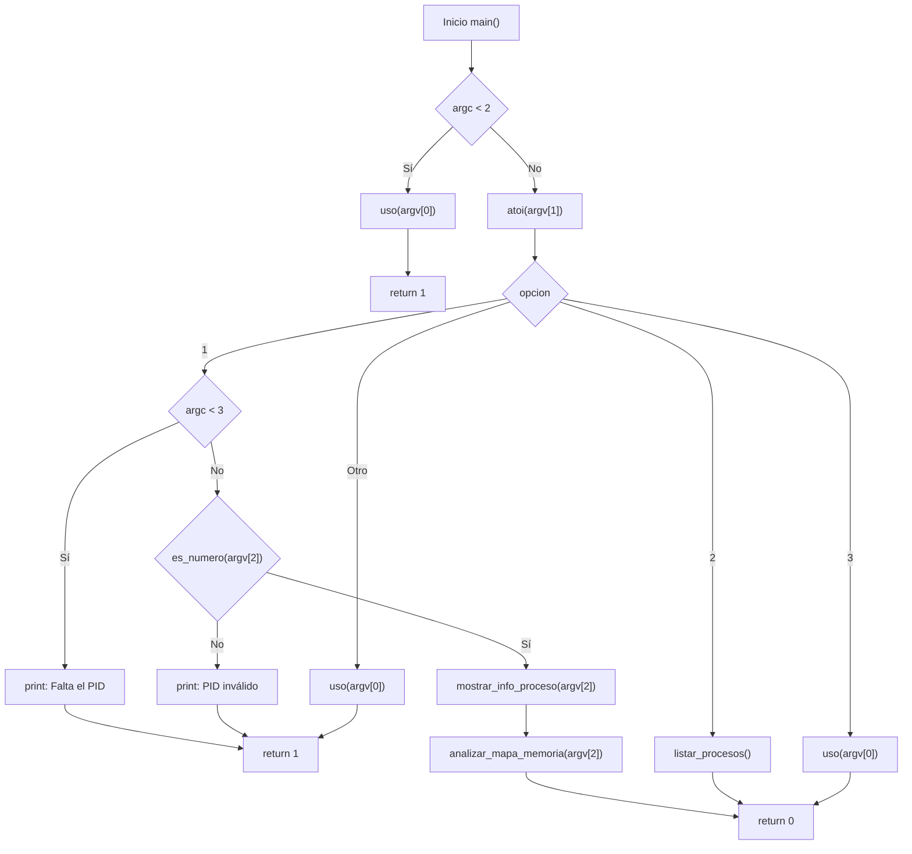
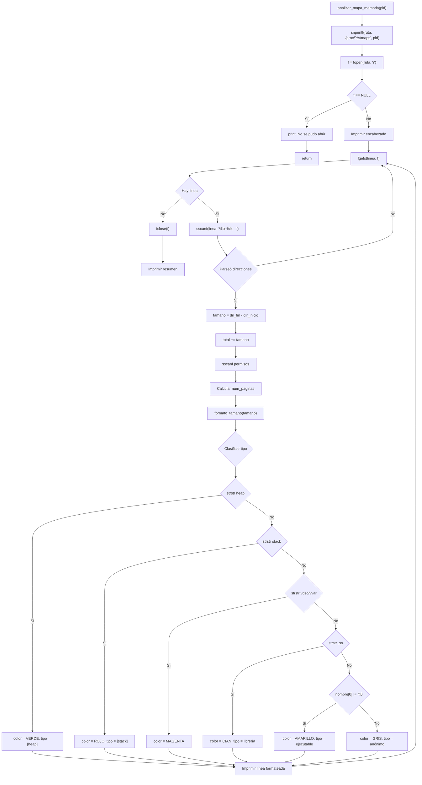
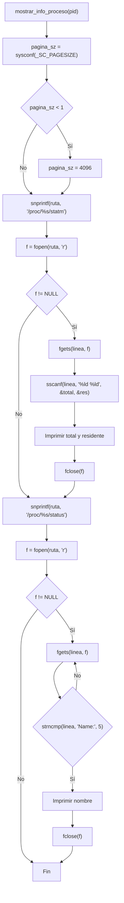
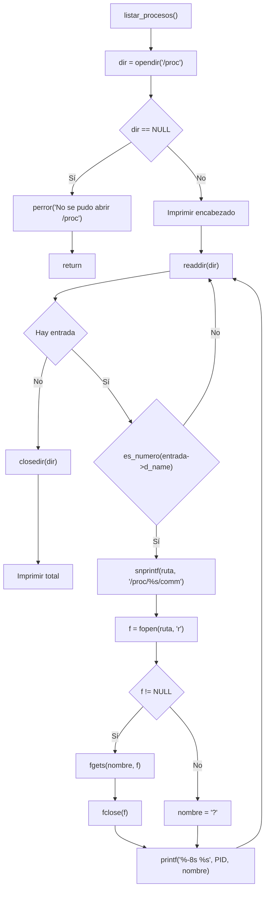
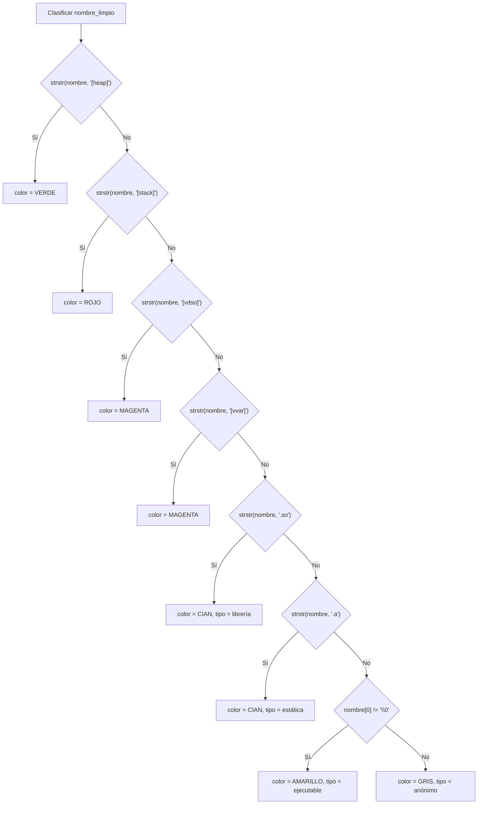
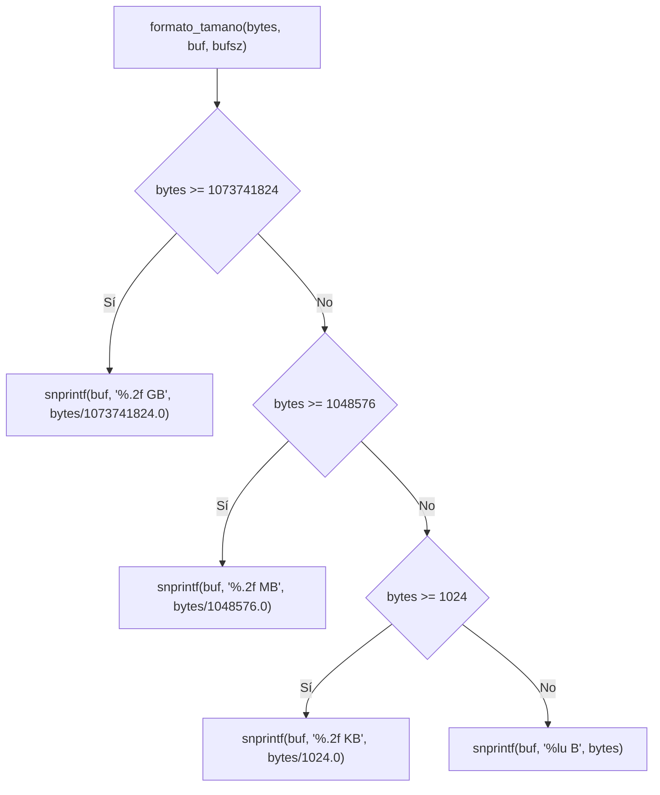

# Reporte de Programa 4 - Análisis de paginación y mapas de memoria de procesos en /proc

## 1. Portada

- Materia: Sistemas Operativos II
- Actividad: Programa 4 (análisis de memoria de procesos)
- Alumno: Dante Castelán Carpinteyro
- Fecha: 2 de septiembre de 2026
- Lenguaje: C (gcc 13.3.0, Linux)

## 2. Objetivo

Desarrollar un programa en C que lea el directorio `/proc` para analizar la paginación y los mapas de memoria de procesos activos. El programa debe:

1. Obtener el tamaño de página del sistema.
2. Leer `/proc/[pid]/maps` para mostrar las regiones de memoria (direcciones, permisos, tamaño, tipo).
3. Leer `/proc/[pid]/statm` para obtener estadísticas de páginas (total, residentes).
4. Clasificar cada región por tipo (ejecutable, librería, heap, stack, vdso, anónimo).
5. Mostrar un resumen con permisos acumulados y total de páginas.
6. Listar todos los procesos activos del sistema.

## 3. Instrucciones de la actividad

> Analizar de qué tamaño son las páginas, entrar al /proc y decir qué rangos de direcciones de memoria manejan asociado a un proceso, verificar cuál es el tamaño o cómo lo divide ese proceso, o que esté en el PID asociado al proceso, y mostrar el proceso.

## 4. Requisitos y entorno

- Sistema operativo: Linux (requiere el sistema de archivos `/proc`).
- Compilador: gcc.
- Librerías: solo las del estándar y POSIX (`stdio.h`, `stdlib.h`, `string.h`, `dirent.h`, `ctype.h`, `unistd.h`). Sin dependencias externas.
- Tamaño de página: 4096 bytes (4.0 KB) en x86_64 (obtenido con `sysconf(_SC_PAGESIZE)`).

Compilación:

```bash
cd programs
gcc -O2 -Wall -Wextra -o program-4 program-4.c
```

## 5. Implementación realizada

### 5.1 Arquitectura general

El programa se estructura en tres modos de ejecución:

```bash
./program-4 1 <PID>    # Analizar mapa de memoria de un proceso
./program-4 2          # Listar procesos activos
./program-4 3          # Mostrar ayuda
```

Cada modo es una funcion independiente que se llama desde `main()`:

```c
switch (atoi(argv[1])) {
    case 1:
        mostrar_info_proceso(argv[2]);
        analizar_mapa_memoria(argv[2]);
        break;
    case 2:
        listar_procesos();
        break;
    case 3:
        uso(argv[0]);
        break;
}
```

### 5.2 Estructura de datos: por qué no hay estructuras propias

A diferencia de los programas anteriores, este programa **no define estructuras de datos propias**. La razón es filosófica: el sistema operativo ya tiene todas las estructuras necesarias en `/proc`. Nosotros solo leemos y formateamos lo que el kernel ya calculó.

Esto es importante porque demuestra cómo un programa de usuario puede acceder a información interna del SO sin necesidad de llamadas al sistema especiales. Solo necesitamos `fopen`/`fgets`/`sscanf` para leer los archivos de `/proc`.

### 5.3 Obtención del tamaño de página

```c
long pagina_sz = sysconf(_SC_PAGESIZE);
if (pagina_sz < 1) pagina_sz = 4096;
```

**Explicación:** La función `sysconf()` de POSIX permite obtener parámetros de configuración del sistema en tiempo de ejecución. El parámetro `_SC_PAGESIZE` retorna el tamaño de página en bytes. En arquitecturas x86_64 típicamente es 4096 bytes (4 KB), pero en sistemas embebidos o con huge pages puede ser diferente.

El fallback a 4096 es por si `sysconf()` falla (retorna -1), que no debería pasar en un sistema Linux funcional pero es una buena práctica de defensa.

### 5.4 Lectura de `/proc/[pid]/statm`

```c
void mostrar_info_proceso(const char *pid) {
    char ruta[256];
    FILE *f;
    char linea[512];
    long paginas_total, paginas_residentes;

    snprintf(ruta, sizeof(ruta), "/proc/%s/statm", pid);
    f = fopen(ruta, "r");
    if (f) {
        if (fgets(linea, sizeof(linea), f)) {
            sscanf(linea, "%ld %ld", &paginas_total, &paginas_residentes);
            printf("Tamanio total: %ld paginas (%lu bytes)\n",
                   paginas_total, (unsigned long)(paginas_total * pagina_sz));
            printf("Residente:     %ld paginas (%lu bytes)\n",
                   paginas_residentes, (unsigned long)(paginas_residentes * pagina_sz));
        }
        fclose(f);
    }
}
```

**Explicación:** El archivo `/proc/[pid]/statm` contiene una sola línea con 7 campos numéricos. Los dos primeros son:

1. **Tamaño total** (en páginas): cuántas páginas tiene el proceso en su espacio de dirección virtual.
2. **Residente** (en páginas): cuántas páginas están realmente en memoria física (no en swap).

Los demás campos (shared, text, lib, data, dt) se ignoran en esta implementación por simplicidad.

**Diferencia clave:** Un proceso puede tener 1000 páginas asignadas (virtuales) pero solo 200 residentes (en RAM). Las demás pueden estar en swap o no haber sido tocadas aún (lazy allocation).

### 5.5 Lectura de `/proc/[pid]/status` (nombre del proceso)

```c
snprintf(ruta, sizeof(ruta), "/proc/%s/status", pid);
f = fopen(ruta, "r");
if (f) {
    while (fgets(linea, sizeof(linea), f)) {
        if (strncmp(linea, "Name:", 5) == 0) {
            linea[strcspn(linea, "\n")] = '\0';
            printf("Proceso:       %s\n", linea + 6);
            break;
        }
    }
    fclose(f);
}
```

**Explicación:** El archivo `/proc/[pid]/status` contiene información legible por humanos sobre el proceso. La primera línea siempre es `Name: <nombre>`. Usamos `strncmp` para buscar el prefijo y extraer el nombre con `linea + 6` (saltando "Name: ").

### 5.6 Análisis del mapa de memoria: `/proc/[pid]/maps`

Esta es la función principal del programa. Cada línea de `/proc/[pid]/maps` tiene el formato:

```
direccion_inicio-direccion_fin permisos offset dispositivo inode [nombre_archivo]
```

Ejemplo real:

```
000060763d01f000-000060763d10e000 r-xp 00002000 103:01 2228363  /usr/bin/bash
```

**Parseo con sscanf:**

```c
if (sscanf(linea, "%lx-%lx %*s %*s %*s %*s %255[^\n]",
           &dir_inicio, &dir_fin, nombre_arch) < 2) {
    /* Intentar sin nombre */
    if (sscanf(linea, "%lx-%lx %*s", &dir_inicio, &dir_fin) < 2)
        continue;
    nombre_arch[0] = '\0';
}
```

**Explicación del parseo:**

- `%lx-%lx` lee las direcciones hexadecimal (inicio y fin).
- `%*s` descarta los campos que no necesitamos (permisos, offset, dispositivo, inode).
- `%255[^\n]` lee el resto de la línea como el nombre del archivo (si existe).

Si el sscanf con nombre falla (menos de 2 campos leídos), intentamos sin nombre porque algunas regiones anónimas no tienen archivo asociado.

**Cálculo del tamaño:**

```c
tamano = dir_fin - dir_inicio;
total += tamano;
```

El tamaño de cada región es simplemente la diferencia entre las direcciones fin e inicio. Esto nos da el tamaño en bytes de la región de memoria virtual asignada.

**Extracción de permisos:**

```c
char perms[5] = "----";
if (sscanf(linea, "%*s %4s", perms) >= 1) {
    perm[0] += (perms[0] == 'r');  /* Lectura */
    perm[1] += (perms[1] == 'w');  /* Escritura */
    perm[2] += (perms[2] == 'x');  /* Ejecucion */
    perm[3] += (perms[3] == 'p');  /* Privado (no compartido) */
}
```

**Explicación:** Los permisos son una cadena de 4 caracteres:

- `r` = lectura
- `w` = escritura
- `x` = ejecución
- `p` = privado (no compartido con otros procesos)
- `s` = compartido

Contamos cuántas regiones tienen cada permiso para el resumen final.

**Cálculo de páginas por región:**

```c
unsigned long num_paginas = tamano / pagina_sz;
if (tamano % pagina_sz != 0) num_paginas++;
```

**Explicación:** Dividimos el tamaño de la región entre el tamaño de página. Si hay residuo, sumamos una página más porque el kernel siempre asigna páginas completas (no fracciones).

### 5.7 Clasificación por tipo y colores ANSI

```c
if (strstr(nombre_limpio, "[heap]")) {
    color = VERDE;
    tipo = "[heap]";
} else if (strstr(nombre_limpio, "[stack]")) {
    color = ROJO;
    tipo = "[stack]";
} else if (strstr(nombre_limpio, "[vdso]")) {
    color = MAGENTA;
    tipo = "[vdso]";
} else if (strstr(nombre_limpio, ".so")) {
    color = CIAN;
    tipo = "libreria";
} else if (nombre_limpio[0] != '\0') {
    color = AMARILLO;
    tipo = "ejecutable";
} else {
    color = GRIS;
    tipo = "anonimo";
}
```

**Explicación de cada tipo:**

| Tipo | Color | Descripción |
|------|-------|-------------|
| `[heap]` | Verde | Memoria dinámica (malloc/new). Crece hacia direcciones mayores. |
| `[stack]` | Rojo | Pila de llamadas. Contiene variables locales, parámetros, direcciones de retorno. Crece hacia direcciones menores. |
| `[vdso]` | Magenta | Virtual Dynamic Shared Object. Página especial del kernel para llamadas al sistema rápidas. |
| `[vvar]` | Magenta | Variables virtuales del kernel (reloj, etc.). Solo lectura. |
| `.so` | Cian | Librerías compartidas (libc, libm, etc.). Cargadas con `dlopen` o automáticamente por el loader. |
| `.a` | Cian | Librerías estáticas (raras en memoria, normalmente se enlazan). |
| Ejecutable | Amarillo | El binario del programa en sí (text segment, data segment, etc.). |
| Anónimo | Gris | Región sin nombre de archivo. Puede ser memoria de hilos, buffers internos del kernel, etc. |

### 5.8 Impresión formateada del mapa

```c
printf("%s", GRIS);
printf("%016lx-%016lx ", dir_inicio, dir_fin);
printf("%s%-8s ", color, perms);
printf("%s%-10s ", AMARILLO, tamano_str);
printf("%s%lu ", CIAN, num_paginas);
printf("%s%-10s ", color, tipo);
printf("%s", nombre_limpio[0] ? nombre_limpio : "(anonimo)");
printf("%s\n", RESET);
```

**Explicación:** En lugar de un solo `printf` con muchos argumentos (que causa warnings del compilador), usamos múltiples `printf` encadenados. Esto es más legible y evita problemas de formato.

Cada campo se imprime con su color correspondiente:
- Direcciones en gris
- Permisos en color del tipo
- Tamaño en amarillo
- Número de páginas en cian
- Tipo en color clasificado
- Nombre del archivo

### 5.9 Listado de procesos

```c
void listar_procesos(void) {
    DIR *dir;
    struct dirent *entrada;
    int count = 0;

    dir = opendir("/proc");
    if (dir == NULL) {
        perror("No se pudo abrir /proc");
        return;
    }

    while ((entrada = readdir(dir)) != NULL) {
        if (es_numero(entrada->d_name)) {
            char ruta[512], nombre[256] = "?";
            FILE *f;

            snprintf(ruta, sizeof(ruta), "/proc/%s/comm", entrada->d_name);
            f = fopen(ruta, "r");
            if (f) {
                if (fgets(nombre, sizeof(nombre), f)) {
                    nombre[strcspn(nombre, "\n")] = '\0';
                }
                fclose(f);
            }

            printf("%-8s %s\n", entrada->d_name, nombre);
            count++;
        }
    }

    closedir(dir);
    printf("Total: %d procesos\n", count);
}
```

**Explicación:** Recorremos `/proc` con `opendir`/`readdir` y filtramos las entradas numéricas (que corresponden a PIDs). Para cada PID, leemos `/proc/[pid]/comm` que contiene solo el nombre del proceso.

**Por qué `/proc/[pid]/comm` y no `/proc/[pid]/status`?** Porque `comm` es más rápido: contiene solo el nombre en una línea. `status` tiene mucha más información que no necesitamos para el listado.

### 5.10 Función auxiliar: formato de tamaño

```c
void formato_tamano(unsigned long bytes, char *buf, size_t bufsz) {
    if (bytes >= 1073741824UL)
        snprintf(buf, bufsz, "%.2f GB", (double)bytes / 1073741824.0);
    else if (bytes >= 1048576UL)
        snprintf(buf, bufsz, "%.2f MB", (double)bytes / 1048576.0);
    else if (bytes >= 1024UL)
        snprintf(buf, bufsz, "%.2f KB", (double)bytes / 1024.0);
    else
        snprintf(buf, bufsz, "%lu B", bytes);
}
```

**Explicación:** Convierte bytes a formato legible para humanos. Usa condicionales de mayor a menor para que el primer match sea la unidad correcta.

### 5.11 Función auxiliar: validación de números

```c
int es_numero(const char *s) {
    int i;
    if (s[0] == '\0') return 0;
    for (i = 0; s[i] != '\0'; i++) {
        if (!isdigit((unsigned char)s[i]))
            return 0;
    }
    return 1;
}
```

**Explicación:** Verifica si una cadena contiene solo dígitos. Se usa para:
1. Filtrar entradas de `/proc` que no son PIDs (como "self", "net", "bus").
2. Validar el PID ingresado por el usuario.

El cast `(unsigned char)` es necesario porque `isdigit` espera un valor no negativo.

### 5.12 Funciones del sistema utilizadas

A continuación se describen las funciones de la biblioteca estándar y del sistema que se usan para leer `/proc`, validar PIDs y clasificar la memoria de un proceso.

#### `sysconf()`
La función `sysconf()` obtiene parámetros del sistema en tiempo de ejecución.

- Requerimiento: incluir `<unistd.h>`.
- Parámetros: recibe una constante como `_SC_PAGESIZE` para consultar el tamaño de página.
- Valor de retorno: devuelve el valor configurado o `-1` si falla.

#### `opendir()`
La función `opendir()` abre un directorio para iterar sobre sus entradas.

- Requerimiento: incluir `<dirent.h>`.
- Parámetros: recibe la ruta del directorio a abrir.
- Valor de retorno: devuelve un puntero `DIR` o `NULL` en caso de error.

#### `readdir()`
La función `readdir()` recorre las entradas de un directorio abierto.

- Requerimiento: incluir `<dirent.h>`.
- Parámetros: recibe el puntero `DIR`.
- Valor de retorno: devuelve `struct dirent *` con la siguiente entrada o `NULL` al final.

#### `closedir()`
La función `closedir()` cierra un directorio abierto con `opendir()`.

- Requerimiento: incluir `<dirent.h>`.
- Parámetros: recibe el puntero `DIR`.
- Valor de retorno: devuelve 0 si se cerró bien o `-1` si hubo error.

#### `fopen()`
La función `fopen()` abre un archivo del sistema, como `/proc/[pid]/maps` o `/proc/[pid]/status`.

- Requerimiento: incluir `<stdio.h>`.
- Parámetros: recibe la ruta del archivo y el modo de apertura (`"r"`, `"rb"`, etc.).
- Valor de retorno: devuelve un puntero `FILE *` o `NULL` si no pudo abrirse.

#### `fgets()`
La función `fgets()` lee una línea completa de un archivo abierto.

- Requerimiento: incluir `<stdio.h>`.
- Parámetros: recibe el buffer, el tamaño y el flujo `FILE *`.
- Valor de retorno: devuelve el mismo buffer si tuvo éxito o `NULL` si ocurre un error o llega al final.

#### `sscanf()`
La función `sscanf()` extrae datos formateados desde una cadena de texto.

- Requerimiento: incluir `<stdio.h>`.
- Parámetros: recibe la cadena fuente y un formato que describe qué valores deben leerse.
- Valor de retorno: devuelve el número de elementos convertidos correctamente.

#### `strncmp()`
La función `strncmp()` compara dos cadenas con un máximo de caracteres.

- Requerimiento: incluir `<string.h>`.
- Parámetros: recibe las cadenas a comparar y la longitud máxima.
- Valor de retorno: devuelve un valor menor, mayor o igual a cero según el orden lexicográfico.

#### `strstr()`
La función `strstr()` busca una subcadena dentro de otra.

- Requerimiento: incluir `<string.h>`.
- Parámetros: recibe la cadena completa y la subcadena que se quiere localizar.
- Valor de retorno: devuelve un puntero a la primera coincidencia o `NULL` si no existe.

#### `isdigit()`
La función `isdigit()` comprueba si un carácter es un dígito numérico.

- Requerimiento: incluir `<ctype.h>`.
- Parámetros: recibe un entero que representa el carácter a evaluar.
- Valor de retorno: devuelve un valor distinto de cero si es un dígito, y 0 si no lo es.

### 6. Funciones auxiliares (propias)

Las funciones definidas por el programa se describen brevemente a continuación (qué hacen, parámetros y salida).

#### `es_numero(const char *s)`

- Qué hace: Verifica si la cadena `s` contiene solo dígitos (útil para filtrar entradas de `/proc`).
- Parámetros: `s` — puntero a la cadena a validar.
- Salida: devuelve `1` si es numérica, `0` en caso contrario.

#### `formato_tamano(unsigned long bytes, char *buf, size_t bufsz)`

- Qué hace: Convierte `bytes` a una representación legible (B, KB, MB, GB) y la escribe en `buf` respetando `bufsz`.
- Parámetros: `bytes` — número de bytes; `buf` — buffer destino; `bufsz` — tamaño del buffer.
- Salida: escribe la cadena formateada en `buf`; no devuelve valor (`void`).

#### `mostrar_info_proceso(const char *pid)`

- Qué hace: Lee `/proc/[pid]/statm` y `/proc/[pid]/status` para mostrar tamaño total, residente y nombre del proceso.
- Parámetros: `pid` — cadena con el PID del proceso a analizar.
- Salida: imprime información en `stdout`; no devuelve valor (`void`).

#### `analizar_mapa_memoria(const char *pid)`

- Qué hace: Lee `/proc/[pid]/maps`, parsea cada mapeo (direcciones, permisos, nombre), calcula tamaños y clasifica por tipo (heap, stack, .so, etc.) y muestra un listado coloreado.
- Parámetros: `pid` — cadena con el PID a analizar.
- Salida: imprime el mapa de memoria y un resumen con totales y conteos de permisos; no devuelve valor (`void`).

#### `listar_procesos(void)`

- Qué hace: Recorre `/proc`, filtra entradas numéricas y lee `/proc/[pid]/comm` para mostrar una lista de PIDs y nombres.
- Parámetros: ninguno.
- Salida: imprime la lista de procesos en `stdout`; no devuelve valor (`void`).

#### `uso(const char *prog)`

- Qué hace: Imprime la ayuda y las opciones de uso del programa en `stderr`.
- Parámetros: `prog` — nombre del ejecutable.
- Salida: imprime el mensaje de ayuda; no devuelve valor (`void`).

## 6. Diagramas de flujo

### 6.1 Flujo principal `main()`



### 6.2 Análisis de mapa `analizar_mapa_memoria()`



### 6.3 Función `mostrar_info_proceso()`



### 6.4 Función `listar_procesos()`



### 6.5 Clasificación por tipo



### 6.6 Función `formato_tamano()`



## 7. Ejecucion

```bash
cd programs
gcc -O2 -Wall -Wextra -o program-4 program-4.c

# Analizar un proceso especifico
./program-4 1 $$          # Analizar el proceso actual (bash)
./program-4 1 1           # Analizar systemd (PID 1)
./program-4 1 $(pgrep bash)  # Analizar bash

# Listar todos los procesos
./program-4 2

# Ayuda
./program-4 3
```

## 8. Estructura de `/proc` y su importancia

### 7.1 Que es `/proc`?

`/proc` es un **sistema de archivos virtual** (procfs) que el kernel de Linux monta en memoria. No existe en disco; se genera dinamicamente cada vez que se accede a el. Contiene archivos y directorios que reflejan el estado interno del sistema en tiempo real.

### 7.2 Archivos relevantes para este programa

| Archivo | Contenido | Uso en el programa |
|---------|-----------|-------------------|
| `/proc/[pid]/maps` | Mapa de memoria virtual | Analisis principal: direcciones, permisos, tamano |
| `/proc/[pid]/statm` | Estadisticas de paginas | Obtener total y residentes |
| `/proc/[pid]/status` | Info legible por humanos | Obtener nombre del proceso |
| `/proc/[pid]/comm` | Nombre corto | Listado de procesos |
| `/proc/[pid]/smaps` | Detalle extendido (RSS, PSS) | No usado, pero disponible para mejoras |
| `/proc/[pid]/pagemap` | Tabla de paginas fisicas | No usado, pero demuestra mapeo virtual->fisico |

### 7.3 Ejemplo real de `/proc/[pid]/maps`

```
000060763cfef000-000060763d01f000 r--p 00000000 103:01 2228363  /usr/bin/bash
000060763d01f000-000060763d10e000 r-xp 00002000 103:01 2228363  /usr/bin/bash
000060763d10e000-000060763d143000 r--p 00007000 103:01 2228363  /usr/bin/bash
000060763d143000-000060763d147000 r--p 00008000 103:01 2228363  /usr/bin/bash
000060763d147000-000060763d150000 rw-p 00009000 103:01 2228363  /usr/bin/bash
0000607654ae1000-0000607654b02000 rw-p 00000000 00:00 0        [heap]
```

**Analisis de cada linea:**

1. **r--p** = solo lectura, privado. Es el segmento de codigo ejecutable (text) mapeado como solo-lectura.
2. **r-xp** = lectura + ejecucion, privado. Es el codigo maquina ejecutable.
3. **r--p** = solo lectura. Datos de inicializacion (constantes).
4. **r--p** = solo lectura. Secciones adicionales del ELF.
5. **rw-p** = lectura + escritura. Variables globales inicializadas (data segment).
6. **rw-p** = lectura + escritura. Heap (memoria dinamica).

## 9. Cumplimiento del enunciado

- Analizar el tamano de las paginas del sistema: cumplido (`sysconf(_SC_PAGESIZE)`).
- Entrar al /proc: cumplido (`fopen` de `/proc/[pid]/maps` y `/proc/[pid]/statm`).
- Decir que rangos de direcciones de memoria maneja un proceso: cumplido (columna "Direccion Inicio-Fin").
- Verificar el tamano o como lo divide el proceso: cumplido (columna "Tamano" y "Paginas").
- Mostrar el proceso: cumplido (nombre, PID, tipo de cada region).
- Listar procesos activos: cumplido (modo 2 con `opendir`/`readdir`).

## 10. Conceptos clave de paginación

### 9.1 ¿Qué es la paginación?

La paginación es un esquema de gestión de memoria virtual que divide:

- **Memoria virtual** del proceso en bloques de tamaño fijo llamados **páginas**.
- **Memoria física** (RAM) en bloques del mismo tamaño llamados **marcos** (frames).

Cuando un proceso necesita ejecutarse, el kernel mapea sus páginas virtuales a marcos físicos. Si no hay marcos libres, puede mover páginas a disco (swap).

### 9.2 Ventajas de la paginación

1. **No necesita contiguidad:** las páginas de un proceso pueden estar dispersas en RAM.
2. **Protección:** cada tabla de páginas tiene permisos (rwx) por región.
3. **Eficiencia:** solo se cargan las páginas que se usan (demand paging).
4. **Swap:** páginas no usadas pueden ir a disco y volver cuando se necesiten.

### 9.3 Relación con este programa

Este programa muestra exactamente lo que el kernel ha decidido para cada proceso:
- Qué regiones de memoria virtual ha asignado.
- Qué permisos tiene cada región.
- Cuántas páginas tiene cada región.
- Cuántas páginas están realmente en RAM (residentes).

## 11. Conclusión

Este programa demuestra cómo el kernel de Linux administra la memoria de cada proceso a través del sistema de archivos `/proc`. A diferencia de la simulación del Programa 3, aquí vemos la realidad: el SO divide el espacio de direcciones virtuales en regiones con permisos específicos, y cada región se mapea a páginas físicas según sea necesario.

Lo más interesante es observar cómo un proceso "real" tiene múltiples regiones: el ejecutable (text segment), las librerías compartidas (.so), el heap, el stack, y páginas especiales como [vdso] y [vvar]. Cada una tiene permisos diferentes que reflejan su propósito: el código ejecutable es solo lectura y ejecución, el heap es lectura-escritura, y el stack crece dinámicamente hacia direcciones menores.

La diferencia entre páginas virtuales y residentes es clave: un proceso puede tener miles de páginas asignadas pero solo unas pocas realmente en RAM. El kernel carga las páginas bajo demanda (lazy loading) y puede moverlas a swap cuando la memoria es escasa. Este mecanismo permite que muchos procesos "crean" que tienen mucha memoria disponible, cuando en realidad el kernel la comparte eficientemente entre todos.

## 12. Anexo A - Comandos usados

```bash
cd programs
gcc -O2 -Wall -Wextra -o program-4 program-4.c

# Analizar bash
./program-4 1 $$

# Analizar systemd
./program-4 1 1

# Listar procesos
./program-4 2

# Verificar tamano de pagina
getconf PAGESIZE

# Ver maps manualmente
cat /proc/$$/maps
cat /proc/$$/statm
```

## 13. Bitácora de prompts

| # | Prompt textual | ¿Sirve? | LLM / Agente |
|:-:|:-:|:-:|:-:|
| 1 | **"¿Cómo leer el archivo /proc/[pid]/maps en C para obtener las regiones de memoria de un proceso?"** | Sí | Gemini |
| 2 | **"¿Qué campos contiene /proc/[pid]/statm y cómo interpretarlos?"** | Sí | Gemini |
| 3 | **"¿Cómo saber el tamaño de página del sistema en C con POSIX?"** | Sí | Gemini |
| 4 | **"¿Cómo clasificar las regiones de memoria por tipo (heap, stack, librería, etc.)?"** | Sí | Gemini |
| 5 | **"¿Cómo listar todos los procesos activos leyendo /proc?"** | Sí | Gemini |
| 6 | **"¿Cómo imprimir direcciones hexadecimal en C con formato de 16 caracteres?"** | Sí | Gemini |
| 7 | **"¿Qué diferencia hay entre páginas virtuales y residentes?"** | Sí | Gemini |
| 8 | **"¿Cómo funciona el lazy loading de páginas en Linux?"** | Sí | Gemini |
